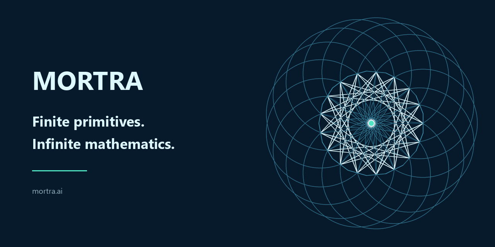

<p align="center">
  
</p>

<h1 align="center">MORTRA</h1>

<p align="center"><strong>Finite primitives. Infinite mathematics.</strong></p>

<p align="center">
  <a href="https://mortra.ai/?utm_source=github&utm_medium=repository&utm_campaign=mortra1">Try MORTRA</a>
  ·
  <a href="https://mortra.ai/research?utm_source=github&utm_medium=repository&utm_campaign=mortra1">Research</a>
  ·
  <a href="docs/research/README.md">Reproducible artifacts</a>
</p>

MORTRA turns mathematical statements into typed structures, searches executable morphisms, and returns the problem, proof route, figure, and replayable certificate from one semantic state.

The core path is symbolic and inspectable. A result is accepted only when its certificate can be replayed.

## Current verified results

| Result | Current ledger | Evidence |
|---|---:|---|
| Audited geometry cohort | **89 / 89** | [remaining-11 closure and non-vacuity audit](docs/research/MORTRA-CODEX-FUSED-REMAINING11-CLOSURE-20260828.md) |
| Replayed exact identities | **357 / 357** | [proof-artifact ledger](docs/research/MORTRA-CODEX-FUSED-REMAINING11-CLOSURE-20260828.md) |
| Software/circuit equivalence | **2,000,000 / 2,000,000** | [machine-readable claim verification](data/claim-verification-2026-08-22.json) |

The website reads these public figures from one source, [`lib/mortra/i18n.ts`](lib/mortra/i18n.ts), to prevent stale copies across pages.

## One state, many representations

```text
Natural language / TeX ──> Typed semantic state <── Diagram / data
                                  │
                     ┌────────────┼────────────┐
                     │            │            │
                 Discovery    Generation   Experience
                     │            │            │
                     └──────── Verification ───┘
                                  │
                         Replayable certificate
```

The same geometry kernel also produced the MORTRA `Incidence weave` identity used across the site, X, and this repository. Avatar, header, and social cards preserve semantic hash `e6523b41e3883cc66f665f09930d10ae27c980d30a7c79f175e73277e23017cb`; only the render policy changes.

## Repository map

- [`math_os_prototype/`](math_os_prototype/) — typed mathematical objects, morphisms, proof and figure experiments
- [`worker/`](worker/) — long-running search and specialist backends
- [`app/`](app/) and [`components/`](components/) — MORTRA web product
- [`docs/research/`](docs/research/) — methods, results, failures, and conclusions
- [`data/`](data/) and [`artifacts/`](artifacts/) — machine-readable ledgers and replay artifacts
- [`research/fpga/`](research/fpga/) — candidate-filter circuit research

## Run locally

```bash
npm install
npm run dev
```

The local product opens at `http://localhost:3002`.

Required web environment values are documented in [`.env.local.example`](.env.local.example). X credentials are needed only for publishing; mathematical reasoning does not depend on them.

## Verify

```bash
cd worker
npm ci
npm test
npm run build
```

Generate and verify the current brand assets from the same semantic figure:

```bash
python scripts/generate_incidence_brand_assets.py
```

The generator fails if the source semantic hash changes or if the GitHub social preview exceeds GitHub's file-size limit.

## Research practice

MORTRA separates capability claims from exploratory results. Research notes record the objective, method, result, interpretation, and next falsifiable experiment. Scores are tied to frozen cohorts and proof artifacts rather than copied from console output.

Start with the [research index](docs/research/README.md) and the [current distribution strategy](docs/design/MORTRA-DISTRIBUTION-STRATEGY-20260830.md).
