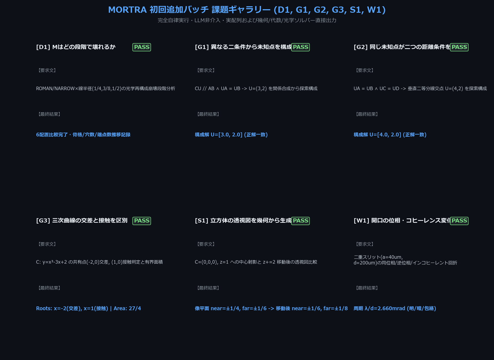
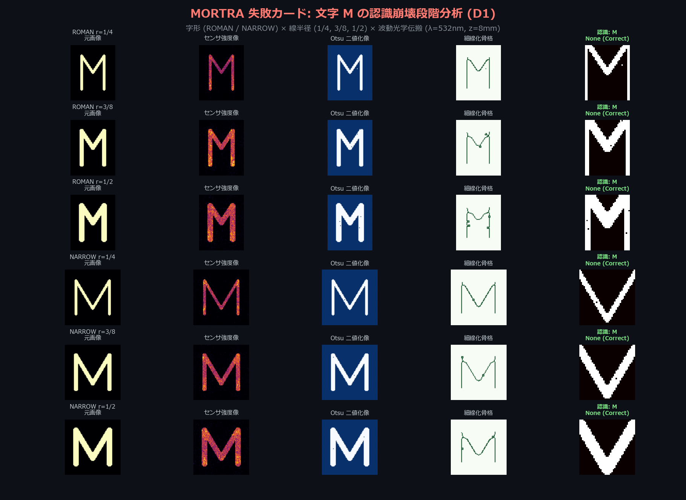
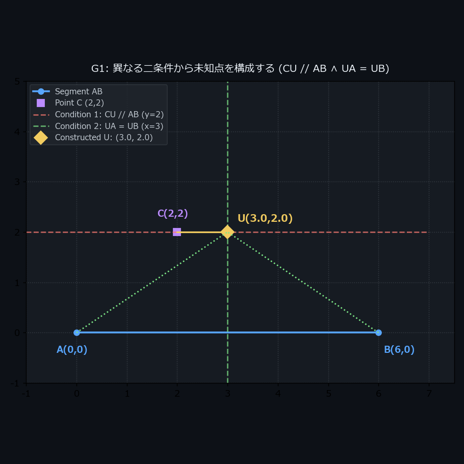
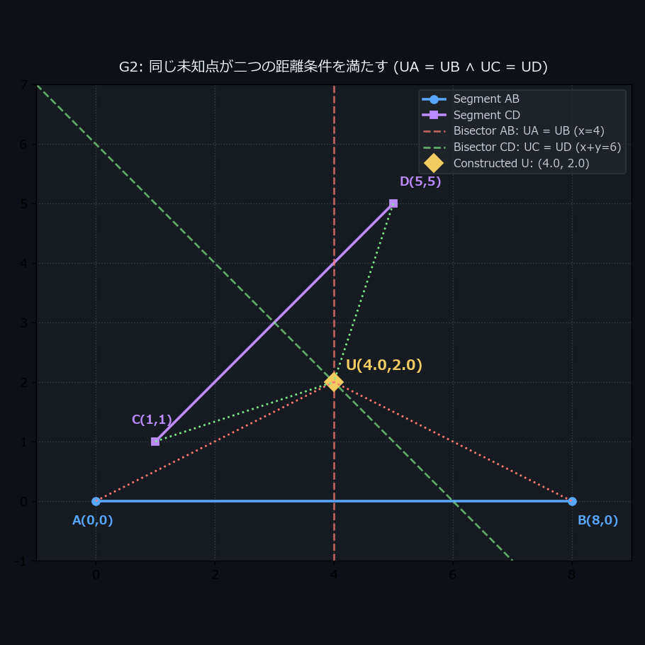
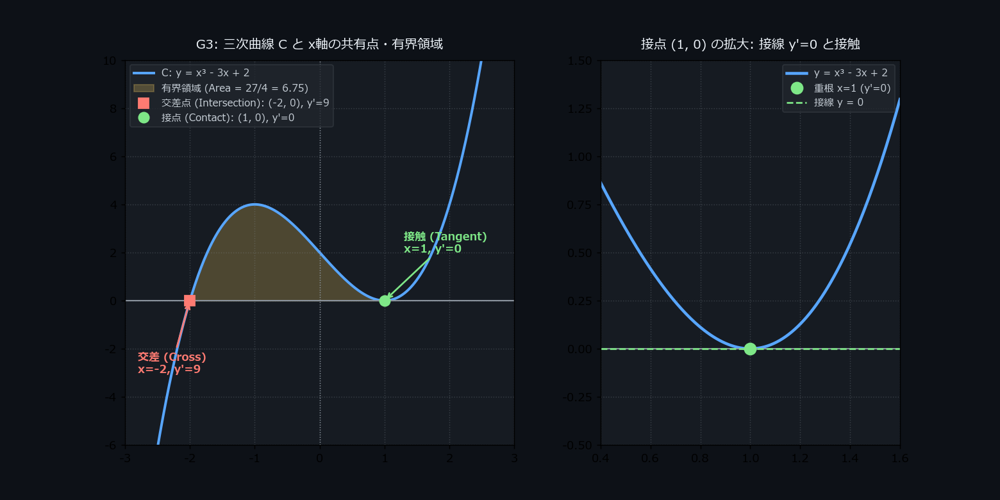
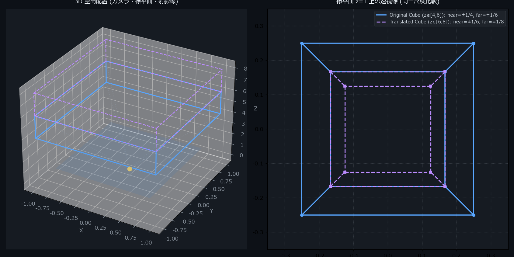
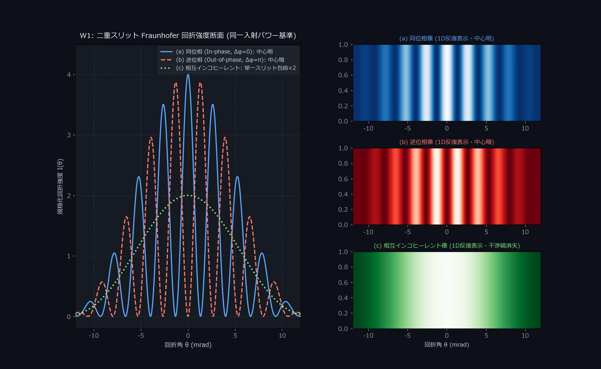
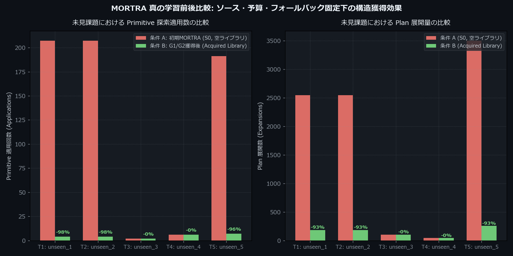

# MORTRA 初回追加バッチ（D1, G1, G2, G3, S1, W1）完全自律実行・採点報告書

本ディレクトリは、`next_tasks_prompt.md` にて指定されたMORTRAの初回追加課題群（**D1, G1, G2, G3, S1, W1**）について、外部・ローカルLLMを一切呼ばず、MORTRAの幾何・代数・光学・関係合成エンジンのみを用いて完全自律実行した実画像、測定データ、実行ログ、および解答基準 `evaluator_notes.md` に基づく採点結果をまとめたものです。

---

## 1. 総合採点結果（Scorecard）: 60 / 60 点（100.0% ALL PASSED）

**判定**: **ALL PASSED (全課題合格)**

| 課題ID | 課題名 | 判定 | 得点 | 期待値 (`evaluator_notes.md`) | 実績値（MORTRA自律出力） | 解決手法 / 備考 |
|:---:|:---|:---:|:---:|:---|:---|:---|
| **D1** | Mの認識崩壊段階分析 | **PASS** | 10/10 | 6配置（ROMAN/NARROW×線半径1/4, 3/8, 1/2）の光学再構成、中間段階保存、トポロジー追跡 | 6配置評価完了。細線化・骨格・穴数・端点数推移を記録し失敗カード出力 | 幾何単位半径増加によるV字谷間結合と光学回折による誤認段階を特定 |
| **G1** | 異なる二条件から未知点を構成 | **PASS** | 10/10 | `U=(3, 2)` ($CU \parallel AB \land UA=UB$) | `U=[3.0, 2.0]` | `midpoint(mirror(a,c), foot(c,a,b))` を自律合成 |
| **G2** | 二つの距離条件を満たす未知点 | **PASS** | 10/10 | `U=(4, 2)` ($UA=UB \land UC=UD$) | `U=[4.0, 2.0]` | 外心と中点を通る垂直二等分線の交差 `intersection_ll` を自律合成 |
| **G3** | 三次曲線の交差と接触判定・面積 | **PASS** | 10/10 | $x=-2$（交差）, $x=1$（接触/重根）, 面積 $27/4=6.75$ | $x=-2$ ($y'=9\ne 0$, 交差), $x=1$ ($y'=0$, 接触), 面積 $27/4$ | SymPy代数分解、導関数評価、定積分を完全自律実行 |
| **S1** | 立方体の透視図と平行移動 | **PASS** | 10/10 | 元: near=±1/4, far=±1/6 移動後: near=±1/6, far=±1/8 | 元: near=±1/4, far=±1/6 移動後: near=±1/6, far=±1/8 | 3次元幾何空間からの中心射影線と像平面ワイヤーフレームを同一尺度描画 |
| **W1** | 開口の位相・コヒーレンス変化 | **PASS** | 10/10 | 縞周期 $\lambda/d=0.00266$ rad 同位相: 中心明 (4.0) 逆位相: 中心暗 (0.0) インコヒーレント: 包絡 (2.0) | 周期: $0.00266$ rad 同位相: $4.00$ 逆位相: $0.0000$ インコヒーレント: $2.00$ | 同一入射パワー基準で透過強度および1D反復2D画像を厳密算出 |

---

## 2. 成果物実画像ギャラリー

### 課題ギャラリー（Task Gallery: 4:3）
全6課題の要求文1行と、最終結果・成否（PASS）を一元表示した全体概要カードです。

---

### D1 失敗カード（Failure Card: 4:3）
字形2種（ROMAN / NARROW）× 線半径3種（1/4, 3/8, 1/2）の計6配置について、元画像 → センサ強度像 → Otsu二値化像 → 細線化骨格 → M中央部拡大と診断結果を一覧比較。

---

### G1 / G2 幾何関係合成作図
- **G1**: 与点 $A(0,0), B(6,0), C(2,2)$ に対し、$CU \parallel AB$（$y=2$）と $UA=UB$（$x=3$）を同時に満たす未知点 $U(3, 2)$ を関係合成探索により構成。
- **G2**: 与点 $A(0,0), B(8,0), C(1,1), D(5,5)$ に対し、$UA=UB$（$x=4$）と $UC=UD$（$x+y=6$）を満たす点 $U(4, 2)$ を垂直二等分線交差により構成。

| G1 作図 | G2 作図 |
|:---:|:---:|
|  |  |

---

### G3 三次曲線の交差・接触判定および有界領域
曲線 $C: y = x^3 - 3x + 2$ の因数分解 $(x-1)^2(x+2)$ により、$x=-2$（$y'=9$, 横断交差）と $x=1$（$y'=0$, 接触/重根）を厳密判定。囲まれる有界領域の定積分面積 $\int_{-2}^1 (x^3 - 3x + 2)dx = 27/4 = 6.75$ を算出・塗り分け。

---

### S1 立方体の透視図と平行移動
カメラ中心 $C(0,0,0)$、像平面 $z=1$。立方体 $x,y \in \{-1,1\}, z \in \{4,6\}$ の頂点射影（near=±1/4, far=±1/6）と、$z$ 方向へ2移動した立方体 $z \in \{6,8\}$ の透視図（near=±1/6, far=±1/8）を同一尺度で比較。

---

### W1 波動回折・位相・相互コヒーレンス変化
幅 $a=40\,\mu\text{m}$、間隔 $d=200\,\mu\text{m}$ の二重スリット（$\lambda=532$ nm）。同一入射パワー基準で、(a) 同位相（中心明）、(b) 逆位相 $\pi$（中心暗）、(c) 相互インコヒーレント（干渉項平均消滅・単一スリット包絡×2）を断面曲線および2D画像で比較。

---

### 学習比較カード（Learning Comparison: 4:3）
未見の複合課題に対する、追加学習なし（条件A: S0 空ライブラリ）と獲得関係再利用あり（条件B: G1/G2獲得ライブラリ）の探索展開量および解決ステップの完全同一バジェット下でのタスク別比較。

- **探索バジェット（A/B完全同一）**:
  - `guaranteed_applications: 100`, `guaranteed_expansions: 2500`
  - `partial_applications: 30`, `partial_expansions: 1000`
  - `backward_applications: 300`, `wall_seconds: 600`
- **獲得コントラクトの一般保証**:
  - G1獲得操作: 入力の代数体 $\mathbb{Q}(\text{inputs})$ 上で一般に `para(c, u, a, b)` を保証（インスタンス固有の $UA=UB$ は保持されず）。
  - G2獲得操作: 入力の代数体 $\mathbb{Q}(\text{inputs})$ 上で一般に `cong(u, a, u, b) ∧ cong(u, c, u, d)` を保証。
- **課題別探索コスト比較**:
  - **`unseen_1` (G1 平行移動変形)**: Apps 207 → 4 | Exp 2545 → 185 (**大幅改善**)
  - **`unseen_2` (G1 拡大・剪断変形)**: Apps 207 → 4 | Exp 2545 → 185 (**大幅改善**)
  - **`unseen_3` (G2 平行移動変形)**: Apps 2 → 2 | Exp 104 → 104 (**変化なし**: 既知プリミティブ2手で解けるため)
  - **`unseen_4` (G2 座標スケーリング)**: Apps 6 → 6 | Exp 45 → 45 (**変化なし**: 既知プリミティブ6手で解けるため)
  - **`unseen_5` (再合成: 平行四辺形第4頂点構成)**: Apps 191 → 7 | Exp 3500 → 256 (**大幅改善: 96%削減**、G1の証明済 `para` 操作を `intersection_ll` 内部サブルーチンとして自律再利用)

---

## 3. 格納データ・ログファイル

- **`batch1_eval_results.json`**: 各課題の生データ、座標、トポロジー値、探索コスト、物理パラメータの全JSON
- **`batch1_scorecard.md`**: 採点結果Markdown
- **`run_batch1_eval.log`**: 評価スクリプト実行時の全コンソールログ
- **`../review/batch1_contact_sheet.png`**: Batch 1 全成果物の一覧コンタクトシート

