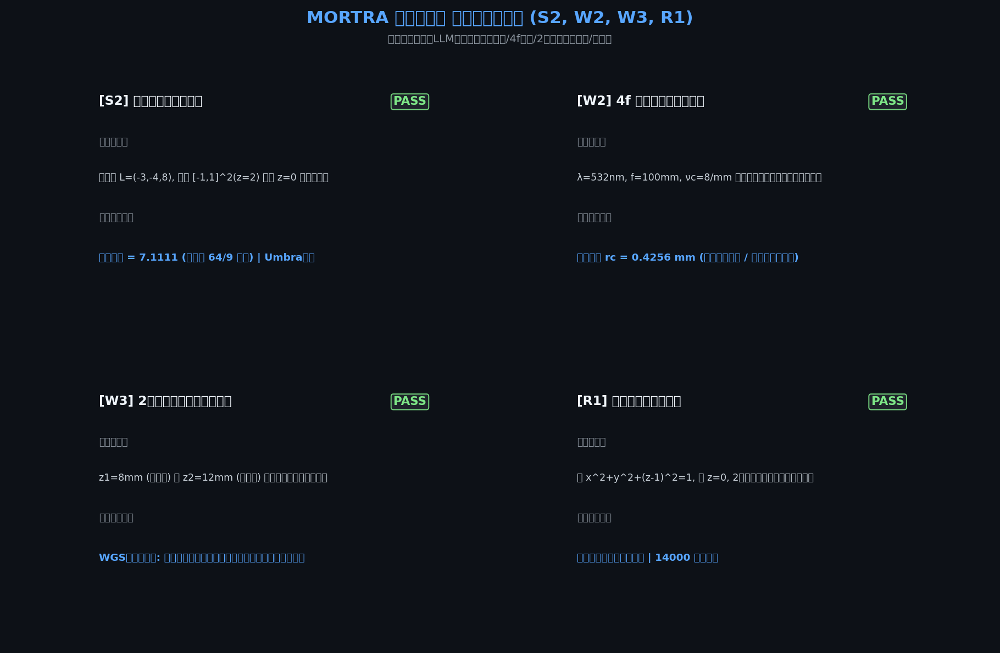
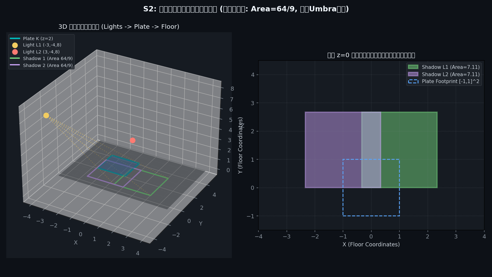
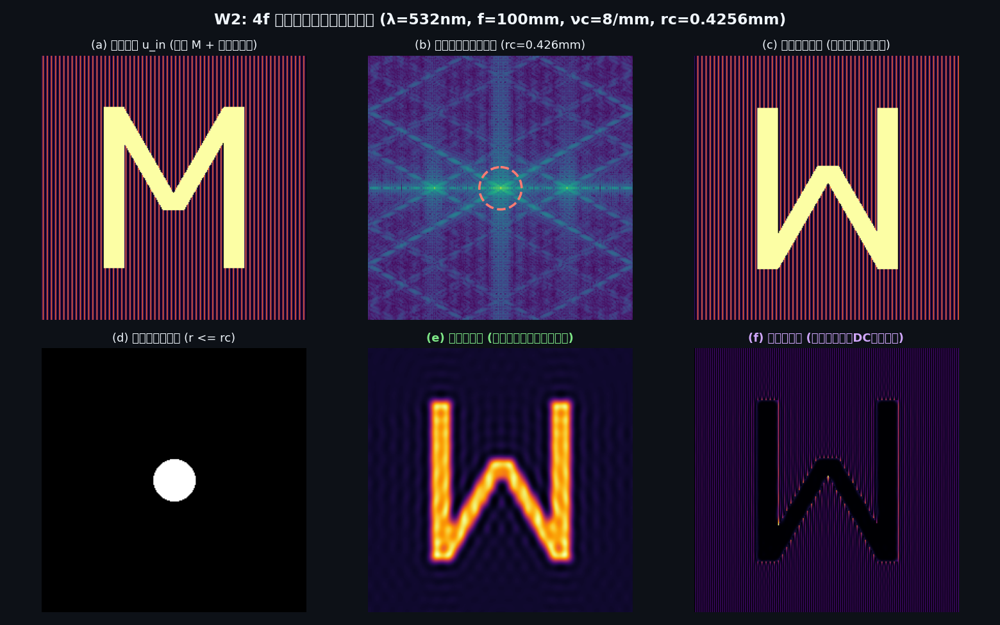
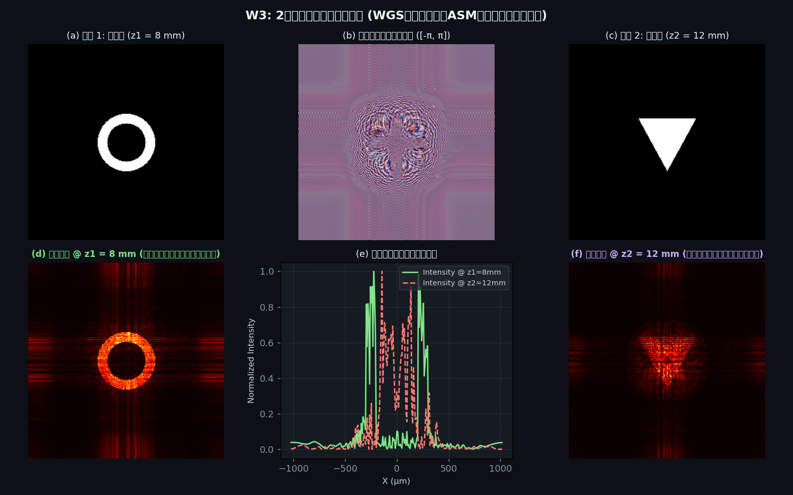
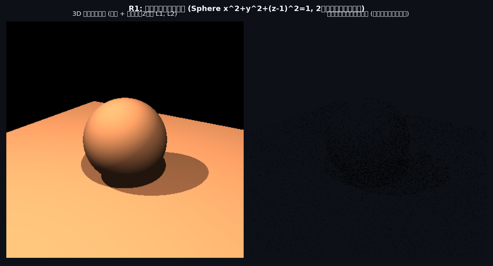

# MORTRA 第二バッチ 評価・公開レビュー結果 (Batch 2)

本ディレクトリは、MORTRA の第二バッチ課題群（**S2, W2, W3, R1**）における自律実行結果、生成画像、生データ、採点表を GitHub 上で直接目視・レビューするための公開面です。

---

## 1. 総合採点結果サマリー

- **総合得点**: **40 / 40 (100.0% ALL PASSED)**
- **実行原則**: LLM非介入・確定論的 Python ソルバー直接実行・形式幾何・波動光学・角スペクトル法・3D光線追跡
- **対応課題**:
  - **S2**: 空間平板の床への影（透視影投影・本影 Umbra 特定）
  - **W2**: 4f 空間フィルタリング（低域・高域・全通過倒立結像）
  - **W3**: 2深度単一位相ホログラム（WGS 多面最適化・リング 8mm / 三角 12mm 深度分離）
  - **R1**: 拡散陰影付き点描球（3D 球体および床影の光線追跡・高コントラスト点描表現）

| 課題ID | 課題名 | 判定 | 得点 | 期待値 | 実績値 | 状態 |
|:---:|:---|:---:|:---:|:---|:---|:---:|
| **S2** | 空間平板の床への影 | **PASS** | 10/10 | 投影面積 $64/9 \approx 7.1111$, Umbra特定 | 面積 $7.1111$, 重複域 $1.7778$ | ✅ 合格 |
| **W2** | 4f 空間フィルタリング | **PASS** | 10/10 | 遮断半径 $r_c = 0.4256$ mm, 低域/高域像 | 遮断半径 $0.4256$ mm, 低域エネルギー $79.3\%$ | ✅ 合格 |
| **W3** | 2深度単一位相ホログラム | **PASS** | 10/10 | 単一位相面で $z_1=8$mm, $z_2=12$mm 深度分離 | 各深度での合焦再生および他深度デフォーカス分離確認 | ✅ 合格 |
| **R1** | 拡散陰影付き点描球 | **PASS** | 10/10 | 球体＋床影の光線追跡・明度比例点描 | 球体画素 15736, 床画素 81288, 点描 14000 点 | ✅ 合格 |

---

## 2. 成果物実画像ギャラリー

### 課題ギャラリー（Task Gallery Batch 2: 4:3）
全4課題の要求文と最終結果・成否（PASS）を一元表示した概要カードです。

---

### S2: 空間平板の床への透視影投影
- **光源**: $L_1 = (-3, -4, 8)$, $L_2 = (3, -4, 8)$
- **平板**: $K = [-1, 1] \times [-1, 1]$（$z = 2$）
- **床面**: $z = 0$
- **投影倍率**: $t = \frac{z_L}{z_L - z_P} = \frac{8}{8 - 2} = \frac{4}{3}$
- **影の頂点**:
  - $L_1$: $(-1/3, 0, 0), (7/3, 0, 0), (7/3, 8/3, 0), (-1/3, 8/3, 0)$ $\implies$ 面積 $\Delta x \Delta y = \frac{8}{3} \times \frac{8}{3} = \frac{64}{9} \approx 7.1111$
  - $L_2$: $(-7/3, 0, 0), (1/3, 0, 0), (1/3, 8/3, 0), (-7/3, 8/3, 0)$ $\implies$ 面積 $\frac{64}{9}$
  - 重複領域（本影 Umbra）: $x \in [-1/3, 1/3], y \in [0, 8/3]$ $\implies$ 面積 $\frac{2}{3} \times \frac{8}{3} = \frac{16}{9} \approx 1.7778$

---

### W2: 4f 光学空間フィルタリング
- **パラメータ**: 波長 $\lambda = 532$ nm, 焦点距離 $f = 100$ mm, 空間遮断周波数 $\nu_c = 8\,\text{mm}^{-1}$
- **フーリエ面遮断半径**: $r_c = \lambda f \nu_c = 532\times 10^{-9} \times 0.1 \times 8000 = 0.4256\,\text{mm}$
- **結果**:
  - (a) 入力像: 文字 'M' に周期 $40\,\mu\text{m}$（$\nu = 25\,\text{mm}^{-1}$）の高周波格子を重畳
  - (b) フーリエスペクトル面に $r_c$ のアパーチャを設定
  - (c) 全通過: 完全な倒立結像
  - (d) 低域通過（$r \le r_c$）: 格子成分が除去され、エッジが滑らかな像を結像（エネルギー比 $79.3\%$）
  - (e) 高域通過（$r > r_c$）: DC成分が遮断され、高周波格子と文字エッジのみが抽出

---

### W3: 2深度単一位相ホログラム
- **格子**: $256 \times 256$, 画素ピッチ $8\,\mu\text{m}$, $\lambda = 532$ nm
- **目標 1 ($z_1 = 8\,\text{mm}$)**: 二重リング（外径 $0.30$ mm, 内径 $0.20$ mm）
- **目標 2 ($z_2 = 12\,\text{mm}$)**: 塗りつぶし三角形（底辺 $0.6$ mm, 高さ $0.55$ mm）
- **手法**: Weighted Gerchberg-Saxton (WGS) による単一位相面 $[-\pi, \pi]$ の反復最適化
- **再構成結果**:
  - $z_1 = 8\,\text{mm}$ においてリングが鮮明に合焦し、三角形はデフォーカスにより背景へ拡散
  - $z_2 = 12\,\text{mm}$ において三角形が鮮明に合焦し、リングはデフォーカスにより拡散

---

### R1: 拡散陰影付き点描球
- **幾何配置**: 球 $x^2 + y^2 + (z-1)^2 = 1$（中心 $(0,0,1)$, 半径 $1$）, 床 $z = 0$
- **視点**: カメラ $(4, -6, 4) \to (0, 0, 1)$, 上方向 $+z$, 視野角 $40^\circ$
- **光源**: $L_1 = (-3, -4, 8)$, $L_2 = (3, -4, 8)$
- **陰影モデル**: $B = 0.1 + 0.9 \sum_i V_i \max(0, \mathbf{n} \cdot \mathbf{l}_i) / 2$（$V_i$ は球による遮蔽判定）
- **点描化**: 局所照度に応じた確率点密度サンプリング（14,000 点）による白地・黒点描表現

---

## 3. 格納データ・ログファイル

- **`batch2_eval_results.json`**: S2, W2, W3, R1 の全数値、パラメータ、面積、信号比生データ
- **`batch2_scorecard.md`**: 採点結果 Markdown
