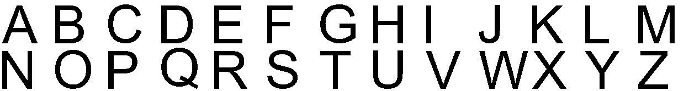
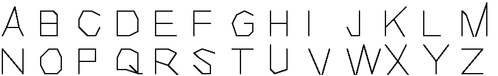

# Reading the alphabet: the inverse of drawing, decided by the fragment

Repository: `corcondor/mortra`. Branch: `codex/operation-contracts-20260918`.
Base: `ed9d6cf`.

## 0. The question that started it, answered first

**Has MORTRA ever read a character by itself? No.** Before this work it had not,
and the repository says so in two places: `MORTRA-QUERY-FIDELITY-AND-PRODUCTION-CLOSED-LOOP-20260902.md`
records that "OCR of images and PDFs is unimplemented", and
`MORTRA-PUBLIC-PRODUCTION-CLOSED-LOOP-20260902.md` names image OCR as the gap in
the next public version. What the repository *does* contain is two readers that
are not MORTRA at all and are not used here:

* `worker/backend/geometry_diagram_grounder.py` builds a letter image from
  OpenCV's bundled Hershey font and finds it with `cv2.matchTemplate` — a reader
  that is handed the shape of the letter in advance;
* `math_os_prototype/x_math_analyzer.py` calls `pytesseract`.

Neither is imported by anything in this work, and a test asserts it
(`test_the_reading_path_imports_no_optical_character_recognition`). The previous
round's own record said plainly that recognition there was "matching one
outline's relations against another's, not naming a character". This round names
the character.

## 1. What was built

Three modules and one script.

| file | what it is |
|---|---|
| `math_os_prototype/geometry_raster.py` | the measurement layer, deliberately **not** MORTRA: bitmaps, a round nib and a square nib, components, holes, Zhang–Suen thinning, the skeleton graph, spur pruning, the polyline cut, a deterministic ragged edge |
| `math_os_prototype/geometry_reading.py` | where the claims start: corners **constructed** by `intersection_ll`, one snap, then a description made of the fragment's relations |
| `math_os_prototype/geometry_alphabet.py` | twenty-six straight-stroke capitals in two styles, the drawing side, and the coordinate control |
| `scripts/run_alphabet_reading.py` | the run: 338 images, four readers, the ablations, the typefaces |

The alphabet is **straight-stroke**, because a circular arc is not rational and
the fragment is exact over QQ. B, O and S are polygons. That is a real
restriction, stated rather than hidden.

## 2. The pipeline, and the one line that matters

```
bitmap → clean → components, holes → thin → skeleton graph → straight pieces
                                                                     ↓
                  description ← snap ← corners = intersection_ll of those pieces
                       ↓
        nearest of the twenty-six descriptions built from the definitions
```

**A corner is never read off the image.** Thinning rounds a corner, so the
pixels on either side of one do not lie on the strokes that lead into it. Each
straight part of a chain is taken from two pixels well inside it, with a margin
dropped at each end, and the corner is then **where those two lines meet** —
`execute_primitive("intersection_ll", …)`, the fragment's own. A three-way
junction is the same construction. A free end is its line carried out to where
the ink stops. For the letter R at 72px that is 4 corners and 2 junctions built
by intersection and 2 free ends carried out.

**The inexactness is spent in exactly three places and then never again:**
thinning, the polyline tolerance, and the snap onto the lattice. After the snap
every geometric question goes to `atom_holds`, which decides it exactly over QQ
with the non-degeneracy prerequisites certified recursively.

**The description is relations, not coordinates.** For each recovered corner:
its degree, and which of the baseline, cap line, mid line and left edge it
stands on (`coll`). For each stroke: its direction against four reference
directions (`para`). Between strokes: `para`, `perp`, `cong`. Among corners:
`coll`. Every one decided by the certifier. Nothing in the description is a
coordinate — which is the whole point, and section 4 is what it buys.

## 3. What it reads

338 images. References built from the `ROMAN` definitions and from nothing else
— never from an image, never from `NARROW`.

| condition | relations | coordinates (control) |
|---|---|---|
| roman 48px, round nib | **26/26** | 24/26 |
| roman 72px, round nib, moved | **26/26** | 25/26 |
| roman 96px, bold | **26/26** | 26/26 |
| roman 36px, hairline | **26/26** | 26/26 |
| roman 72px, **square nib** | **26/26** | 26/26 |
| roman 72px, 1 edge cell in 16 flipped | 25/26 | 24/26 |
| roman 72px, 1 in 8 | 25/26 | 24/26 |
| roman 72px, 1 in 4 | 22/26 | 23/26 |
| **narrow** 48px | **26/26** | **4/26** |
| **narrow** 72px | **26/26** | **4/26** |
| **narrow** 96px bold | **26/26** | **3/26** |
| **narrow** 72px square nib | **26/26** | **3/26** |
| **narrow** 72px, 1 in 8 | 19/26 | 0/26 |
| **total** | **325/338** | 212/338 |

Of the clean ROMAN decisions, **25 of 26 are exact**: the recovered description
*equals* the reference outright rather than merely being nearest to it. The rest
are decided by taking the nearest description, which is a one-nearest-neighbour
rule over exactly-decided facts. There are no learned parameters and no training
data, and the predicted-letter histogram is flat (the most-predicted letter
accounts for 17 of 338), so nothing collapses onto one answer.

## 4. The experiment that decides whether the fragment is doing the work

The obvious accusation is that the relations are decoration — that the accuracy
lives in the thinning and the snap, and a coordinate comparison would do as
well. On `ROMAN` it very nearly does: 198/208 against 202/208. So the question
was put where it can be answered.

`NARROW` is the same twenty-six letters drawn with different proportions — bars
at different heights, bowls recut, widths changed. **No reference is ever built
from it.**

> **relations 123/130. coordinates 14/130.**

A description made of coordinates does not survive a change of proportion. A
description made of relations does, because a relation does not mention where
anything is. That is the claim this work can defend, and it is the one it makes.

What it does **not** claim is that the certifier beats every conceivable
baseline. The same relations could be computed with a cross product and a
comparison; what MORTRA supplies is the decision procedure — exact over QQ, with
prerequisites certified, with no epsilon — not the accuracy.

## 5. Two ablations, and a theorem that bites

**Remove the frame.** `coll`, `para`, `perp` and `cong` are invariant under
every similarity, rotations included. So a description built only from relations
among a glyph's own strokes *cannot* tell a letter from a turned copy of itself.
Measured: with the frame removed the descriptions of **N and Z become equal**,
and so do **H and I**; accuracy falls 325/338 → 280/338. Orientation is supplied
entirely by incidence against the normalising box. This is a property of the
predicate set, not a defect of the code, and it is stated here before anyone
else states it.

**Remove the relations.** Holes, corners, strokes and degrees alone — the part
that is counted rather than decided — give 187/338.

## 6. Letters this repository did not draw

The strongest check available: A–Z rasterised from real font files at 96px and
read with the same twenty-six descriptions, which were built from straight-stroke
definitions. Pillow reads the font and draws the letter; the reader is given the
cells. These typefaces have curves and are **out of scope**.

| typeface | read | what it got wrong |
|---|---|---|
| Arial | **21/26** | I→K, J→N, K→C, R→P, S→G |
| Consolas | 18/26 | C→U, J→W, K→X, N→U, O→G, Q→G, V→N, W→J |
| Calibri | 18/26 | C→U, I→K, J→V, K→H, M→C, O→S, P→M, Q→O |
| Times New Roman | **3/26** | collapses onto I |

Times New Roman is the informative failure: every serif is a extra branch on the
skeleton, the stroke graph fills with junctions, and the description no longer
resembles any letter — so it lands on the sparsest one. Serifs break this reader,
and nothing was done to hide that.




The second picture is what the reader ended up holding: exact rational corners,
joined by straight strokes, built out of the pixels by `intersection_ll`.

## 7. What is not claimed

* **MORTRA does not find the ink.** Binarisation, the cleaning rule, connected
  components, hole counting, Zhang–Suen thinning, spur pruning and the polyline
  cut are integer image processing, and they are what decides *where the strokes
  are*. That is the largest non-MORTRA component and it is named first.
* The bounding box, the normalisation and the snap are ordering and rounding,
  which the equality fragment cannot express. **All of the tolerance to
  measurement noise lives in the snap.**
* `geometry_ink.on_closed_segment`, used when the reference arrangement decides
  whether a crossing lies on both strokes, is a Python inequality on exact
  rationals — not a certified atom. Its existential-equational justification
  needs real witnesses, which the rational model does not always supply.
* The match is nearest-description, a one-nearest-neighbour rule. What is true
  is that there are no learned parameters and no training data.
* The alphabet is straight-stroke. A typeface with real curves is out of scope;
  section 6 is a probe, not a benchmark.
* One rule constrains the letter shapes and it is typographic: no two junctions
  stand closer than two units. A feature shorter than the stroke is thick cannot
  be resolved from ink by anything.
* Every image except section 6 is rendered by this repository. Two nibs, a
  ragged edge and a second set of proportions widen that; no scan and no
  photograph was read.

## 8. Running it

```
python scripts/run_alphabet_reading.py --output reports/alphabet
python -m pytest tests/test_geometry_alphabet.py
```
