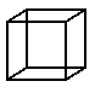
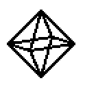
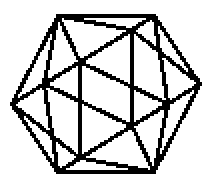

# A sign kernel, letters built from three points, and the fragment in space

Repository: `corcondor/mortra`. Branch: `codex/operation-contracts-20260918`.
Base: `461ebd2`.

Ordering is what the letters, the figures, the shadows and the solids all need,
and the equality fragment does not have it. Every one of them has therefore been
smuggling it in as a Python `<=`: whether a pixel is near enough to a stroke,
whether a crossing lies on a segment rather than on its line, whether a point
stands between the light and what it would light. This round builds the smallest
thing that fixes that, and then puts three things on top of it.

## 1. The kernel

> A rational `a` is non-negative **if and only if** there are rationals
> `x, y, z, w` with `a = x² + y² + z² + w²`.

Write `a = p/q` in lowest terms; then `a = (pq)/q²`, `pq` is a non-negative
integer, and Lagrange's four-square theorem applied to `pq` and divided by `q`
gives the four rational squares. The converse is immediate. The name is *not*
"Lagrange for rationals" — Lagrange is about integers; the field-theoretic
statement is that **the Pythagoras number of QQ is 4**, and 4 is sharp: 7 is a
sum of four rational squares and not of three.

So **an order fact is an existentially quantified equation** — the fragment's own
language — and a certificate for one is four numbers.

**Checking is comparison-free; finding is not.** Verifying a certificate is one
addition and one `==`. Finding the four numbers is a search full of comparisons.
Measured: a decision is `1.7 µs`, a certificate `74 µs`, forty-three times more.
The loops still run the comparison and the module says so in its first
paragraph. The claim is not that the comparison is gone; it is that every order
fact the system leans on can be handed a witness that turns it into an equation.

**The number of squares is a dimension.** The least number of rational squares
summing to `a` is exactly the least `d` for which `√a` is a distance between two
points of `QQᵈ`.

| `a` | squares | meaning |
|---|---|---|
| 4, 169/4 | 1 | a rational number |
| 2, 5, 1/2 | 2 | a distance in the rational **plane** |
| **3**, 6, 23/5 | **3** | a distance in rational **space**, and not in the plane |
| 7, 7/9 | 4 | no distance between rational points of space at all |

The arithmetic criterion for two — every prime ≡ 3 (mod 4) divides `uv` to an
even power — agrees with the search on every value tested.

**It stops at QQ, and refuses rather than pretending.** In `QQ(√3)`, which
`geometry_quadratic` opts into, a sum of squares must be positive under *both*
real embeddings; `4√3` is not, so that true ordering fact has no certificate of
this kind. `sign` raises on a non-rational argument and names the example.

## 2. What the kernel turns into a construction

**An inked cell.** "P is within r of the segment AB" is
`∃ Q X: on_closed_segment(Q,A,B) ∧ |PX| = r ∧ Q in the closed disk about P
through X`. Q is the fragment's own `foot`; X is `P + (r,0)`. Both are rational,
always — so every inked cell of every letter in this repository has a witness in
QQ. And the *failure* case needs the other half: that the witness tried was the
best there is. That is an identity, not an argument:

```
|PQ|² − |PF|² = |AB|² (t − t₀)²        one square, certified
```

**A point in a disk.** Three layers, kept apart, because conflating them would
be the easiest lie here:

* membership **means** `∃U V: midp(P,U,V) ∧ cong(O,U,O,A) ∧ cong(O,V,O,A)`;
* it is **decided** by the four-square certificate on `|OA|² − |OP|²`;
* the pair `U, V` **illustrates** it, tagged with the field it needed.

The second and third do **not** always agree over QQ. For `O=(0,0)`, `A=(2,1)`,
`P=(1,1)` the point is inside and there is **no rational pair** — the witness
lives in `QQ(√(3/2))`. A test asserts exactly that. And soundness is itself an
identity, checked rather than asserted:

```
|U − V|² = 4 (|OA|² − |OP|²)     given midp(P,U,V) and the two congs
```

**A shadow.** "X is occluded" is `∃P: on_closed_segment(P,A,B) ∧ P strictly
between L and X`, and the witness is `intersection_ll(L,X,A,B)` — a primitive.
Two lines meet in at most one place, so that witness is the only candidate.

## 2a. Where it changed an answer, not just the justification

The fair question about a kernel like this is whether anything downstream gets
*more correct*, or only better dressed. Mostly the latter: every `<=` in the
rendering and reading path was already applied to exact rationals, and
certifying it changes no pixel and no letter. But auditing the pipeline against
the kernel turned up **four ordering decisions that were wrong**, and all four
are fixed in this commit.

| site | what was wrong | effect |
|---|---|---|
| `geometry_ink.occluded` | when the light lies **on the occluder's own line**, `intersection_ll` refuses two coincident lines, and the code took the refusal as "not occluded". A light placed along the occluder cast **no shadow at all** | **the boolean was wrong.** Now the collinear case is decided as an interval overlap, exactly |
| `geometry_ink.shadow_polygon` | exact rational corners were sorted by `atan2(float(...))`, and the shoelace area that follows is order-dependent | **the outline and the area could be wrong.** Now sorted by a half-plane test and the sign of a cross product, with no float |
| `geometry_raster.prune` | the branch-length test went through a float square root of float centroids | **a branch of a skeleton could be cut or kept by rounding**, which changes the recovered glyph and so the letter. Now compared as exact squares |
| `geometry_reading.recover` | `round(float(Fraction))` for the junction radius, the prune length and the margin could cross a rounding tie | same. Now the exact value is rounded |

The first two were latent bugs in the shadow work; the second two were mine,
introduced in the alphabet round. The alphabet evaluation was re-run after the
fix and the numbers are reported again in `reports/alphabet/result.json` —
unchanged on every condition.

## 3. Universal statements: non-negative at every configuration

Certified by an exact sum of squares over QQ, verified by expansion.

| statement | certificate |
|---|---|
| Cauchy–Schwarz in the plane | `(ad − bc)²` — one square |
| Lagrange's identity in space | three squares: the components of the cross product |
| `\|PQ\|² + \|QR\|² ≥ \|PR\|²/2` | `½(a−c)² + ½(b−d)²` |
| `a² + b² ≥ ab` | `(a − b/2)² + ¾a²` |

The layer certifies non-negativity and never refutes it: a failure to find a
decomposition is a failure of the search.

## 4. The letters, built rather than typed

The alphabet used to be a table of coordinates someone wrote down. Now it starts
from three points —

```
o = (0,0)      ex = (1,0)      ey = (0,1)
```

— and **82 steps of `mirror` and `midpoint`** produce all 85 lattice points, with
a program that replays from those three alone. `mirror(a,b) = 2b − a` walks an
axis; `(m,n) = mirror(o, midpoint((m,0),(0,n)))` leaves it. Every corner of every
letter in both styles is the output of a primitive, and the test compares the
replayed table against the old one: identical.

Why three seeds and not two: from two points nothing ever leaves their line —
200 constructions tried, 5 points ever exist, none off the line — because every
primitive commutes with the reflection in that line and the reflection fixes both
given points.

`A` is now `[[o, p2_6, x4], [p1_3, p3_3]]`.

## 5. Space

Points in `QQ³`; the plane's predicates plus `coplanar`; eight primitives, every
witness a rational function.

**The same obstruction, one dimension up.** Every primitive is defined by metric
conditions, so each commutes with every isometry — a reflection *in a plane*
included. Hence **from three points nothing ever leaves their plane**: 260 points
built, 300 constructions tried, none off it. A fragment does not become
three-dimensional by being handed three coordinates; it becomes so at the fourth
point.

Two corrections that belong with that, because the earlier documents in this
repository were loose about them:

* the theorem is about the **equivariance of this list of primitives**, not about
  arithmetic. Rational rotations are plentiful in both dimensions — `(3/5, 4/5)`
  turns the plane. "No rotation is rational" would be wrong.
* the reflection has to be in a **plane**. The plane fragment's `reflect` in a
  line has determinant −1 in two dimensions and **+1** in three, where it is a
  half turn; quoting it here would invert the argument.

**And one thing is free here that the plane had to pay for.** A rational
equilateral triangle does not exist in the plane — the shoelace sum makes a
rational triangle's area rational, while an equilateral one of squared side `s`
has area `√3·s/4` — which is why `geometry_quadratic` adjoined `√3`. In space:

```
(0,0,0)   (1,1,0)   (1,0,1)        all three squared edges = 2
```

The sign kernel predicts it exactly: `√3` needs **three** squares, and three
squares means *a distance between rational points of space and not of the plane*
— it is the diagonal of the unit cube.

**The five solids.**

| solid | field | vertices | edges congruent | convex |
|---|---|---|---|---|
| tetrahedron | QQ | 4 | yes | **certified** |
| cube | QQ | 8 | yes | **certified** |
| octahedron | QQ | 6 | yes | **certified** |
| icosahedron | **QQ(√5)** | 12 | yes | — |
| dodecahedron | **QQ(√5)** | 20 | — | — |

Convexity is certified face by face: for each face, every other vertex gives the
same sign of `det(b−a, c−a, v−a)`, and each sign carries a sum-of-squares
certificate.

Why two of them leave QQ — and this is a theorem about *every* edge length and
orientation, not about these coordinates. Suppose the twelve vertices lie in
`K³`. Move the centroid, a `K`-point, to the origin. The rotation group is `A₅`
and contains an element of order five; three independent vertices are a `K`-basis
it maps to `K`-vectors, so it lies in `GL₃(K)` and its trace is in `K`. The trace
of a turn through `t` is `1 + 2cos t`, and for a fifth of a turn that is
`(1±√5)/2`. So `√5 ∈ K`. The same fact from the other side is **Niven's
theorem**: a rational rotation has rational trace, so the only finite orders in
`SO(3,QQ)` are 1, 2, 3, 4, 6 — **never 5**.

**What the kernel buys in space.** Inside a tetrahedron is four sign
certificates and no division at all (the barycentric ratios are replaced by the
products `V_X · V`). Which faces an eye sees is one sign per face: a cube seen
from far along an axis shows exactly one.






## 6. What it costs

| | |
|---|---|
| one sign decision | 3.2 µs |
| one four-square certificate | 91 µs — **×29** |
| one disk witness, with its three atoms | 31 ms |
| one inked cell, fully certified | 85 ms |

Reading, at three sizes, on a quiet machine:

| glyph height | inked cells | drawing (26) | reading (26) | per letter | cells/s | correct |
|---|---|---|---|---|---|---|
| 36 px | 4 943 | 1.19 s | 5.36 s | 0.206 s | 922 | 26/26 |
| 72 px | 24 172 | 4.10 s | 6.28 s | 0.242 s | 3 848 | 26/26 |
| 144 px | 97 052 | 17.58 s | 12.22 s | 0.470 s | 7 946 | 26/26 |

Reading is sublinear in the pixels because the work is in the skeleton, not the
ink; drawing is linear and overtakes it by 144 px.

The witness search is `O(√N)` in the numerator times the denominator, and the
sweep shows it plainly: `10⁷ → 0.3 ms`, `10⁸ → 0.8 ms`, `10⁹ → 2.4 ms`,
`10¹⁰ → 16.8 ms`. Past `SEARCH_LIMIT` the kernel refuses the witness and still
returns the sign.

A certificate for every cell of a 72 px alphabet would be about 2 000 s against
4 s of drawing. That is why the loops run the comparison, and it is stated
rather than hidden.

One measurement was wrong before this table and is worth recording: the first
version timed reading as "a drawing-and-reading pass minus a separately-timed
drawing pass", which measures the difference between two drawing passes as much
as anything else, and gave 0.08 s per letter. The images are now drawn once and
kept.

## 7. What is not claimed

* **The comparison is not gone.** `sign` is a comparison, the search for the four
  squares is full of comparisons, and every per-pixel loop still runs one. What
  the kernel supplies is a witness that turns the answer into an equation, and
  *checking* that witness uses no order at all.
* The theorem makes a certificate exist for every true instance, so its existence
  proves nothing about the instance. What it buys is that the fact can be stated
  in the fragment's language and checked in it.
* The universal layer certifies and never refutes. It also only ever handles
  short identities: a tight geometric inequality sits on the boundary of the
  sum-of-squares cone, and nothing here searches for a Gram matrix there.
* `geometry_ink.on_closed_segment` still decides its collinearity half with a
  raw cross product rather than with `atom_holds("coll", …)`. It is exact and it
  is a bypass of the certifier, and it is on the per-pixel shadow path, which is
  why it has not been changed.
* The three-dimensional fragment is new code and shares no certifier with the
  plane one; its predicates are written there rather than derived.
* The solids are checked, not classified. The impossibility for the icosahedron
  and the dodecahedron is argued above and is not machine-checked; what the run
  checks is that the traces of a fifth turn are irrational and that the standard
  coordinates are not rational.
* In three dimensions `perp` does **not** mean the lines meet — skew lines
  satisfy it. A test records that, so no plane theorem gets imported by analogy.
* The letters are built by the fragment from three points. *Which* twenty-six
  shapes to build was still a human choice.

## 8. Running it

```
python scripts/run_sign_and_space.py --output reports/sign-and-space
python -m pytest tests/test_geometry_sign_and_space.py
```
