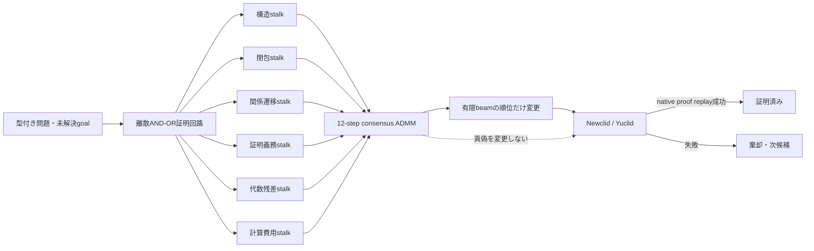

# MORTRA 微分可能証明探索回路 実験報告

日付: 2026-08-18

## 要旨

MORTRAの厳密な記号推論器を変更せず、小型の微分可能回路を補助構成の探索順位にだけ接続した。問題ID、点名、数値、正解、既知補助点、定理名、構成族名を入力しない。6個の局所stalkが型付き探索状態を観測し、12回のscaled consensus ADMMで優先度を合意する。数学的真偽は従来どおりYuclid/Newclidのnative certificate replayだけが決める。

51パラメータ版に加え、局所数学回路を固定して6信頼度・`rho`・riskだけを学ぶ8パラメータ版を実装した。8パラメータ版は4問題leave-one-problem-outの未解決接頭辞平均順位を16.0から11.75へ改善したが、閉包順位6.75には届かなかった。実探索では51パラメータ版が未見`2020_p1`を1184経路で解いた一方、8パラメータ版は3200経路でも解けなかった。厳密順位を半分保存するポートフォリオだけが従来と同じ288経路でnative proofを得た。したがって「微分可能回路単独で探索が改善する」という仮説は棄却し、単独では既定化しない。

## 原理



### 真理面と制御面

真理面は離散である。命題は型付きground atom、推論はAND-OR gate、受理条件はnative certificateの再生成功である。連続値は候補順序だけを決め、命題を真にできない。

局所stalk `i` の特徴を `f_i in [0,1]^d_i`、生の学習重みを `theta_i` とする。局所提案は

```text
w_i = softplus(theta_i)
q_i = sigmoid(b_i + <w_i, f_i> / sum(w_i))
```

である。各特徴は「大きいほど局所的な進捗が大きい」向きに符号化したため、局所回路は単調である。

stalk信頼度を `tau_i = softplus(alpha_i) + 0.05` とし、共有効用 `z` に対してscaled consensus ADMMを12回展開する。

```text
x_i <- (tau_i q_i + rho (z-u_i)) / (tau_i+rho)
z   <- mean_i (x_i+u_i)
u_i <- u_i + x_i-z
```

最終順位は `z - kappa std(q)` で、`kappa <= 0.25`に制限した。初期実験ではこの上限がなく、小標本に不一致ペナルティが過適合したためである。

## 方法

### 入力特徴

- 型付き構成rank 17成分
- goal/all deduction、target relation、near-goal relation
- relation transition potential、channel coverage
- frontier距離、goal support overlap、witness数
- backward obligation数、open demand数
- Wu/ARのgoal支持、閉包、残差支持、L1残差、既知rank
- 実行時間、deduction cost、状態の有効性

除外した入力:

- 問題ID・問題名
- 点名・entity label
- 問題中の数値
- 正解・dataset auxiliary clause・既知補助点
- theorem名・construction family名

点・規則を改名しても特徴とscoreが完全一致するテストを置いた。古いtraceにAR列がない場合は「残差ゼロ」ではなく中立値0.5とする。

### 学習と分割

native proofで解けた8問題の探索traceを使用した。beam制御が実際に必要なのは証明完了前だけなので、学習対象を2段証明の第1段に限定した。

固定分割:

- train: `2009_p2`, `2010_p2`, `2015_p3`
- calibration: `2008_p6`。1段で完了するため非終端学習群は0
- frozen held-out: `2020_p1`

さらに4個の2段問題を順番に未見へ回すleave-one-problem-outを実施した。各問題の候補数による偏りを避けるため、pairwise logistic lossは問題ごとに総重みを等しくした。

比較:

1. 型付き構造rank
2. deduction closure
3. 従来のAR residual/frontier Pareto
4. 微分可能consensus
5. random 200試行平均

### 回路の複雑度ablation

| 回路 | 学習値 | 数学的内容を学習するか |
|---|---:|---|
| full | 51 | 局所特徴重み37、bias 6、信頼度6、`rho`、risk |
| trust-only | **8** | しない。局所回路を固定し、信頼度6、`rho`、riskのみ |

シリアライズ形式は共通なので両者とも51値を持つが、trust-onlyで局所重み37とbias 6は固定値でありoptimizerへ渡さない。このablationは「解法特徴の学習」と「協調だけの学習」を区別する。

## 結果

### 未解決接頭辞のleave-one-problem-out

| 方法 | 平均順位 | MRR | Hit@8 |
|---|---:|---:|---:|
| 構造rank | 16.75 | 0.1018 | 25% |
| closure | **6.75** | **0.2232** | **75%** |
| AR/frontier Pareto | 8.00 | 0.1686 | 50% |
| 微分可能consensus 51値学習 | 16.00 | 0.0752 | 25% |
| 微分可能consensus 8値学習 | 11.75 | 0.1145 | 50% |
| random平均 | 24.70 | 0.0518 | 0% |

微分可能回路はrandomより良いが、厳密なclosure/Paretoを超えなかった。

### 固定held-out `2020_p1`

正しい第1補助構成 `intersection_ll(o,c,a,y)` の104候補中順位:

| 方法 | 順位 |
|---|---:|
| closure | **2** |
| AR/frontier Pareto | 3 |
| 構造rank | 16 |
| 微分可能consensus 51値学習 | 18 |
| 微分可能consensus 8値学習 | 18 |
| random平均 | 49.465 |

### 実Newclid探索

全条件でdataset auxiliary clause、問題ID分岐、LLMを使用していない。native artifact verifierも通過した。

| 制御 | 解けたか | 評価経路 | 相対量 |
|---|---:|---:|---:|
| 既存厳密順位 | yes | 288 | 1.00x |
| 厳密1/2 + 51値学習回路1/2 | yes | 288 | 1.00x |
| 51値学習回路のみ | yes | 1184 | **4.11x** |
| 8値学習回路のみ | **no** | 3200 | 11.11x以上 |
| 厳密1/2 + 8値学習回路1/2 | yes | 288 | 1.00x |

成功した条件が発見した構成は次である。

```text
intersection_ll(o,c,a,y)->e
intersection_ll(a,e,b,c)->f
```

回路の純Python推論は10,000 recordで0.863秒、約86.3 microseconds/recordだった。51パラメータなので、計算資源ではなく学習信号の不足がボトルネックである。

## PDCA

1. **初期回路**: 終端状態を含む9群で学習し、未見第1段は61位。完成証明の識別へ偏った。
2. **非終端限定**: 第1段だけに限定し18位。改善したがclosureを超えない。
3. **欠損意味修正**: 古いtraceのAR欠損を中立値へ変更。schema shiftを除いたが18位。
4. **不一致上限**: `kappa <= 0.25`として小標本での発散を防止。順位改善はなし。
5. **live比較**: 回路単独でも証明したが4.11倍の経路。厳密半分を保存するportfolioは回帰なし。
6. **協調限定ablation**: 局所回路を固定し、学習値を51から8へ削減。LOPO平均順位は11.75へ改善したが、live探索は3200経路で未解決。
7. **8値portfolio**: 厳密探索を半分保存すると288経路で成功。回路の利得ではなく、能力保存機構が機能した結果である。

失敗結果を消さず、最終採否をlive searchで決めた。

## 考察

### 支持されたこと

- 厳密論理回路と微分可能制御を分離して実装できる。
- 51パラメータの回路をNewclidの実補助構成探索へ接続できる。
- 回路が誤った順位を出してもnative proof以外を受理しない。
- 問題名、点名、数値、既知解を使わず未見問題の正しい証明へ到達できる。
- 能力保存型portfolioなら既存288経路を維持できる。
- 局所数学回路を固定したまま、協調係数だけを微分可能にできる。

### 支持されなかったこと

- 微分可能回路単独が既存の厳密順位より効率的である。
- 3個の非終端学習群で51パラメータを十分に同定できる。
- ADMMを入れるだけでSakanaAI論文と同等の自己組織化利得が生じる。
- パラメータを51から8へ減らすだけでlive探索が改善する。

### 原因

主因はパラメータ数そのものではなく、独立な「未解決状態 -> 後に証明へつながった構成」のtraceが3群しかないことである。8値版でも未同定であり、単純な容量削減だけでは解決しなかった。終端proofを大量に混ぜると目的がずれ、同一問題のseed違いを増やすと問題構造の擬似反復になる。したがって解法暗記を避けたまま改善するには、dev問題群で多数の未解決義務を生成し、entity renaming・数値置換・同型商を保ったままproof-flowを収集する必要がある。

また、現在の回路は候補をYuclidで評価した後のbeam選択器である。compile/evaluation costそのものを減らすには、typed AND-OR回路のbackward demandを構成候補へ直接restrictionし、評価前の候補生成を制御する必要がある。

## 結論

採用する構造は引き続き次である。

```text
厳密な型付き論理回路
  + 小型微分可能制御
  + native certificate replay
```

ただし、今回の51パラメータ版も8パラメータ版も単独の既定探索器にはしない。51値版は未見問題を解けたが非効率で、より厳密に協調だけを学ぶ8値版は未見live探索に失敗した。現時点の採用対象は能力保存型portfolioだけである。

次の反証可能な実験は、frozen `2020_p1`を再調整に使わず、新しいdev問題から最低100個の非終端proof-flowを収集し、(a) 6-stalk固定平均、(b) 学習trustのみ8パラメータ、(c) 51パラメータ、(d) exact closure、を別の未見集合で比較することである。

## 再現

```powershell
python -B -m pytest worker/backend/test_differentiable_proof_controller.py -q
python -B scripts/experiment_differentiable_proof_controller.py --artifacts <8 trace files> --heldout-problem 2020_p1 --calibration-problem 2008_p6 --epochs 500 --cross-validate --architecture trust-only --output data/differentiable-proof-controller-trust-only-experiment-2026-08-18.json
python -B scripts/verify_newclid_construction_stalk_artifact.py --artifact data/differentiable-trust-only-live-2020-p1-2026-08-18.json.gz
python -B scripts/verify_newclid_construction_stalk_artifact.py --artifact data/differentiable-trust-only-portfolio-live-2020-p1-2026-08-18.json.gz
```

実装:

- `worker/backend/differentiable_proof_controller.py`
- `scripts/experiment_differentiable_proof_controller.py`
- `scripts/experiment_newclid_construction_stalk.py`
- `worker/backend/test_differentiable_proof_controller.py`
- `data/differentiable-proof-controller-live-summary-2026-08-18.json`

51値単独・51値portfolio・8値単独・8値portfolioの全探索traceとnative proofは`data/differentiable-*-live-2020-p1-2026-08-18*.json.gz`として圧縮保存した。検証器は通常JSONとgzipの両方を同じ条件で監査する。

## 一次資料

- Sakana AI, [Self-Organizing Multi-Agent Intelligence via Learned Sheaf-ADMM](https://arxiv.org/abs/2605.31005), official code commit `1e2b5d648361802234348b0b1a7fb3a222128e7d`
- Riegel et al., [Logical Neural Networks](https://arxiv.org/abs/2006.13155)
- Huang et al., [Scallop: From Probabilistic Deductive Databases to Scalable Differentiable Reasoning](https://arxiv.org/abs/2304.04812)
- Trinh et al., [Solving olympiad geometry without human demonstrations](https://www.nature.com/articles/s41586-023-06747-5)
