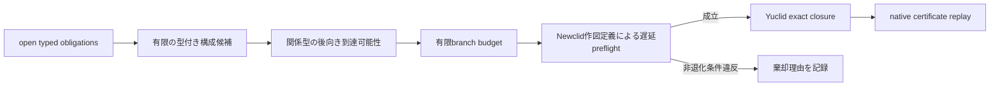

# MORTRA 型付き事前候補ゲート 実験報告

日付: 2026-08-18

## 要旨

MORTRAの補助構成探索で、Newclid/Yuclidへ候補を渡す前に無効な枝を除く型付きゲートを実装した。ゲートは二段からなる。

1. 現在のopen proof obligationへ、構成族の出力述語がNewclidの規則グラフ上で到達可能かを検査する。
2. Newclid自身の作図定義で候補を遅延構築し、非退化条件を満たさない枝をYuclid実行前に除く。

外部LLM、問題ID、正解、dataset auxiliary clause、既知補助点は使わない。5問題の同条件ablationでは、証明結果と証明経路を5/5で保持し、Yuclid評価枝を216本から154本へ28.7%削減し、実行時エラーを62件から0件へ減らした。一方、総実行時間は153.47秒から152.75秒で0.5%しか短縮しなかった。深さ2の追試では同じ証明を保持したが、174.03秒から179.89秒へ3.4%遅くなった。

したがって「無効な枝を証明前に除去できる」は支持されたが、「それだけで探索を高速化できる」は支持されなかった。

## 原理



関係型ゲートを

```text
R_goal = open obligationの述語集合
Reach^-(R_goal) = native Horn ruleを逆向きに閉包した述語集合
```

とする。構成族 `c` の宣言出力 `Out(c)` が既知なら、

```text
Out(c) intersection Reach^-(R_goal) = empty
```

のときだけ関係型不適合と判定する。出力宣言または到達可能性証拠がない場合はfail-openとし、証拠不足を「不要」の証明に使わない。

第2段は近似判定ではない。探索で実際に使うNewclidの同じ作図定義を小バッチ単位で構築し、要求される`diff`、`ncoll`、`npara`などが成立しない枝だけを除く。通過した問題オブジェクトは再構築せず、そのままYuclidへ渡す。

## 仮説

- H1: 実行可能性ゲートは、証明成否と証明経路を保持する。
- H2: 実行可能性ゲートは、Yuclidへ渡す枝と実行時エラーを減らす。
- H3: 枝削減により壁時計時間も短縮する。
- H4: 関係型の到達可能性だけでも候補を十分に削減できる。

## 方法

### 固定条件

- construction grammar: extended 32族
- per-family limit: 8
- branch limit: 64
- depth: 1
- workers: 8
- ranking: structural
- beam ranking: exact AR-residual Pareto
- obligation-guided: on
- seed: 0

対象は`2008_p6`, `2009_p2`, `2010_p2`, `2015_p3`, `2011_p6`の5問。各問で`gate=off`と`gate=combined`を同一条件で1回ずつ実行した。`2011_p6`は固定評価側として扱ったが、リポジトリには過去の探索artifactが存在するため、完全な未見問題とは主張しない。ゲート実装は問題名を入力として使用しない。

深さ2の証明保持追試には`2000_p6`を使い、branch 24、beam 8とした。

## 結果

### 深さ1の5問題

| 指標 | gate off | combined | 差 |
|---|---:|---:|---:|
| 証明結果・経路の一致 | - | **5/5** | - |
| Yuclid評価枝 | 216 | **154** | -62 (-28.7%) |
| 実行時エラー | 62 | **0** | -62 |
| 総時間 | 153.47 s | 152.75 s | -0.72 s (-0.5%) |

証明できた2問では経路も同一だった。

```text
2008_p6: foot(o,a,i2)->e
2015_p3: intersection_lc(a,f,h)->d
```

`2009_p2`では、関係型閉包だけでは256候補中256候補が残った。open obligationが6述語にまたがり、後向き規則閉包が主要な幾何述語をほぼ覆ったためである。その後の実行可能性ゲートは64候補中28候補を非退化条件違反として除去した。

### 深さ2追試

| 指標 | gate off | combined lazy |
|---|---:|---:|
| 証明 | yes | yes |
| 証明経路一致 | - | yes |
| Yuclid評価枝 | 152 | 145 |
| 実行時エラー | 10 | 0 |
| 時間 | **174.03 s** | 179.89 s |

証明経路:

```text
foot(i,z,x2)->d
reflect(t1,i,d)->e
```

## 考察

H1とH2は今回の範囲で支持された。棄却はNewclid自身の構成前提に基づくため、問題ごとの解法暗記ではない。異なる5問題で、実行時に失敗していた枝とpreflightで棄却した枝の数が一致した。

H3は支持されなかった。無効枝はYuclidの深い推論へ入る前に早く失敗しており、その失敗コストとpreflight構築コストが近い。深さ2ではpreflightの分だけ遅くなった。したがってこのゲートを高速化機構として既定化する根拠はまだない。

H4も支持されなかった。述語名だけの閉包は粗すぎる。`perp`や`cyclic`へ至る規則は多数あり、複数のopen obligationを合併するとほぼ全構成族が到達可能になる。次段では、述語名だけでなく、量化変数、既知点、穴の位置、引数対称性を保つtyped atom unificationが必要である。ただしこれは候補順位にまず使い、証明不能が厳密に示せない候補をhard rejectしてはならない。

## 結論

実装したゲートは、無効なCAS呼び出しを完全に除去し、証明能力を今回の5対と深さ2追試で保持した。しかし壁時計性能は改善していない。採用判断は次のとおり。

- artifact監査とエラー除去には採用可能。
- 高速化目的の既定値にはまだしない。
- 真理面は引き続きnative certificate replayだけに置く。
- 次はtyped atom単位の後向きrestrictionと、親状態からの増分構築を別々にablationする。

## 再現

```powershell
python -B -m pytest worker/backend/test_typed_geometry_stalk.py -q
python -B scripts/verify_candidate_gate_ablation.py --artifact data/candidate-gate-depth1-ablation-2026-08-18.json
python -B scripts/experiment_candidate_gate_ablation.py --python <newclid-python> --dataset <imo.txt> --yuclid-exe <yuclid> --runtime-path <boost-runtime> --problems 2008_p6 2009_p2 2010_p2 2015_p3 2011_p6 --output data/candidate-gate-depth1-ablation-2026-08-18.json --run-dir <trace-dir> --branch-limit 64 --beam-width 8 --max-depth 1 --max-workers 8
```

実装:

- `worker/backend/typed_geometry_stalk.py`
- `scripts/experiment_newclid_construction_stalk.py`
- `scripts/experiment_candidate_gate_ablation.py`
- `scripts/verify_candidate_gate_ablation.py`
- `data/candidate-gate-depth1-ablation-2026-08-18.json`
- `data/candidate-gate-depth2-followup-2026-08-18.json`
