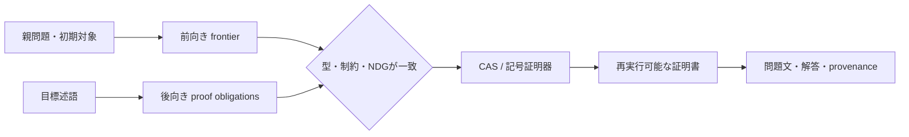
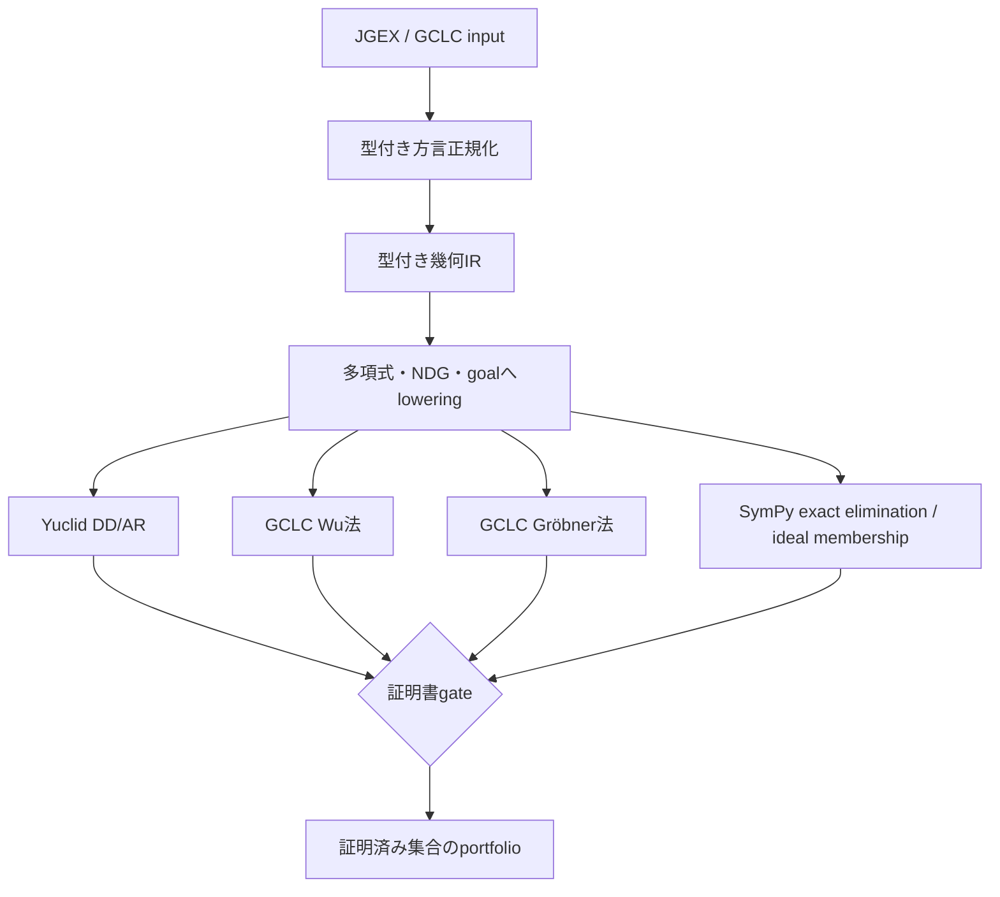

# MORTRA: 型付き幾何IRと厳密証明書ポートフォリオによる可追跡な記号推論

## LLMを用いないIMO-AG-30再現・拡張実験

- **版:** 研究準備稿 v0.1
- **日付:** 2026-08-16
- **実装:** MORTRA Project
- **査読状況:** 未査読

## 要旨

本研究は、数学問題を文章列として直接生成・処理するのではなく、型付き数学対象、
制約、構成射、証明義務へ変換し、記号推論器が返す証明書によって採否を決定する
MORTRAの幾何推論経路を検証した。外部LLM、問題ID分岐、答え参照、データセット付属の
補助構成を用いず、Newclid/JGEX入力を型情報で正規化した後、19種類の一般構成を
多項式方程式と非退化条件へloweringした。Yuclid all-ARの固定baselineはIMO-AG-30で
17/30だった。baseline未解決集合に厳密backendを適用し、`2008_p1a`、`2009_p2`、
`2012_p5`の3題について剰余0の再実行可能な証明書を得た。両経路の証明済み集合の
和集合である記号portfolioは20/30（66.7%）となった。

GCLC公式5例では、Wu法5/5、Gröbner法3/5、MORTRAによる独立exact replay 5/5を得た。
これは複数の記号手法の相補性を示すが、MORTRA単体またはNewclid単体で20/30を達成した
ことを意味しない。GitHub Actions上では、固定したNewclid commit、31テスト、4成果物の
改行正規化SHA-256、証明名、証明書hash、非LLM条件を自動検証した。本実験が確立するのは
一部の幾何語彙における型付きlowering、厳密実行、証明書replayであり、任意の親問題からの
完全自動作問や構造的新規性の保証は今後の課題である。

**キーワード:** 記号推論、幾何定理証明、型付き中間表現、Wu法、Gröbner基底、
証明書、双方向探索、LLM不使用

---

## 1. 原理

### 1.1 研究仮説

中心仮説は次の通りである。

> 問題文を型付き数学対象と実行可能な制約へ変換し、異なる証明器の出力を同じ証明書契約で
> 接続すれば、問題固有の解法テンプレートを追加せずに、単一証明器より広い問題集合を
> 厳密に処理できる。

MORTRAと通常の言語生成系との差を「確率を使うか否か」だけには置かない。差は、生成物と
検証境界にある。

```text
言語生成系:
  入力 -> テキスト列 -> 必要に応じて事後検証

MORTRA:
  型付き目標 -> 射・制約・証明義務 -> 記号実行 -> 証明書 -> 人間向け表示
```

LLMが数学的抽象を内部に持ち得ないとは主張しない。一方、通常の生成文には、各結論が
どの対象、仮定、射、非退化条件から生じたかを機械的に再実行する証明書が必ず付くわけでは
ない。MORTRAでは、文章より先に証明可能な構造を生成・検証する。

### 1.2 型付き有向ハイパーグラフ

探索空間を型付き有向ハイパーグラフ

```text
H = (V, E, type, pre, post)
```

として扱う。

- `V`: 点、直線、円、方程式、関係、証明状態などの型付き対象。
- `E`: 構成、変換、消去、観測、補題適用を表す射。
- `type`: 射のdomain/codomain。
- `pre`: `diff`、`ncoll`、`npara`などの前提・非退化条件。
- `post`: 射を適用した後に成立する関係。

証明は射の列またはDAGであり、各段階で型と前提を検査する。型不一致の経路は探索前に
除外されるため、有限語彙の無制限な文字列列挙とは異なる。

### 1.3 逆向き推論

ここでいう「逆向き」は、全ての射が逆関数を持つという意味ではない。射影、消去、面積の
観測は一般に情報を失う。MORTRAが用いるのは、目標から必要な証明義務を戻す操作である。
射 `f: X -> Y` と目標述語 `G(Y)`に対し、最弱事前条件を

```text
WP_f(G)(X) = G(f(X))
```

とする。前向きに構成可能な状態と、後向きに必要な義務が、同じ型・制約・非退化条件で
合流したときだけ候補経路を採用する。



### 1.4 証明書による受理

本研究で公開可能な生成物・証明結果は、少なくとも

```text
A = (P, IR, T, C, V, R)
```

を持つ。

- `P`: 人間向け問題文または定理文。
- `IR`: 型付き意味表現。
- `T`: 射列または証明DAG。
- `C`: 方程式、前提、非退化条件。
- `V`: 証明器の出力と独立replay証明書。
- `R`: 入力、実験条件、commit、hashを含むprovenance。

今回の厳密backendの受理条件は

```text
exact_replay = true かつ polynomial_remainder = 0
```

である。探索スコア、近似座標、候補数の増加だけでは正答と数えない。

---

## 2. 方法

### 2.1 対象と固定条件

評価対象にはNewclidのIMO-AG-30形式化を用いた。環境は次で固定した。

| 項目 | 固定値 |
|---|---|
| MORTRA branch | `research/reversible-synthesis` |
| Newclid commit | `ac6550732a950564cf7614d605b5bf1eadd29701` |
| GCLC commit | `8f73a5d7e6c373f6210c4b293231dcc0dcc07a28` |
| Python | 3.12.10 |
| SymPy | 1.14.0 |
| benchmark | IMO-AG-30、30題 |
| 外部LLM | 使用しない |
| 問題ID分岐 | 使用しない |
| データセット補助構成 | exact lowering前に除外 |

### 2.2 入力正規化

旧JGEX入力には、構成の出力点を左辺と右辺の双方に書く形式、右辺だけに書く形式、左辺を
省く形式が混在していた。旧経路では5題が構文エラーになっていた。

`jgex_legacy_normalizer.py`は、問題名ではなく各definitionの型付き`output_points`を用いて
方言を正規化する。この修復により入力エラーは5件から0件となり、Yuclid all-ARの
17/30 baselineを同じ30題で復元した。

### 2.3 型付き意味IRから実行可能制約へのlowering

構成を次の三つ組へ変換する。

```text
L(IR) = (E, N, Q)
```

- `E`: 構成を表す多項式方程式集合。
- `N`: 分母非零、点の相異、非共線などの非退化条件。
- `Q`: 証明すべき結論多項式または関係述語。

実装した19種類の一般構成は次である。

```text
r_triangle / foot / on_line / on_circle
triangle / midpoint / orthocenter / circumcenter
on_tline / on_pline / on_dia
angle_bisector / incenter / incenter2
mirror / reflect / on_bline / on_aline / eqangle3
```

平行・垂直は方向ベクトル、直径円は有理パラメータ、角の等値は行列式と内積による
有向角多項式へ変換した。内心では辺長変数と`length^2 = squared_distance`を導入し、
主値解釈と分母を証明書の仮定として保持した。未知の構成語は黙って無視せず、
`unsupported`として分離した。

### 2.4 複数証明器の接続

実験経路は次の通りである。



GCLCの成功フラグだけは信頼しない。GCLCの構成と結論を具体的な点、関係、方程式、NDGへ
戻し、SymPyで独立にexact replayした。小規模系ではGröbner商証明書を保存し、大きな
incidence系では宣言順の有理消去を行い、出現した全ての非零分母を記録した。

### 2.5 Portfolioの定義

Yuclidが証明した問題集合を `S_Y`、MORTRA exact backendが証明した問題集合を `S_E` とし、
portfolioの正答集合を

```text
S_portfolio = S_Y union S_E
```

と定義する。したがってportfolio scoreは単一証明器のscoreではない。証明書hashが衝突する
報告、`exact_replay=false`、剰余非零の報告はmergeしない。

### 2.6 反証試験

解法暗記・問題固有分岐を検出するため、以下を行った。

1. 点名を変更した同型問題で同じloweringと証明を再生する。
2. 結論を偽命題へ変更した場合は証明を拒否する。
3. 問題名をbackendの分岐条件に使用しない。
4. 補助構成を隠した状態で実行する。
5. 未知語彙、timeout、剰余非零を正答に含めない。
6. 証明書を先頭から再実行し、同じ剰余0へ到達する。

### 2.7 再現性

GitHub ActionsはLinux/Python 3.12上で固定Newclid commitを取得し、次を検査する。

- 31 unit tests。
- 研究モジュールの構文コンパイル。
- 4参照成果物の改行正規化SHA-256。
- `uses_llm=false`。
- Yuclid baseline 17/30。
- portfolio 20/30。
- 3題の証明名と証明書hash。
- 厳密受理規則。

---

## 3. 結果

### 3.1 Baselineの回復

| 入力経路 | 正答 | 入力エラー |
|---|---:|---:|
| 旧JGEX heuristic | 14/30 | 5 |
| 型付き正規化 + ratio-only | 16/30 | 0 |
| 型付き正規化 + all-AR | **17/30** | **0** |

ここでの改善は新しい証明探索によるものではなく、比較可能な入力契約の回復による。

### 3.2 GCLC公式例の証明書roundtrip

midpoint、orthocenter、Gauss、Pappus、Pappus hexagonの5例を用いた。

| 証明・検証経路 | 成功数 |
|---|---:|
| GCLC Wu法 | **5/5** |
| GCLC Gröbner法、60秒 | 3/5 |
| GCLC Gröbner法、120秒 | 3/5 |
| MORTRA independent exact replay | **5/5** |
| canonical Newclid predicate lowering | **5/5** |
| 両native法 + replay | 3/5 |
| いずれかのnative法 + replay | **5/5** |

Pappusの2例ではGröbner法が120秒でもtimeoutした一方、Wu法の結果を構成順消去で独立再生
できた。これはアルゴリズムの相補性を示す。

### 3.3 固定未解決13題へのexact backend

17/30 baselineで未解決だった13題を、1題60秒の同一条件で評価した。

| 状態 | 件数 |
|---|---:|
| exact proved | 2 |
| unsupported vocabulary | 1 |
| timeout | 10 |
| lowering後の反証・未証明 | 0 |
| execution error | 0 |

60秒で証明したのは`2009_p2`と`2012_p5`である。`2008_p1a`は60秒を超えたため、事前に
定めた120秒境界実験で単独再実行し、65.90秒で剰余0を得た。

### 3.4 Portfolio score

| 指標 | 結果 |
|---|---:|
| Yuclid all-AR baseline | 17/30 = 56.7% |
| exact backendによる追加証明 | 3題 |
| 証明済み問題 | `2008_p1a`, `2009_p2`, `2012_p5` |
| MORTRA symbolic portfolio | **20/30 = 66.7%** |
| baselineからの絶対増分 | **+10.0 percentage points** |
| baselineからの正答数増分 | **+3題** |

証明書SHA-256は次で固定した。

| 問題 | certificate SHA-256 |
|---|---|
| `2008_p1a` | `043190e5e9777d23b65e40c5388e6393899201fab1acd4169920720874c7b82a` |
| `2009_p2` | `d4ea66f599efc7b948eb32ff06ba734a2df1525f21622266f57358ca441fa8e9` |
| `2012_p5` | `97a481b9d55ac8ae6c4c33c9dbd7de244c2c579eed02f399ddc0e76462482339` |

### 3.5 公開検証

GitHub Actionsの`Reversible Symbolic Geometry` jobは次を全て通過した。

| 検査 | 結果 |
|---|---:|
| unit tests | **31 passed** |
| artifact hashes | 4/4一致 |
| semantic acceptance checks | 7/7一致 |
| Linux上のworkflow | success |

---

## 4. 考察

### 4.1 何が示されたか

第一に、入力方言の差を問題別正規表現ではなくdefinitionの型情報で吸収できた。これは
「問題文が違っても同じ数学的構成へliftする」ための最小例である。

第二に、19種類の一般構成を実行可能な多項式制約へ変換し、点名変更に対して不変、偽結論に
対して拒否する証明経路を作れた。少なくとも今回の3証明は、問題番号や答えを参照する
lookupではない。

第三に、Wu法、Gröbner法、DD/AR、構成順消去は同じ問題で異なる失敗特性を持つ。GCLC例で
Gröbner法がtimeoutした2題をWu法と独立replayが処理したこと、Yuclid未解決3題をexact
backendが処理したことは、共通の証明書境界を持つportfolioの合理性を支持する。

### 4.2 なぜ語彙追加だけでは十分でなかったか

19構成への拡張により、以前`unsupported`だった6題が実行可能になった。しかし、それらの
多くは60秒以内に証明されず、`unsupported`から`timeout`へ移っただけだった。これは

```text
語彙被覆 != 探索・消去可能性 != 証明成功
```

を示す。現在の中心ボトルネックは表層語彙ではなく、中間式膨張、変数順序、構成順消去、
対称性による商、前向き・後向きfrontierの合流戦略である。

### 4.3 「逆向き」と「可逆」の区別

今回の証明経路は、結果から使用した射、方程式、NDG、証明書を逆順に監査できる。この意味で
可追跡である。一方、一般の作問に対して目標から中間補題を自動合成し、任意の親問題の
forward frontierへ合流させる機構は完成していない。

したがって現状を正確に記述すると次になる。

```text
確立済み:
  一部幾何語彙の型付きlowering、厳密実行、証明書replay、portfolio統合

未確立:
  任意の親問題に対する完全な逆向き作問、未知原始射の自動発明、構造的新規性保証
```

### 4.4 解法暗記に対する評価

点名変更、偽結論、補助構成除去、問題ID非参照は、単純な答えlookupや問題ごとの分岐を
反証する。しかし、これだけで高校数学全体への汎化を証明したことにはならない。より強い
主張には、構造・出典・表層が分離されたheld-out集合で、同一の型付き射と証明書契約が
再利用されることを示す必要がある。

今後の汎化実験では少なくとも次を固定する。

1. family、morphism chain、constraint skeleton、query signatureを分離する。
2. 数値・点名・文体を変えてもcertificate構造が維持されるか測る。
3. 異なる構造を誤って同一視しないか測る。
4. surface-templateを除去したablationを行う。
5. 開発に使わないfrozen held-outを最後に一度だけ評価する。

### 4.5 妥当性への脅威

- 評価対象は平面幾何30題であり、整数、解析、確率、立体幾何へ直接一般化できない。
- 20/30は単一solver scoreではなくportfolio scoreである。
- 60秒・120秒の境界はハードウェアに依存する。
- exact loweringが表す非退化条件と元問題の幾何的意味が一致する必要がある。
- 3題の追加成功だけでは、新規問題分布上の統計的優位を断定できない。
- ソフトウェアテストとhash一致は再現性を高めるが、第三者査読の代替ではない。

### 4.6 次の反証可能な実験

固定した20/30を基準点として、同じ語彙・同じtimeoutで次を比較する。

| 条件 | 内容 |
|---|---|
| forward-only | 初期対象から構成可能な射だけを展開 |
| backward-only | goalから最弱事前条件だけを展開 |
| bidirectional | 型付き中間状態でmeet-in-the-middle |
| portfolio ablation | 各証明器単体、単純和集合、証明義務交換を比較 |

主要指標は正答数だけでなく、探索ノード数、時間、証明書長、timeout率、誤受理率、
held-outでのcertificate一致率とする。双方向方式が同じ証明書基準を保ったまま成功率または
探索効率を改善しなければ、逆向き探索の有効性仮説は棄却する。

---

## 5. 結論

本研究では、LLMを用いず、型付き幾何IRを実行可能な多項式制約と非退化条件へ変換し、
Yuclid、GCLC、SymPy exact backendを再実行可能な証明書境界で接続した。型付き入力正規化に
よりYuclid all-ARの17/30 baselineを回復し、baseline未解決3題をexact backendで証明した。
証明済み集合の和集合であるMORTRA symbolic portfolioは20/30（66.7%）であった。

結果の意義は、単に3題増えたことだけではない。異なる記号推論法の途中結果を、具体的な点、
方程式、NDG、剰余0証明書として接続し、偽結論を拒否しながら再生できる公開経路を構築した
点にある。一方、完全な逆向き作問、未知構造の自動発明、高校数学全体への汎化はまだ
実証されていない。次段階では、語彙追加よりも、前向き・後向き探索の合流、構成順消去、
同型状態の商、frozen held-out評価を中心に検証する。

---

## 6. コード・データ・再現手順

- [再現手順](REPRODUCING-MORTRA-REVERSIBLE-SYNTHESIS.md)
- [理論ノート](MORTRA-REVERSIBLE-SYNTHESIS-THEORY-2026-08-16.md)
- [GCLC/Newclid bridge実験](GCLC-NEWCLID-CERTIFICATE-BRIDGE-2026-08-15.md)
- [再現manifest](../../data/mortra-reversible-synthesis-reproduction-manifest-2026-08-16.json)
- [20/30 portfolio](../../data/jgex-exact-portfolio-expanded19-2026-08-16.json)
- [研究CI](../../.github/workflows/reversible-symbolic-geometry.yml)

完全再実行のコマンド、固定commit、期待される証明名とhashは再現手順に記載した。

## 参考実装

1. Newclid, <https://github.com/Newclid/Newclid>
2. GCLC, <https://github.com/janicicpredrag/gclc>
3. SymPy, <https://github.com/sympy/sympy>
