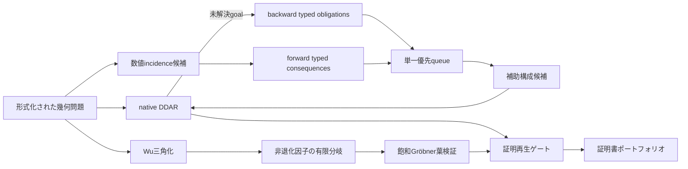

# MORTRA: HAGeo型補助構成・双方向探索・Wu/Gröbner統合実験

実施日: 2026-08-18

## 要旨

外部LLMを推論に使わず、次の5要素を一つの厳密証明ポートフォリオへ接続した。

1. HAGeo論文に基づく数値incidence補助点提案
2. backward goal探索とforward construction探索の単一優先キュー
3. Wu法の非退化条件を有限分岐し、葉をRabinowitsch飽和Gröbnerで閉じる機構
4. DDAR・補助構成・Wu/Gröbner証明の証明書単位の統合
5. IMO-AG-30とHAGeo-409の固定split評価

IMO-AG-30の厳密ポートフォリオは24/30から25/30へ改善した。HAGeo-409の
SHA-256 held-out 89問では、補助構成なしの28/89から37/89へ改善した。ただし
16問は300秒打切りであり、37/89は下限である。Wu/Gröbnerは2021 P3で計算を
完了したが、11個の退化葉を閉じられず、得点には加えていない。

## 1. 原理

### 1.1 数値層は提案、記号層は真理

HAGeoは、候補点が既存の複数直線・円に数値的にincidentであるかを用いて
補助構成を提案し、最終的な定理判定をDDARへ戻す。MORTRAでも同じ分離を守る。

```text
数値座標 -> incidence候補順位
                     |
                     v
型付き補助構成 -> native DDAR -> 証明再生 -> 採否
```

浮動小数点の一致だけで定理を受理しない。座標は平行移動・回転・一様拡大に
依存しないよう正規化する。

### 1.2 双方向探索は型付きmeetを探す

goalからの後向き義務と、補助構成からの前向き帰結を同じ優先キューへ載せる。
候補順位は問題文や問題IDでなく、次の残差で決める。

```text
(構造残差, 未充足atom数, hole数, forward深さ + backward深さ)
```

meetは探索順の根拠にすぎず、定理の受理条件ではない。

### 1.3 非退化条件は構成可能集合として扱う

Wu法が非退化条件 `f != 0` の下でのみゴールを示す場合、証明対象は
`V(P) intersect D(f)` である。MORTRAは次の二つを使う。

1. 有限被覆

   `V(P) = (V(P) intersect D(H)) union union_{f | H} V(P union {f})`

2. Rabinowitsch飽和

   `f != 0` を新変数 `u` と方程式 `u f - 1 = 0` で符号化する。

全枝の恒等式が再生され、すべての葉が証明または空集合と判定された場合だけ
元定理を完備証明とする。

### 1.4 ポートフォリオは証明集合の和である

異なるエンジンの「解けた」というフラグは信用しない。次だけを受理する。

- native DDAR: 入力SHA-256と証明SHA-256を伴う再生成功
- Wu/Gröbner: 完備被覆、未解決葉0、全恒等式再生

## 2. 論文・公開コード監査

### HAGeo

- 論文: https://arxiv.org/abs/2512.00097
- 公開リポジトリ: https://github.com/boduan1/HAGeo
- HAGeo-409: https://huggingface.co/datasets/HAGeo-IMO/HAGeo-409

論文は、1試行につき補助点生成 `N=6` round、IMO-30で `K=4096`、
HAGeo-409で `K=2048/8192` とする。2026-08-18時点の公式リポジトリは
READMEと画像のみで、READMEにもfull codeはMicrosoft審査中と記載されている。
したがって本実装は論文記述からの独立再構成であり、公式ソースの行単位再現ではない。

実装済みの論文ヒューリスティックは、3直線以上の交点、直線と円の多重交点、
非自明な軌跡上の中点・点対称点、別直線上に来る垂足、既存点と一致する多重
incidenceである。論文のrandom construction、`N=6`、大規模Pass@K、20倍高速化
DDARは未再現である。

### AlphaGeometry / DDAR

- 公開コード: https://github.com/google-deepmind/alphageometry
- AlphaGeometry2: https://github.com/google-deepmind/alphageometry2

MORTRAは候補を与えた後の真理面としてnative Yuclid/DDAR証明再生を用いる。
補助構成を生成するLLM部分は使用しない。

### Wu法

- 論文: https://arxiv.org/abs/2404.06405

Wu法単体とDDARの補完性を検証対象とした。ただし非退化条件付き証明を無条件の
正解として数えず、有限零点分解を追加した。

## 3. 方法



### 3.1 実装

- `worker/backend/numerical_incidence_auxiliary.py`
- `worker/backend/typed_bidirectional_priority.py`
- `worker/backend/constructible_groebner.py`
- `worker/backend/wu_zero_decomposition.py`
- `scripts/experiment_newclid_construction_stalk.py`
- `scripts/benchmark_hageo409_native.py`
- `scripts/benchmark_hageo409_auxiliary.py`
- `scripts/finalize_geometry_proof_portfolio.py`

### 3.2 データ分割

HAGeo-409は `SHA256(problem_id) mod 10` で固定した。

- dev: 0--5
- calibration: 6--7
- held-out: 8--9

held-outは89問で、全問をnative parserで構築できた。全409問では408問が構築可能、
1問は数値図形の退化で構築不能だった。問題の既知解答やHAGeo補助節は探索に
渡していない。

### 3.3 探索予算

HAGeo-409のMORTRA実験は、補助深さ1、候補経路16、beam 6、各familyの
incidence前候補16である。初回180秒・8並列のタイムアウトを、300秒・4並列で
再実行した。この予算はHAGeo論文の `N=6, K=2048/8192` と同一ではない。

## 4. 結果

### 4.1 IMO-AG-30

| 指標 | 変更前 | 変更後 |
|---|---:|---:|
| 厳密ポートフォリオ | 24/30 | **25/30** |
| 正答率 | 80.00% | **83.33%** |

新規に加わったのは `2008_p6` である。補助構成
`intersection_lt(a,i2,o,a,i2)->e` の後、native証明を再生し、入力・証明双方の
SHA-256を保存した。

残る `2019_p2`, `2019_p6`, `2020_p1`, `2021_p3` に同じHAGeo型＋統一queueを
適用したが、各399--438候補、約3.7万queue状態の範囲では新規解決がなかった。

### 4.2 HAGeo-409 held-out

| 指標 | native DDAR | 補助構成ポートフォリオ |
|---|---:|---:|
| 解決 | 28/89 | **37/89** |
| 正答率 | 31.46% | **41.57%** |
| 新規解決 | - | **9** |
| 300秒打切り | - | 16 |

新規解決は次の9問である。

| 問題 | 難易度 | 補助構成 | HAGeo分類候補数 |
|---|---:|---|---:|
| 2011CTSTp16 | 3.9 | `reflect(k,b,c)->d` | 2 |
| 2012G4 | 2.5 | `circle(y,d,e)->f` | 1 |
| 2013USATSTp2 | 4.8 | `intersection_tt(a,b,x,d,a,b)->e` | 0 |
| 2017AsiaPacificMOp2 | 2.1 | `parallelogram(a,d,b)->e` | 0 |
| 2017CHNSouthEastMOg10p2 | 2.8 | `intersection_lt(c,b,a,c,b)->g` | 3 |
| 2017G3 | 2.7 | `intersection_lt(a,o,b,a,o)->d` | 1 |
| 2020ELMOp4 | 2.8 | `midpoint(h,d1)->e` | 2 |
| 2021SilkRoadp3 | 4.2 | `circle(b,a,b1)->d` | 0 |
| 2022CzechAPSlovakp5 | 2.4 | `intersection_lt(b,c,x,d,a)->e` | 0 |

難易度別の基準→ポートフォリオは次の通りである。

| 難易度 | 問題数 | native | portfolio |
|---|---:|---:|---:|
| [1,3) | 36 | 23 | **29** |
| [3,4) | 19 | 4 | **5** |
| [4,5) | 18 | 1 | **3** |
| [5,6) | 12 | 0 | 0 |
| [6,7] | 4 | 0 | 0 |

### 4.3 統一優先queue A/B

2008 P6で、候補・incidence・証明予算を同一にした。

| scheduler | 解決 | 経路 | queue states | wall time |
|---|---|---:|---:|---:|
| proof-dag-lazy | yes | 8 | 32,383 | 288.95秒 |
| unified priority | yes | 8 | 37,197 | 102.28秒 |

同じ `foot(o,a,i2)->e` を得た。wall timeは64.6%短縮したが、状態数は14.9%増えた。
単一問題の測定であり、時間短縮の一般性は未確立である。少なくとも「統一queueが
探索状態数も減らす」という仮説はこの問題では支持されない。

### 4.4 Wu/Gröbner有限分岐

修正前は、根で全体系へGröbnerを先行適用し600秒で打切りとなった。修正後は
Wuの条件付き証明から先に零点分解し、548.55秒で計算自体は完了した。

| 指標 | 結果 |
|---|---:|
| solver branches | 4 |
| regular proved leaves | 1 |
| unresolved leaves | 11 |
| branch-budget leaves | 8 |
| replayed identities | all |
| complete cover | **no** |

したがって2021 P3はポートフォリオへ加えていない。

### 4.5 テスト

関連する44テストが成功した。内容は数値incidenceの相似不変性、型付き双方向meet、
Rabinowitsch飽和、証明DAG再生、Wu分岐順序、HAGeo方言変換、証明書受理ゲートを含む。

## 5. 考察

### 5.1 支持された仮説

- 数値提案と厳密証明を分離したまま、held-outの被覆を28から37へ増やせた。
- DDAR・補助構成・Wuを証明書単位で統合でき、条件付きWu証明の誤加点を防げた。
- 未見HAGeo問題でも、問題IDや答えを使わず新しい補助構成を見つけた。

### 5.2 支持されなかった仮説

- 5問calibrationではincidence候補を広げても2/5の被覆は増えず、最大514秒へ悪化した。
- 統一queueは2008 P6のwall timeを短縮したが、探索状態数を減らさなかった。
- Gröbnerを葉へ移しても2021 P3の退化枝は完備閉包しなかった。

### 5.3 何がまだ足りないか

1. HAGeo論文の6段補助構成とPass@K探索
2. random constructionを含む無作為対照群
3. DDAR証明状態の候補間・深さ間での増分再利用
4. 大きい多項式を局所中間補題へ分解する規則
5. 難易度5以上で有効な複数補助点の合成

低い被覆率の主因は構文解析ではなく、探索深さと証明状態の再利用にある。論文は
1試行で最大6 round、HAGeo-409で `K=2048/8192` を用いるのに対し、今回の実験は
深さ1・最大16経路である。経路数だけでも論文の128分の1から512分の1であり、
複数補助点が必要な証明は表現できない。また16問の300秒打切りをすべて正解と仮定
しても `53/89 = 59.55%` であるため、時間制限だけでは論文の70.2%相当との差を
説明できない。難易度5以上16問の新規解決が0であることも、候補の単純な増量より
中間補題分解と多段構成が必要だという診断を支持する。

新規9問のうち4問はHAGeo分類候補数0である。したがって改善を
「HAGeo incidenceだけの効果」と解釈してはならない。型付き構成語彙、候補ゲート、
統一探索、native証明器を合わせたポートフォリオ効果である。

## 6. 結論

5要素を実装し、LLMなしの厳密ポートフォリオとしてIMO-AG-30を25/30、
HAGeo-409 frozen held-outを少なくとも37/89まで改善した。これは実際の前進だが、
HAGeo論文の28/30またはHAGeo-409 70.2%の再現ではない。最大の未解決点は候補数では
なく、複数補助点を必要とする証明義務の分解と、退化枝の小さい補題への分割である。

次の実験は、現在の深さ1を `N=2,3,6` へ段階的に拡張し、同一held-out上で
Pass@K曲線、時間、証明状態再利用率を同時に測ることである。

## 7. 主要成果物

- `data/mortra-paper-guided-portfolio-imo-ag-30-2026-08-18.json`
- `data/hageo-409-heldout-native-baseline-2026-08-18.json`
- `data/hageo-409-heldout-auxiliary-full-2026-08-18.json`
- `data/hageo-409-compatibility-audit-2026-08-18.json`
- `data/wu-groebner-portfolio-2021-p3-fixed-order-2026-08-18.json`
- `data/hageo-scheduler-ablation-lazy-clean-2008-p6-2026-08-18.json`
- `data/hageo-scheduler-ablation-priority-2008-p6-2026-08-18.json`
