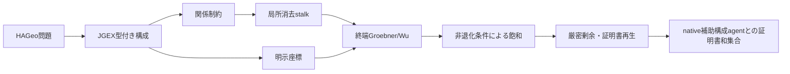

# MORTRA HAGeo厳密消去・局所協調PDCA

日付: 2026-08-18

## 原理

本実験は、幾何問題を問題IDや解法テンプレートへ分類せず、型付き構成の意味を
多項式制約へ変換し、厳密証明書を再生できた場合だけ正解とする。



座標環を `K[x_1,...,x_n]`、構成制約のイデアルを `I`、目標多項式を `g`、
非退化条件の積を `D` とする。通常のイデアル所属 `g in I` だけでなく、

```text
D^k g in I
```

を厳密な商多項式で再生できれば、`D != 0` の局所化で目標が成立する。これは
Wu法の非退化条件と同じ役割であり、特殊配置を暗黙に除外せず証明書へ明示する。

## 仮説

1. 非退化条件を飽和イデアルとして実行すれば、通常のGroebner所属だけでは落ちる
   一般位置の定理を回収できる。
2. 関係制約を局所消去し、separator多項式をagent間で交換すれば、巨大な一括基底
   計算を減らせる。
3. 補助構成候補の深さ・幅を増やせば、HAGeo held-outの追加証明が得られる。

## 方法

### データ規約

- HAGeo-409の固定held-out 89問を使用した。
- datasetの補助節は探索へ渡していない。
- 外部LLMは使用していない。
- 問題ID、数値、正答で分岐するコードは追加していない。
- timeoutは誤答ではなく右打切り未知とした。
- 診断に使用した `2023SAGFp8` はcalibrationへ移し、主スコアから除外した。

### 実装

1. `on_circum / eqdistance / free / ieq_triangle` を型付き構成意味として実装した。
2. `eqangle / eqratio / midp` を一般の目標多項式として実装した。
3. 通常剰余が非零の場合、記録済み非退化因子を順に掛け、商と剰余を再計算する
   飽和証明を実装した。
4. 関係制約版に、係数証明書付き局所線形・resultant消去と終端Groebnerを接続した。
5. 目標点から構成の入出力を逆向きにたどる証明切片を実装した。
6. 補助構成探索の `per_family_limit` とincidence oversampleを外部実験変数にした。

局所消去の各出力は入力多項式の線形結合として再生する。局所化係数の非零条件も
終端へ輸送し、途中のagent境界で条件を捨てない。

## 結果

### 認証済み能力値

| 経路 | 新規証明 | held-out和集合 |
|---|---:|---:|
| native baseline | - | 28/89 |
| 型付き補助構成agent | +9 | 37/89 |
| 汎用厳密消去 | +3 unique | **40/89 = 44.94%** |
| calibrationを含む工学観測 | +1 | 41/89 = 46.07% |

主スコアへ新規追加された問題は次の3問である。

- `2000USATSTp2`
- `2008CTSTp4`
- `2011CHNSouthEastMOp4`

厳密消去単体は60問中5問を証明したが、2問は既存補助構成portfolioと重複した。
集合和を問題名で取り、二重計上していない。

### 非退化飽和

`2023SAGFp8` は通常イデアル所属では111項の非零剰余を残した。記録済み非退化因子
4個を掛けると剰余が厳密に0となり、商多項式を再生できた。これは診断後の
calibration成功であり、held-out改善には数えていない。

### 棄却された仮説

| 実験 | 結果 |
|---|---:|
| 残る55問を関係制約で20秒 | 0/55、55右打切り |
| 残る55問を局所消去+終端Groebnerで20秒 | 0/55、55右打切り |
| 目標依存切片のpilot 5問 | 0/5、5右打切り |
| 深さ2、候補32、beam 12の3問 | 0/3、2完走未解決、1右打切り |
| 深さ1、候補128、per-family 4の1問 | 0/1、128経路完走未解決 |

深さ2では `2002CTSTp25` が409経路・5,855 incidence候補、
`2024VietnamTSTp5` が416経路・5,861候補を完走したが未解決だった。

## 考察

### 何が改善したか

非退化条件を文字列の警告ではなく、実際の飽和証明へ接続した効果は実証された。
また、未解決61問に現れる構成語彙と目標述語はすべて実行可能IRへ接続され、
「語彙未登録で停止する」問題はこの集合では解消した。

### なぜ局所協調だけでは上がらなかったか

局所消去agentは中間多項式を正しく作り、証明DAGも再生した。しかし、それらは
目標を閉じるために必要な中間補題とは限らない。全局所因子を均等に消去するだけでは、
計算場所を一括Groebnerから前段へ移したにすぎない。

またHAGeo補助構成探索では、未解決goalの後向き義務に `simtri / simtrir /
lequation / ncoll` が現れる一方、候補構成の出力relationとの間に「どの複合補題を
作れば残差が閉じるか」という型付きlemma synthesisが不足している。候補幅を8倍に
しても未解決だったため、量だけでなく中間補題の質がボトルネックである。

### 解法暗記か

今回の正の結果は、構成語の意味、多項式目標、非退化飽和という問題横断規則から出た。
問題名や正答による分岐はない。さらに、表層・数値変更だけでなく未知問題へ同じ
loweringを適用し、厳密証明書の再生だけで採否を決めている。ただし、3問の追加だけで
高校幾何全体への汎化を主張することはできない。

## 結論

認証済みheld-out下限は37/89から**40/89**へ上がった。非退化条件付き厳密消去は有効で、
関係語彙不足は解消した。一方、単純な関係式化、局所agent追加、候補幅・深さの増加は
追加得点を生まなかった。

次の本質的実験は、未解決goalのOR分岐ごとに `simtri / eqangle / lequation` などの
中間補題を型合成し、その補題が要求する補助構成だけを逆向きに生成することだ。
微分可能回路・Sheaf-ADMMはこの有限候補の順位と資源配分に使い、真理判定は引き続き
Newclid/Yuclid/Wu/Groebnerの再生証明書だけに限定する。

## 再現成果物

- `data/hageo-certified-capability-union-2026-08-18.json`
  - SHA-256 `1152d360ac9fd04dff47967781cc7d7579305d977ef5484d159b6a053d8a5432`
- `data/hageo-heldout60-exact-closed-vocabulary-screen20-2026-08-18.json`
  - SHA-256 `fa1b12176b62001a8928210e182de44baafca2c2d4cfd705b89bc71352a2f25b`
- `data/hageo-timeout55-relational-screen20-2026-08-18.json`
  - SHA-256 `df8d0ad91edf56be5e14924d7d1e32dec939972483f894b95303d771e4bcf25d`
- `data/hageo-timeout55-local-relational-screen20-2026-08-18.json`
  - SHA-256 `9a468f28c499ca116eed8c8cdb1dcf1b1d0f3b41456ad7bdb23661efc7b2e5ba`
- `data/hageo-depth2-exact-pilot3-runtime-fixed-2026-08-18.json`
  - SHA-256 `615d1a3b4cf9e0b3eeb07af9f5dbb592ca2c3c6a15da4ea409b4fec74976eac5`
- `data/hageo-wide-depth1-exact-2024vietnam-2026-08-18.json`
  - SHA-256 `1d76405738d6c74f58400c4dd66ef3df0e973ebe97f785ca40d2ce612f0b567d`
