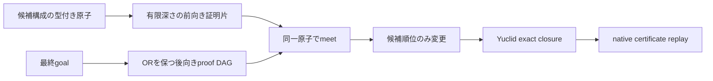

# MORTRA OR保存proof DAG・双方向meet実験

日付: 2026-08-18

## 要旨

候補構成と最終目標が2段以上離れている場合を扱うため、代替証明を平坦化せず、OR分岐とAND前提を保つ有限深さproof DAGを実装した。さらに、候補構成から有限段だけ進む前向き証明片を作り、後向きDAGの一つの枝と型付き原子で接続するmeet-in-the-middle順位を実装した。

5問の校正集合で同一予算の対照実験を行った結果、解決数は両方式とも2/5だった。評価枝は対照93本、新方式98本、壁時計時間は135.93秒から317.07秒へ増えた。したがって「全候補について有限深さの前向き・後向き証明片を先にコンパイルすれば探索が改善する」という仮説は棄却された。

一方、OR枝を混ぜないこと、2段離れた中間原子の接続、変数名変更への不変性、未証明前提の保持、循環証明片の棄却、α同値状態のtable化は単体試験で成立した。失敗原因は論理表現ではなく、全候補への先行コンパイルと、YuclidのAR層を含む長距離経路を深さ2で近似した探索制御にある。

## 原理



後向きDAGの一枝は一つのOR選択列であり、枝内のfrontierはANDである。異なるOR枝の前提を足し合わせない。前向き証明片は次の含意を表す。

```text
candidate_atoms AND residual_frontier => intermediate_atom
```

残った前提は消さない。`diff`、`ncoll`など座標標本で判定できる副条件と、`midp`、`para`、`cyclic`など新たな数学構造を要求する前提を型で区別する。また、接合原子そのものが残差に戻る循環片は棄却する。

順位は証明ではない。正しさは従来どおりYuclidの証明書再生だけで決める。

## 仮説

- H1: ORを保存すれば、互いに両立しない代替証明の前提を混ぜた過大評価を防げる。
- H2: 2段の前向き・後向きmeetは、直接照合では見えない正しい補助構成を前方へ移す。
- H3: α同値状態のtable化により、追加コンパイル費用は候補評価削減で回収できる。
- H4: 問題番号、既知補助点、答えを使わず、同じ規則銀行で複数問題に適用できる。

## 方法

### 実装

- `OpenProofBranch`: 一つのOR選択列とAND frontierを保持する。
- `compile_open_proof_dag`: 既知事実を閉じながら有限深さで後向き展開する。
- `ForwardProofFragment`: 候補に依存する中間結論と未証明残差を保持する。
- `compile_candidate_forward_cone`: 候補から有限段だけ進み、α同値状態をtable化する。
- `align_candidate_cone_to_proof_branches`: 一つの前向き片と一つの後向き枝だけを接続する。
- `proof-dag-meet`: 上記を候補順位へ接続する実験モード。

明示Newclid規則に加え、問題非依存の平行推移、垂直移送、共通垂線、合同推移、等角推移をAR射として規則銀行へ接続した。これは既知解から抽出した問題別規則ではない。

### 単体受理条件

- OR枝を平坦化しない。
- AND前提を残す。
- 2段離れた中間命題へ到達する。
- 点名の一様変更で順位特徴が変わらない。
- 複数の候補原子を同じ証明片で利用できる。
- 実行可能副条件を新しい構造義務より軽く扱う。
- α同値な状態を一度だけ数える。
- `goal => goal`型の循環meetを棄却する。

関連試験29件はすべて通過した。

### ペア実験

対象は既に開発で使用した校正問題であり、frozen held-outではない。

```text
2008_p6, 2009_p2, 2010_p2, 2015_p3, 2011_p6
```

共通条件:

- external LLMなし
- dataset auxiliary clausesなし
- problem ID / answer memoryなし
- extended construction grammar
- per-family limit 1
- branch limit 32
- depth 1
- candidate gate combined
- prefix state incremental
- Yuclid exact certificate replay

処置群だけ、後向きDAG深さ2、各goal最大96枝、候補cone深さ2、各候補最大48片・500状態を追加した。

## 結果

| 問題 | 対照 | proof-DAG meet | 評価枝差 | 時間差 |
|---|---|---|---:|---:|
| 2008_p6 | solved, 8枝 | solved, 7枝 | -1 | +37.25 s |
| 2009_p2 | unsolved, 20枝 | unsolved, 20枝 | 0 | +13.56 s |
| 2010_p2 | unsolved, 30枝 | unsolved, 30枝 | 0 | +17.13 s |
| 2015_p3 | solved, 12枝 | solved, 18枝 | +6 | +45.69 s |
| 2011_p6 | unsolved, 23枝 | unsolved, 23枝 | 0 | +67.51 s |
| **合計** | **2/5, 93枝, 135.93 s** | **2/5, 98枝, 317.07 s** | **+5** | **+181.14 s** |

処置群は77,199個の候補cone状態と39,558個の後向き探索状態を生成した。160候補すべてがcone上限に達した。

`2008_p6`では対照の`foot(o,a,i2)`とは別に、`intersection_lt(a,i2,o,a,i2)`という有効証明を1枝早く発見した。これは順位が実際に変わり、native verifierが別経路を受理した例である。

`2015_p3`の正解候補`intersection_lc(a,f,h)`について証明書を診断すると、候補が直接与える

```text
coll(a,d,h), cong(d,f,f,h)
```

から、平行推移を介して

```text
para(d,h,f,h)
```

までは2段で到達した。しかし最終`para(k,o1,k,o2)`までには、相似、比、角度、AR等式を含むさらに長い合流が必要であり、深さ2のmeetでは識別できなかった。

## 考察

H1は論理表現の単体試験として支持された。平坦化方式で起きた「異なる代替証明の前提を合算する」誤りは除けた。

H2は全体では棄却された。1問では枝を1本減らしたが、解決数は増えず、別の1問で6本増えた。正しい補助構成が2段以上離れていることは確認できたが、実際の証明距離は固定深さ2より長い。

H3は棄却された。table化は同一状態の再生成を除いたが、候補ごとにconeを作る費用が大きく、総時間は2.33倍になった。

H4は限定的に支持された。問題別分岐なしで5問すべてに同じ処理を適用し、対照で解けた2問は両方維持した。ただし正答数の改善はないため、汎化性能の向上は主張しない。

主な理論的欠落は、固定深さの全面展開である。実証明は、候補側の局所AR閉包とgoal側の後向き義務を交互に伸ばし、残差が減った枝だけを継続すべきである。全候補を同じ深さまで先に展開すると、正解候補に必要な長い経路へ予算を集中できない。

## 結論

- OR保存proof DAGと型付き前向き証明片は実装・検証できた。
- 外部LLM、問題ID、答え、既知補助点は順位付けに使っていない。
- 現行の全候補・固定深さmeetは、解決数を増やさず時間と枝数を増やしたため既定戦略にはしない。
- 実験モードと監査情報は残し、native verifierによる正確性境界を維持する。
- 次の本質的実験は、全面コンパイルではなく、残差減少を評価関数とする遅延双方向探索である。候補coneと後向き枝を一段ずつ交互に伸ばし、一度接続したprefixを候補間で共有する。

## 再現

```powershell
python -B -m pytest worker/backend/test_typed_open_proof_dag.py worker/backend/test_typed_candidate_alignment.py worker/backend/test_typed_logic_circuit.py worker/backend/test_geometry_proof_hypergraph.py -q
python -B scripts/experiment_proof_dag_meet_ablation.py --python <newclid-python> --dataset <imo.txt> --yuclid-exe <yuclid> --runtime-path <boost-runtime> --problems 2008_p6 2009_p2 2010_p2 2015_p3 2011_p6 --output data/proof-dag-meet-ablation-tabled-2026-08-18.json --run-dir data/proof-dag-meet-ablation-tabled-2026-08-18
python -B scripts/verify_proof_dag_meet_ablation.py --artifact data/proof-dag-meet-ablation-tabled-2026-08-18.json
```

主要成果物:

- `data/proof-dag-meet-ablation-tabled-2026-08-18.json`
- `worker/backend/typed_open_proof_dag.py`
- `worker/backend/typed_candidate_alignment.py`
- `scripts/experiment_proof_dag_meet_ablation.py`
- `scripts/verify_proof_dag_meet_ablation.py`
