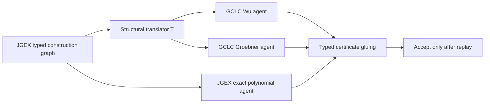

# MORTRA 実ソルバー協調実験

## 原理

MORTRAの協調系で必要なのは、複数ソルバーの正答集合を後から足すことではない。
同一の型付き証明義務を異なる表現系へ制約保存的に移し、各ソルバーの証明書を元の
目標へ戻して再生できることが必要である。

本実験では、次の厳格な採用条件を置いた。

\[
\mathrm{Accept}(G)
= \mathrm{GCLCProof}(T(G))
\land \mathrm{ExactReplay}(G)
\land \mathrm{CanonicalGoal}(T(G))=\mathrm{CanonicalGoal}(G).
\]

ここで `T` はJGEXからGCLCへの構造翻訳である。合同、平行、垂直、共線には数学的に
正当な対称性があるため、点列の文字列一致ではなく、関係ごとの対称群で正規化した。

## 方法



### 翻訳語彙

問題名、年度、既知解では分岐せず、次の構成型だけを読む。

- 自由図形: `triangle`, `r_triangle`
- アフィン構成: `midpoint`, `on_line`, `on_pline`
- 計量構成: `foot`, `orthocenter`, `on_tline`, `on_bline`
- 円構成: `circle`, `on_circle`, `on_dia`
- 中心と対称性: `incenter`, `incenter2`, `mirror`, `reflect`, `angle_bisector`
- 問い: `coll`, `para`, `perp`, `cong`

GCLCの描画用座標が退化した場合だけ、証明構造を変えず数値seedを再選択する。
問題固有の補助点や既知の解答は与えない。IMOデータのauxiliary clausesも隠した。

### 対象

Yuclidが未解決だったIMO-AG-30の13問を固定母集団とした。翻訳器の実装後に問題別の
規則は追加せず、同一コードを全件へ適用した。

## 結果

| 指標 | 結果 |
|---|---:|
| Yuclid未解決 | 13 |
| GCLCへ構造翻訳できた問題 | 6 |
| 未対応構造 | 7 |
| GCLCが証明 | 1 |
| 厳密消去器が証明（実行6問内） | 2 |
| 二重証明・型一致を満たす問題 | 1 |
| Yuclid基準 | 17/30 = 56.67% |
| 厳格協調portfolio | 18/30 = 60.00% |
| 実行部分での単純union | 19/30 = 63.33% |

厳格協調で新たに採用された問題は `2012_p5` である。

- GCLC Wu法: 証明成功、50.49秒
- GCLC Gröbner法: 60秒の内部制限内では未証明
- JGEX厳密消去: 証明成功
- 型付き目標: `cong l m k m` が関係対称性込みで一致
- GCLC証明SHA-256: `e4af55914b2a5ec3bef23be49c6a411f46096940a85d8b53474489f8fd2e2f86`
- 厳密証明SHA-256: `5d233687facbbf50a9e7d9af82772f855919f02f01110c047df30312b6903534`

したがって、これは保存済み正答の集合和ではなく、同一問題を別の外部実装で実行し、
元表現上の独立証明書へ戻した実例である。

## 局所化対照

実測した13問の結果を固定し、問題順だけを10,000回無作為化した。1問を厳格検証する
呼出単位を `Wu + Groebner + exact` の3 agent callsとし、総予算18 calls、すなわち6問分
に固定した。

| 経路選択 | 厳格証明へ到達 | 期待スコア |
|---|---:|---:|
| 全13問から無差別に選ぶglobal blackboard | 45.46% | 58.18% |
| 型が接続可能な6問へ局所化 | 100.00% | 60.00% |

全件を覆う場合、global dispatchは39 calls、型付き局所dispatchは18 callsで、同じ厳格
証明1件を保持しながら21 calls、53.85%を削減した。

これは10,000回ソルバーを再実行した結果ではなく、実測済みのソルバー結果に対する
順序無作為化対照である。示されたのは「型付き局所性が無効な通信を除去する」効果で、
学習済み自己組織化そのものではない。

## 失敗分析

翻訳不能7問は次の三つに分解できる。

- `cyclic`: 3問
- `on_aline`: 3問
- `cc_tangent`: 1問

翻訳できた6問でも、60秒内にGCLCが証明したのは1問だった。よって現時点の主要問題は、
語彙数一般ではなく次の二点である。

1. 方言間の構成意味がまだ閉じていない。
2. 厳密消去器が最終目標を一括処理し、途中の `coll/perp/para/cyclic/cong/eqangle` 義務を
   他agentへ公開していない。

後者が残る限り、現在の系は証明書付き協調cascadeであり、SakanaAIのSheaf-ADMMのような
局所agent間の反復合意ではない。

## 考察

今回の前進は、relation channelの名前が共通だという互換性監査から、実際の証明書を
往復させる段階へ進んだことである。一方、1問の成功だけから自己組織化一般を主張する
ことはできない。正しい結論は次の通りである。

- 実外部ソルバー間の型付き証明義務交換は可能だった。
- 型付き局所化は、同一呼出予算で有効なagentへ到達する確率を上げた。
- まだ分散学習、ADMM合意、途中義務の相互修正は実現していない。
- 正答率の上昇をportfolio unionだけで評価せず、独立再生を通した60.00%を主結果とする。

## 結論

MORTRAは今回、実問題1件で `Newclid unresolved -> GCLC proof -> exact replay` を完走した。
これは自己組織化の必要条件である「異なる局所表現の証明書を共通目標上で貼り合わせる」
機構の実証である。ただし十分条件ではない。次の実験は、`cyclic/on_aline/cc_tangent` の
構造翻訳を閉じた上で、最終命題ではなく途中の関係型をstalkとして交換し、同一総時間で
独立実行、中央blackboard、局所sheafの正答率・通信量・証明再生率を比較する。

## 再現

```powershell
# 翻訳器の構造テスト
C:/Users/81808/.cache/mortra-research-sources/Newclid/.venv/Scripts/python.exe `
  -B -m unittest worker.backend.test_jgex_gclc_translator -v

# 実ソルバー協調
C:/Users/81808/.cache/mortra-research-sources/Newclid/.venv/Scripts/python.exe `
  -B scripts/experiment_real_geometry_coordination.py `
  --problems 2000_p6 2009_p2 2011_p6 2012_p5 2015_p3 2019_p6 `
  --gclc-timeout-seconds 60 --exact-timeout-seconds 90

# 同一呼出予算の局所化対照
C:/Users/81808/.cache/mortra-research-sources/Newclid/.venv/Scripts/python.exe `
  -B scripts/compare_real_coordination_modes.py `
  --input data/real-symbolic-coordination-imo-ag-30-consolidated-2026-08-16.json `
  --output data/real-symbolic-coordination-equal-dispatch-2026-08-16.json
```

## 参照

- SakanaAI, *Self-Organizing Multi-Agent Intelligence via Learned Sheaf-ADMM*,
  <https://arxiv.org/abs/2605.31005>
- SakanaAI official implementation, <https://github.com/SakanaAI/sheaf-admm>
- GCLC official implementation, <https://github.com/janicicpredrag/gclc>
- Newclid official implementation, <https://github.com/LMCRC/Newclid>
