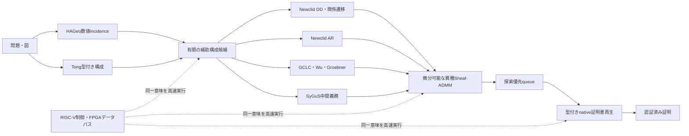

# MORTRA 統合自己組織化アーキテクチャ実験

日付: 2026-08-18

## 原理

HAGeo型補助構成、異種形式言語agent、微分可能Sheaf-ADMM、厳密証明回路、
RISC-V/FPGA高速化は別々の研究テーマではない。次の一つの計算系の異なる層である。



連続値は探索順位と予算だけを決める。数学的真理は、入力からnative証明書を再生できた
場合だけ受理する。FPGA/RISC-Vも同じ回路を高速化するだけで、証明規則を変更しない。

## 方法

局所agentを次の異なる形式言語として実装した。

1. HAGeo数値incidence: 補助構成候補の提案
2. Tong型付きaction: 構成の型と入力可能性
3. Newclid DD: 関係閉包
4. Newclid relation transition: goalへ至る述語遷移
5. Newclid AR: 代数残差
6. GCLC/Wu: 多項式義務と非退化条件
7. SyGuS: 未解決の型付き中間義務
8. resource stalk: 実時間と証明展開量

各agentは私有座標を持ち、同じ型付き候補を観測した座標だけをrestriction mapで共有する。
ADMMの局所更新は、正のagent信頼度を `tau_i` として

```text
x_i <- (tau_i p_i + rho (z_i - u_i)) / (tau_i + rho)
z   <- solve((rho I + gamma delta_F^T delta_F) z = rho (x + u))
u   <- u + x - z
```

とした。`tau_i`と`rho`は微分可能回路から供給する。候補の採否はこの値ではなく、
Yuclid/native checkerの証明書再生で決める。

能力保存は「一つのbeamを半分ずつ分ける」ことでは保証できない。厳密agentと協調agentを
同じ完全予算で独立実行し、再生済み証明書の和集合を取る方式を正式なportfolioとする。

## timeoutの統計的扱い

timeoutは誤答でも正答でもなく右打切りである。報告値を次の三つに分ける。

1. 認証済み下限: `証明書再生成功 / 全問題`
2. 完了条件付き成功率: `証明書再生成功 / timeout以外`
3. 楽観上限: `(証明書再生成功 + timeout) / 全問題`

固定時間leaderboardではtimeoutを未解決として扱う必要があるが、最終的な数学能力の失敗と
同一視しない。長時間workerはfrontierを保存し、時間別解決曲線を別に測る。

## 結果

### HAGeo-409固定held-out

- baseline: 28/89
- HAGeo型補助構成と汎用厳密消去を含む認証済みportfolio: 40/89 = 44.94%
- 600秒再開後、追加探索61問の完了53問中、新規解決9問: 16.98%
- 600秒でも右打切り: 8問
- calibrationを含む工学観測: 41/89 = 46.07%

したがって44.94%は最終能力値ではなく証明済み下限である。一方、timeoutを全て正解とみなす
根拠もない。300秒打切り16問を600秒へ延長しても新規正答は0で、8問が完了未解決、
8問が再打切りだった。低い得点の全てを時間制限だけで説明する仮説は支持されなかった。

### IMO-AG-30

- native証明書を統合した現時点の認証済みportfolio: 26/30 = 86.67%
- 残る4問に対する90秒のcontrol/native-sheaf比較: 全8実行が右打切り

この90秒実験は0/4という数学的失敗ではなく、比較不能である。

### 統合制御のdev実験: 2020 P1

| 制御 | 証明 | 評価経路 |
|---|---:|---:|
| 厳密残差対照 | 成功 | 60 |
| 静的な異種形式言語Sheaf | 成功 | 44 |
| 既存学習信頼度を流用した統合Sheaf | 成功 | 144 |

統合配線と厳密受理は動作したが、既存の微分可能controllerを形式言語stalkへ流用すると
探索効率は悪化した。これは正の結果ではない。形式言語ごとのproof-flowで信頼度を再学習し、
未見問題で静的Sheafと比較する必要がある。

終端`solved`フラグを特徴から除き、証明経路の非終端prefixだけを正例とする7パラメータ
学習も実行した。独立問題がtrain 1、calibration 1、確認1しかなく、正例順位はそれぞれ
2位、6位、1位だった。live探索は144経路のままで改善しなかった。このpilotはデータ不足で
あり、controller採用条件を満たさない。問題文や解法を増やすのではなく、異なる問題から
得られる非終端proof-flowを増やす必要がある。

## RISC-V / FPGAの位置

実装済みなのはCPU上の同一意味回路と、ハードウェア境界の監査可能なmanifestである。
FPGA bitstreamやRISC-V拡張命令はまだ実装していない。

優先対象は次の通り。

- FPGA: 疎なrestriction/coboundary積、固定小数点ADMM、bitset関係閉包
- RISC-V: 型付きinstruction scheduling、非退化条件分岐、証明書commit制御
- CPU/CAS: 大きなWu/Groebner消去。ここは無理にFPGAへ移さない

高速化の効果は「同じ時間で探索できる候補数・深さが増え、右打切りが減る」ことであり、
証明規則自体が強くなることではない。

## 考察

1. HAGeo高得点化、自己組織化、微分可能制御、高速化は一つの閉ループとして扱える。
2. 現在の最大費用はADMMではなく候補ごとのnative推論である。
3. 既存controllerの流用失敗から、単に微分可能にするだけでは改善しないことが分かった。
4. portfolioは能力を保存できるが、同じwall-clockでagent数だけ増やす比較は不公平である。
5. fixed-budget比較とanytime能力曲線の両方が必要である。

## 結論

統合アーキテクチャは実行可能になったが、外部held-outでの自己組織化による追加正答はまだ
実証されていない。現時点で確定した改善はHAGeoの認証済み40/89とIMO 26/30である。
HAGeoの追加3問は非退化条件付き汎用厳密消去による。次の実験は、形式言語proof-flow専用の信頼度学習、
完全予算の能力保存portfolio、残る8打切り問題のfrontier再開、同一証明回路のkernel profilingである。
