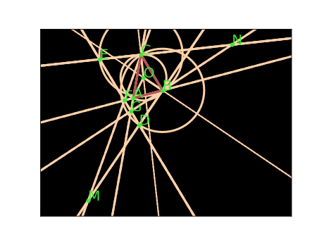

# 2014CHNGaoLian: certified coordinate proof

## Problem

Let `ABC` be an acute triangle such that `angle BAC != 60 degrees`. Let `D,E` be points such that `BD,CE` are tangent to the circumcircle of `ABC` and `BD=CE=BC`, with `A` on one side of line `BC` and `D,E` on the other side. Let `F,G` be the intersections of `DE` with `AB,AC`. Let `M=CF intersection BD` and `N=CE intersection BG`. Prove that `AM=AN`.



## Proof

Scale `BC=1` and set

```text
B=(0,0), C=(1,0), A=(x,y), y>0.
K=x^2-x+y^2.
```

The circumcenter is `O=(1/2,K/(2y))`.

Write `D=(d,h)`. Since `BD=BC=1` and `BD` is tangent at `B`,

```text
d^2+h^2=1,
d*y+h*K=0.                                      (1)
```

The two tangent-circle loci at `B` and `C` are reflections of each other across the perpendicular bisector of `BC`, up to a sign. The strict source condition says that `D` and `E` lie on the same side of `BC`; it rejects the sign-reversing branch. Hence

```text
E=(1-d,h).                                      (2)
```

Therefore `DE` is horizontal. Intersecting it with `AB` and `AC` gives

```text
F=(x*h/y,h),
G=(1+(x-1)*h/y,h).
```

Put

```text
L=1+d-x*h/y,
R=1+d+(x-1)*h/y.
```

Solving the two pairs of linear equations for `M=CF intersection BD` and `N=BG intersection CE` yields

```text
M=(d/L,h/L),
N=(1-d/R,h/R).                                  (3)
```

Substitute `d=-hK/y` from (1) into the difference obtained from (3). Exact polynomial simplification gives

```text
AM^2-AN^2 =
 -(2x-1) [h^2(K^2+y^2)-y^2] Psi
 / ([h(x^2+y^2)-y]^2 [h((x-1)^2+y^2)-y]^2),
```

where `Psi` is a polynomial. But (1) also gives

```text
1=d^2+h^2=h^2(K^2+y^2)/y^2,
```

so `h^2(K^2+y^2)-y^2=0`. Thus `AM^2-AN^2=0`, and therefore `AM=AN`.

The stated nondegeneracy assumptions ensure that the displayed intersections and denominators are defined.

## Machine certificate

- Exact remainder: `0`
- Exact replay: `true`
- Semialgebraic branch certificate: replayed and goal-independent
- Expected answer used: `false`
- External LLM used: `false`
- Certificate SHA-256: `ca7d2e4efabdc505bdf0166f694ab3a8feae7bd03a82da5ef30382dbf44e4504`
- Proof artifact: `data/hageo-semantic-branch-2014chngaolian-runs-2026-08-26/2014CHNGaoLian.json`
