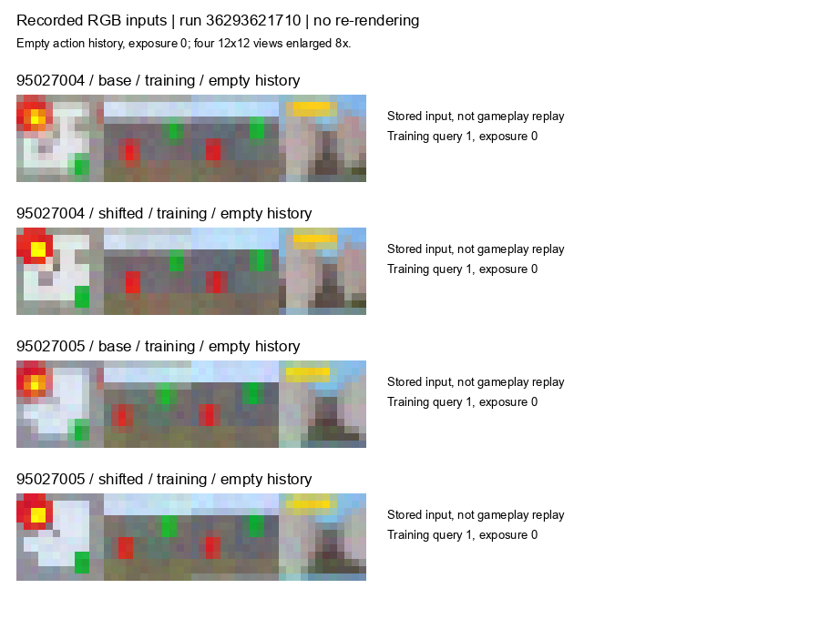
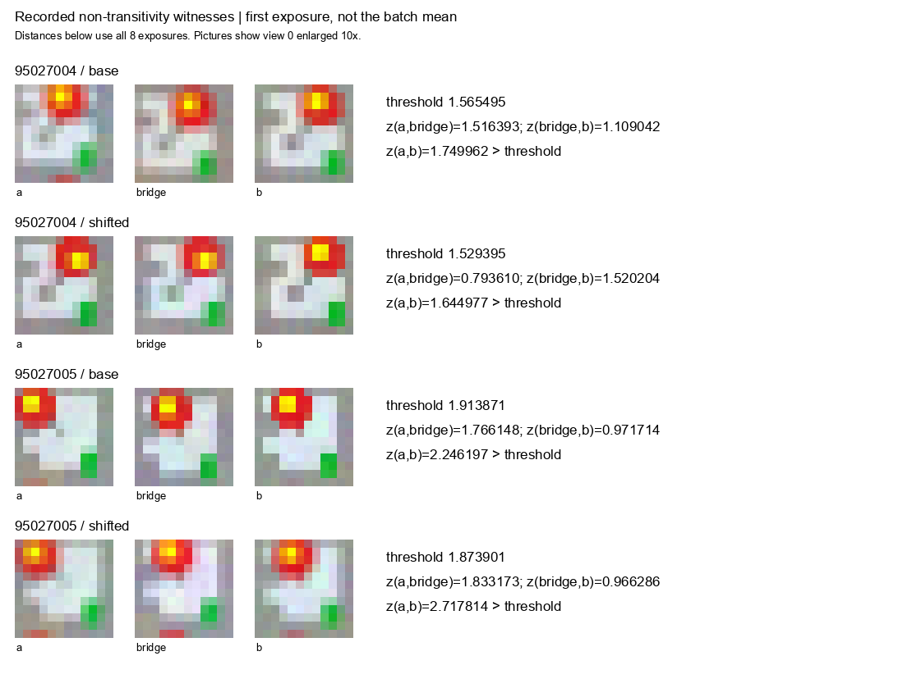

# Noisy RGBだけからの識別行動列の獲得: 開発実験

## 結論

**今回の実装では目的を達成できませんでした。4条件とも状態機械の構築前に停止しました。**
判定は `RUN_NOT_COMPLETED` です。識別行動列の自律獲得に成功した実験として扱いません。
この結果は、MORTRA一般の能力やノイズ画像からの識別不可能性を示すものでもありません。

- GitHub Actions: https://github.com/corcondor/mortra/actions/runs/36293621710
- 実行commit: `7ad519c5dbc3b7443b8f0549262246c1eb2296c5`
- branch: `research/noisy-rgb-suffix-discovery-20260927`
- 入力 `physics3d.py` SHA-256: `bf36fceb6b787a2f0c6e7d1f43c629912ddc224c85512ca9c7680a357713f4e5`
- 既存の制作ループのコード・結果は変更していません。

## 固定した条件

提供された7x7x3の環境を縮小せず使用しました。2つの既知seedに通常カメラと平面上の撮像位置をずらしたカメラを適用しました。既知seedでの開発実験であり、新規環境での確認実験ではありません。

学習は空の識別行動列だけを持つ `E=[empty]` から開始しました。過去に得た状態一覧、識別行動列、清浄な画像、成功フラグは学習器へ渡していません。環境のresetと、公開された行動履歴の再実行は使用します。したがって、連続した一回限りのオンライン探索だけを用いる実験ではありません。

1回の観測は4視点それぞれ12x12のRGB画像です。8回分の画像から平均と分散を計算します。学習器は既存の統計的観測表を使います。具体的な識別行動列はCodexが用意していません。

同じ行動履歴を繰り返し撮影した100組から閾値を決める既存処理を保持しました。係数1.18とノイズ床0.01は参照実装の数値条件です。統計的な誤判定確率の保証ではありません。詳細は [実行前仕様](PROTOCOL.md) にあります。

## 4条件の結果

以下の「履歴数」は観測表に保存した行動履歴の数です。発見した状態数ではありません。「暫定群数」も完成した状態機械の状態数ではありません。

| seed | カメラ | 履歴数 | 暫定群数 | 追加した非空の識別行動列 | 実行時間 | CPU時間 | 最大メモリ |
|---|---|---:|---:|---:|---:|---:|---:|
| 95027004 | 通常 | 1001 | 60 | 0 | 417.76秒 | 414.70秒 | 98.25 MB |
| 95027004 | 位置ずれ | 1001 | 70 | 0 | 420.63秒 | 417.02秒 | 103.70 MB |
| 95027005 | 通常 | 1001 | 40 | 0 | 190.50秒 | 189.58秒 | 96.12 MB |
| 95027005 | 位置ずれ | 1001 | 56 | 0 | 297.45秒 | 295.47秒 | 102.06 MB |

MBは10^6 bytesです。いずれも参照実装の観測表閉包処理が1000回の上限へ達し、`RuntimeError('table did not stabilize')` となりました。これは時間切れ、メモリ不足、ゲーム攻略の失敗ではありません。

完成した識別モデルは0/4です。各条件5000件、合計20000件を予定した未使用データ評価は実行していません。認識精度・真の商の回復率・ゲーム成功率は未測定です。値を0%に置き換えていません。

GitHub Actionsが緑色なのは、例外を含めて記録と成果物保存を完了したためです。研究目的の達成を意味しません。

## 保存記録から特定できた停止機構

画像分布の距離スコアを z、閾値を T とし、`x ~ y` を `z(x,y) <= T` と定義します。今回、この関係は推移律を満たしていません。

95027005・通常カメラの保存画像で、次の公開行動履歴を確認しました。

```text
a      = [1]
bridge = [0,1,0]
b      = [0,1]

T            = 1.9138706517
z(a, bridge) = 1.7661477327 <= T
z(bridge, b) = 0.9717137814 <= T
z(a, b)      = 2.2461965084 >  T
```

つまり a と bridge は近く、bridge と b も近いのに、a と b は遠いと判定されます。同値関係を得たことにはなりません。これは一般論を当てはめただけではなく、今回の保存画像から再計算した具体例です。

参照実装は群内の全履歴と近いかどうかで所属先を判定します。`group_index` は、該当する群が0個の場合と2個以上の場合の両方で `None` を返します。`close_consistent` は両者を同じ「履歴追加」の処理へ送ります。新しい履歴を追加すると、その反復では状態間の矛盾を調べる処理を飛ばします。

全1000回の追加を、直前の暫定群に対する判定で分類しました。

| seed | カメラ | 該当群なし | 複数の群に一致 | 一つの群に一致 |
|---|---|---:|---:|---:|
| 95027004 | 通常 | 59 | 941 | 0 |
| 95027004 | 位置ずれ | 69 | 931 | 0 |
| 95027005 | 通常 | 39 | 961 | 0 |
| 95027005 | 位置ずれ | 55 | 945 | 0 |

合計4000回の追加のうち3778回、94.45%が複数の群への一致でした。観測表はその曖昧さを解消しないまま履歴を追加し続け、今回の1000回の範囲では識別行動列を追加する段階へ進めませんでした。

「上限を増やせば必ず終わる」とも「無限に実行しても終わらない」とも、この記録からは言えません。また、どの閾値でも同じ結果になると検証したわけではありません。

参照コードの対応箇所:
- `StatisticalObservationTable.groups`: 群内の全履歴との一致判定。
- `StatisticalObservationTable.group_index`: 0群と複数群を同じ戻り値にする処理。
- `StatisticalObservationTable.close_consistent`: 閉包を先に処理し、追加があれば矛盾検査を飛ばす処理。

## 検証記録

- 事前テスト: ローカル、Actionsとも10/10合格。小さい決定論例での識別行動列獲得、参照版との動作一致、禁止入力へのアクセス検査を含みます。実環境での獲得成功の代用にはしていません。
- 元の5成果物ZIPはGitHub記録のSHA-256と照合しています。
- 保存RGBから、学習時の7538組の平均・分散を再計算し、すべて保存値と完全一致しました。
- 学習・校正の全RGB観測のハッシュと操作数を読み戻しました。
- 完成モデルがないため、モデル精度の検証は未実行です。
- 保存統計量から元の観測表を再生し、4条件の全4000回の履歴追加順序、識別列、停止例外が一致しました。結果は `table_replay.json` に保存しています。これは追加の環境操作や閾値変更を伴いません。

## 実際の入力画像

以下は4条件で取得した、空の行動履歴に対する学習時の画像です。撮影順序上の最初の問い合わせとは限りません。各行は同一露光の4視点です。元データは各12x12で、表示のため最近傍法で拡大しています。ゲームの再描画や合成画像ではありません。



以下は非推移性が生じた履歴における実画像です。表示は8露光中の最初の露光の視点0です。距離計算は表示中の1枚ではなく、保存された8露光すべての平均・分散に基づきます。



## 保存先と再現

この報告には `aggregate.json`、`conditions.csv`、全条件の元の結果・設定・履歴ログ、校正記録、ソース照合、画像の出所、停止原因の解析、テストXML、GitHubの実行ログを保存しています。大きいRGB圧縮データと統計量は改変していない元のZIPに保存しています。元ZIPの場所、GitHub URL、失効予定日時、ハッシュは `original_artifact_registry.json` を参照してください。

実験の再現には、上記実行commitの独立checkoutで、`PROTOCOL.md` の依存バージョンを使います。既存出力を上書きしない新しい保存先を指定します。

```powershell
python -m pytest tests/test_noisy_rgb_discovery.py -q --junitxml=tests.xml
python -m experiments.noisy_rgb_discovery.run --seed 95027004 --camera base --output reports/unique_output_path
```

残る3条件は同じ仕様のseedとcameraを指定します。結果に応じた再実行や条件変更は今回行っていません。保存記録だけの診断手順は `audit_tools/` にあります。そこに記録したローカルパスは元の監査環境のパスです。

## 結論の範囲

以前の3999/4000という認識評価は、獲得済みの識別行動列を利用していました。今回はその行動列を空から作る段階を試しており、比較対象も測定量も異なります。今回の結果を以前の認識精度の反証として扱いません。

次に検討すべき箇所は、統計的に曖昧な所属判定を、新状態の追加と同じ処理へ送っている接続です。MORTRA一般の探索能力や既存のfixed-field推論を否定する結果ではありません。結果を見て今回の学習器、閾値、環境、上限を変更することなく終了しました。
