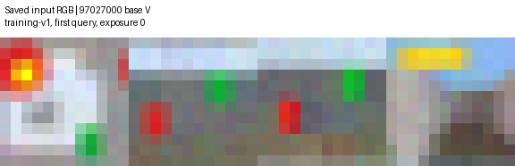

# Noisy RGB候補集合方式: 固定32 world比較

**新方式は識別行動列を発見しましたが、今回の固定条件では状態機械の完成まで到達しませんでした。**
32 world、2 camera、2方式の128実行を終了しました。完成モデルは旧方式H、新方式Vともに0/64条件です。
完成モデルだけを評価する事前仕様に従い、未見画像の認識精度と3D攻略は未測定です。精度0%ではありません。

## 実行と固定条件

- 本比較: [GitHub Actions 36301127275](https://github.com/corcondor/mortra/actions/runs/36301127275)
- 実行commit: `cb61cb548f07243250b1ea07ebb0d8ff46bd9dae`
- 開始点: `e178b2faefb05e6c579e475df935836aa0a01d5e`
- branch: `research/noisy-rgb-version-space-20260927`
- fresh seeds: `97027000..97027031`。各seedでbaseとshifted `(.32,-.24)` を独立実行しました。
- H: 旧hard-membership方式。V: SAME / DIFFERENT / UNRESOLVEDと候補状態集合を保持する方式です。
- V: 1,000,000環境操作、500,000撮影セット、1,800秒、1所属判定あたり最大30 probe、深さ2までです。
- H: 旧仕様の1000 closure passes、20 rounds、深さ2の整合性検査を維持しました。
- 1撮影セットは4視点です。環境操作数にはreset後の履歴再生を含みます。
- 7×7×3環境、画像サイズ、物理法則、renderer、校正、action集合、旧ソースは変更していません。
- Windows、Python 3.12.10、NumPy 1.26.4、Pillow 11.3.0。最大並列数8、各数値計算thread数1です。
- 結果を見た閾値変更、予算変更、seed交換、選択的再実行はありません。run attemptは1です。

事前仕様は `experiments/noisy_rgb_version_space/PROTOCOL_VS.md`、fresh入力登録は同ディレクトリの `fresh_manifest.json` にあります。
信頼性の判定式は、独立測定6個のscoreの最小値lo、最大値hi、幅w=hi-loに対して、32撮影stageでのみ
`hi+w<T` ならSAME、`max(0,lo-w)>T` ならDIFFERENT、それ以外はUNRESOLVEDとしました。
これは実行前に固定した経験的安定性規則です。誤判定確率を数学的に保証する信頼区間ではありません。
また、ここでいうversion spaceは既存代表状態の候補集合です。全有限状態機械の列挙ではありません。

## 再現と開発確認

保存済み旧実験の4条件について、未完了、各access histories=1001、非空suffix=0、
曖昧さによる追加3778/4000件を再確認しました。保存RGBの非推移例も再計算して一致しました。

[開発実行36300223767](https://github.com/corcondor/mortra/actions/runs/36300223767) では、
Hの全4条件についてS/E、校正値、統計キーの順序、query metadata、全入力RGBハッシュが旧実験と一致しました。
Vの開発確認は実装・情報境界・証拠保存の確認であり、完成率を通過条件にはしていません。

旧10件と新11件、計21件のテストはすべて合格しました。本比較の記録は [tests.xml](tests.xml) です。
[独立証拠監査36300730576](https://github.com/corcondor/mortra/actions/runs/36300730576) では、
開発V全4条件の2,000,000撮影セットと1,231,805比較記録を読み戻し、RGBハッシュ、平均・分散、
校正、判定、状態追加証拠、suffix証拠を再計算して一致しました。新しい環境操作は行っていません。
これは開発4条件の全量監査です。fresh全128条件のRGBを再計算したとは主張しません。

## 完成率と停止理由

| 指標 | H: 旧方式 | V: 候補集合方式 |
| --- | ---: | ---: |
| 実行記録が存在する条件 | 64/64 | 64/64 |
| 完成した状態機械 | 0/64 | 0/64 |
| 旧closure上限で未完了 | 63 | 0 |
| 撮影上限で未完了 | 0 | 61 |
| 曖昧さが残った固定点で未完了 | 0 | 3 |
| 実装例外 | 1 | 0 |
| 未見5000 prefix評価が完了した条件 | 0 | 0 |
| 3D control評価 | 対象外 | 未実施 |

Vの固定点停止は `97027018/base`、`97027028/base`、`97027030/base` です。
代表数はそれぞれ16、4、11、識別行動列数は20、3、13、残った未解決履歴は11、1、7です。
深さ2までの固定した実験集合と保存証拠では所属先を一意にできず、証拠が増えないため停止しました。
これらは一般的な識別不能性の証明ではありません。撮影上限の61条件も課題攻略の失敗とは数えません。

旧方式の例外は `97027025/shifted/H` の `not closed at machine construction` です。
保存統計だけで調べると、履歴 `[0,1,4]` と `[0,2,0,1,1,0]` はそれぞれ候補group 4と9の両方に一致しました。
両履歴はすでにSに存在したため、旧closure処理の追加対象から外れました。
曖昧さが残ったままmachine構築へ進み、そこで例外になりました。
コードは直していません。スタックと読み戻し診断は [unclosed_saved_table_diagnosis.json](unclosed_saved_table_diagnosis.json) に保存しました。

Actions全体と集計jobの表示はfailureです。これはこの1件の実装例外を集計器が検出したためです。
128条件すべての結果と証拠は保存されています。欠損による集計失敗ではありません。

## 主要比較

64組すべてについて記録した表は [paired_conditions.csv](paired_conditions.csv) です。
未測定の認識指標を0で埋めていません。

| 指標 | 改善 / 同値 / 悪化 | 解釈 |
| --- | --- | --- |
| 完成モデルがあるか | 0 / 64 / 0 | 保存成果物の有無の比較です。実装例外1組を含み、能力の同等性検定ではありません。 |
| 未見画像の誤った一意判定率 | 評価可能0組 | 完成モデルがありません。 |
| 未見画像の未解決率 | 評価可能0組 | 学習中のUNRESOLVEDとは別の指標です。 |
| 予測遷移誤差 | 評価可能0組 | 完成モデルの監査を実施していません。 |
| 環境操作数 | 0 / 0 / 64 | 実際に消費した操作数です。中断したHの1組は性能比較に使えません。 |

実装例外の1組を別扱いにした残り63組でも、環境操作数は0改善・0同値・63増加です。
これは定めた異なる停止条件下の費用であり、同じ精度に到達するための学習効率比較ではありません。

## 状態獲得の部分結果

| 指標 | H | V |
| --- | ---: | ---: |
| 非空の識別行動列数: 条件平均 | 0.03125 | 21.578125 |
| 非空の識別行動列数: 範囲 | 0〜1 | 3〜29 |
| 内部に保持した履歴/代表数: 条件平均 | 987.265625 access histories | 44.609375代表状態 |
| 内部に保持した履歴/代表数: 範囲 | 67〜1058 | 4〜52 |

Hで非空suffixが1個見つかったのは `97027029/base` と `97027029/shifted` です。
Hのaccess historiesとVの代表状態数は同じ量ではありません。この表から圧縮率を計算しません。
Vの代表は全64条件で重複する真のクラスを持ちませんでしたが、完成した最小商ではありません。
評価側で数えた真のクラスは条件ごとに192〜204個です。Vの代表数4〜52個はその一部にとどまります。

Vの全64条件を合計した機構の記録:

| 指標 | 件数 |
| --- | ---: |
| 所属判定呼び出し | 41,395 |
| 初期段階で候補が複数 | 41,270 |
| 再撮影後に1候補になった判定 | 34,424 |
| 深さ1の能動probe後に1候補になった判定 | 128 |
| 深さ2の能動probe後に1候補になった判定 | 645 |
| 選択した深さ1 / 深さ2 probe | 20,263 / 90,806 |
| 一意所属後の追加整合性probe | 340,968 |
| 新しい代表の追加 | 2,791 |
| SAME / DIFFERENT確定記録 | 223,336 / 391,858 |
| 32撮影stageでもUNRESOLVEDの比較記録 | 530,428 |
| 終了時の未解決queue要素 | 928 |

初期8撮影と16撮影は仕様上UNRESOLVEDを返します。そのため「初期の候補が複数」は自然な画像曖昧率ではありません。
probe件数はテスト行動列の選択件数です。履歴再生を含む実環境操作数は別に集計しています。
action ID別probe数は0:42,002、1:41,247、2:40,383、3:39,477、4:38,766です。
候補数の条件ごとの平均を64条件で平均すると12.1334、条件ごとの95パーセンタイルの平均は39.0875です。
後者は全記録を混ぜた95パーセンタイルではありません。
条件別の全値は [mechanism_conditions.csv](mechanism_conditions.csv) にあります。

## 学習凍結後の診断

真の状態と商は獲得処理を停止した後の評価側だけで計算しました。

- 候補集合の記録238,000件のうち、真のクラスに対応する代表がすでに存在した210,597件では、誤除外は0件でした。
- この件数は各所属判定のstage別記録を含みます。210,597個の独立事例ではありません。
- 残る27,403件では真のクラスの代表自体がまだありませんでした。これを候補集合が正しく被覆したとは扱いません。
- DIFFERENT証拠391,858件と追加suffix証拠1,381件について、同じ真のクラスを誤って分ける証拠は0件でした。
- 一方、学習の途中で異なる真のクラスを同じ候補へ暫定的に所属させた履歴は全64条件で存在しました。
  そのような代表IDは条件内で重複を除いて合計560個でした。これは過去の所属記録の診断であり、最終認識誤差ではありません。

したがって「誤除外0件」から「認識精度100%」は導けません。
未知のクラスをまだ代表として持たないこと、保留が残ること、初期の暫定所属が衝突することは別問題です。
分母と未測定値は [interpretation_denominators.json](interpretation_denominators.json) に明記しています。

## 計算費用

実装例外でHが早期終了した1組を性能比較から分離した、残り63組の条件平均です。
全64条件の実消費量も削除せず [all_results.json](all_results.json) と [cost_conditions.csv](cost_conditions.csv) に保存しています。

| 指標 | H | V | Vの改善 / 同値 / 増加 |
| --- | ---: | ---: | --- |
| 環境操作 | 16,338.41 | 182,539.48 | 0 / 0 / 63 |
| 4視点撮影セット | 16,362.54 | 483,360.00 | 0 / 0 / 63 |
| 獲得CPU秒 | 344.90 | 136.65 | 63 / 0 / 0 |
| 獲得wall秒 | 347.33 | 138.06 | 63 / 0 / 0 |
| peak working-set bytes | 106,520,576 | 862,490,949 | 0 / 0 / 63 |

VのCPU秒が短くても完成率や認識精度の優位は示していません。両方式とも未完了で、停止条件も内部データ量も異なります。
メモリはプロセス全体のpeak working setです。CPUとwallは獲得部分です。画像保存・凍結後監査を含む全時間も各resultに残っています。
全64条件の実操作数合計はH 1,032,079、V 11,682,001です。
全64条件の撮影セット合計はH 1,035,128、V 30,951,680です。
環境操作とCPU秒を混ぜた総合点は作っていません。

## 入力画像

以下は事前のseed順の先頭 `97027000/base/V`、run `36301127275`、`training-v1` の最初のquery、exposure 0です。
保存した実入力の4視点RGBを、表示用に最近傍拡大したものです。成功例の選抜や後からのプレイ再描画ではありません。



元のshapeは4×12×12×3です。元pixelのSHA-256は `d26df98b717c31ebdaf4f2b76405b3085bbec2633e2c4482f30f39a15d14dcdd` です。
同じseedのH/V・両cameraの画像と由来を `images/` に保存しました。
HとVで最初のquery履歴は異なり得るため、同一historyの画像比較とはしていません。
完成モデルがないため、攻略動画は生成していません。

## 成果物の整合性と保存先

- 128件の条件キーに欠損・重複がありません。summaryと条件別resultの値も一致しています。
- 128実行のsource hash一覧は同一でした。凍結旧コードの開始点との差分は空でした。
- 条件別小型コピーのbytesを元のartifact manifestに照合しました。
- 元RGB artifact 128件のIDとdigestをGitHubの保存情報に照合しました。
- 詳細は [artifact_integrity.json](artifact_integrity.json)、[final_readback.json](final_readback.json) です。
- `compact_evidence.zip` は全128条件のresult、入力画像、source/config、元artifactのreceiptを保持します。
- 大規模な元RGB・行動・比較記録はGitHub Actionsの各 `vs-<seed>-<camera>-<H|V>-36301127275` artifactに保持しています。
- 全258 artifactの圧縮後総量は74,293,620,510 bytesです。ローカルへ全量を重複展開していません。
- **GitHub artifactは永久保存ではありません。現在の有効期限は2026-12-26 UTCです。** 個別の正確な期限は `github_artifacts.json` にあります。
- 本ディレクトリの集計、小型証拠コピー、実装例外診断、入力画像はGitにも保存します。

## 再現手順

1. 別の作業ディレクトリで実行commit `cb61cb548f07243250b1ea07ebb0d8ff46bd9dae` をcheckoutします。
2. workflowに記録したPythonと依存関係を用い、数値計算thread数をすべて1にします。
3. `python -m pytest tests/test_noisy_rgb_discovery.py tests/test_noisy_rgb_version_space.py -q` を実行します。
4. 1条件は次の形式で実行します。出力ディレクトリは必ず未使用のものにします。

```text
python -m experiments.noisy_rgb_version_space.run --phase fresh --seed 97027000 --camera base --arm V --output <new-directory>
```

全比較の条件はcommit済みmanifestとworkflowにあります。本報告のための獲得再実行は行っていません。
保存データだけを検査する場合は `compact_evidence.zip` を新規ディレクトリへ展開し、
`readback_tools/noisy_rgb_vs_final_readback.py --compact <unpacked> --summary <this-report> --output <new-json>` を使用します。
`data_sha256.json` はREADME追加前に確定したデータ類のdigestです。

## 結論と停止

「分からない」を保留し、追加撮影・能動probe・確認済みの排除証拠を蓄積する処理は実際に動きました。
旧方式と異なり、全64条件で非空の識別行動列を発見しました。
しかし、今回の固定された統計規則、深さ2、資源予算のもとでは、安定した完成モデル獲得を実証できませんでした。
どの制約が支配的な原因かを切り分ける追加実験は、このrunでは行っていません。

今回検査した範囲は有限・reset可能・決定論的physicsと確率的RGB sensorです。
一般的な3Dゲームへ使えないという結果ではありません。reset、決定論、固定camera、有限状態、単純rendererを
それぞれ緩める検証は別の課題です。その前提条件内でも、今回は完成率の改善は確認できませんでした。
結果に合わせた方式変更や未完了条件の再試行はせず、この比較を終了します。
