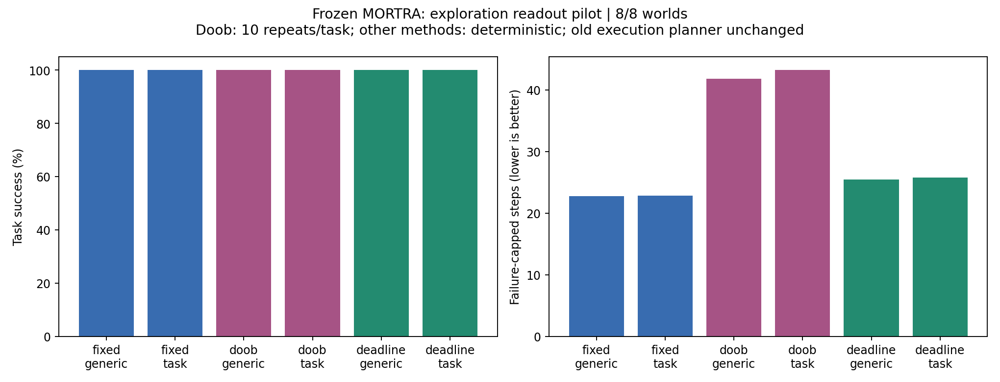

# MORTRA: 縮小性と探索時の行動選択の実験結果

## 結論

残り期待時間を用いた縮小化の同値性は、適用条件を満たす保存済みグラフで数値確認できました。しかし、今回試した二つの探索方策への変更は、既存方策より平均手数を減らしませんでした。数学的な整合性と、実際のタスクでの優位性は別の結果です。

## 実行記録

- GitHub Actions run: [36262565024](https://github.com/corcondor/mortra/actions/runs/36262565024)
- 実行コード: `1413820982a2ce56110f2dd26136ec9d1fa4af00`
- 凍結した既存アルゴリズム: `24c44da50aac2c084a91fdd9f6754f0429da9350`
- 入力を保存した過去のrun: `36220511321`
- 実行期間: 2026-09-27 03:26:46-03:30:53 JSTです。準備・検査・集計を含む経過時間は4分7秒でした。
- 8/8世界、96タスク、2,304エピソードが完了しました。
- 67テストが成功しました。失敗・エラー・スキップは0件でした。
- 凍結対象ファイルは元コミットとバイト単位で一致しました。
- 既存2条件の192エピソードは、過去ログの成功、手数、探索手数、再計画数、失敗理由、終端受理状態などとの比較で不一致0件でした。過去の全行動列との一致を検査したという意味ではありません。

## 比較条件

以前の70世界の登録データから、番号順の先頭8世界 `73000000-73000007` を実験前に固定しました。各世界の12タスク、開始状態、512ステップ時点の学習済みモデルをそのまま使用しました。世界やタスクの再生成・選抜・再学習はしていません。

変更したのは、既知の経路でタスクを実行できない場合に呼ぶ探索方策だけです。既存の実行用固定場、q=0.90、StructuralLearner、タスク記憶、環境、成功条件は維持しました。各条件の開始モデルは同一ですが、異なる行動を選んだ後の経験は異なります。

各探索方式で、タスクに依存しない終端重み1と、既存のタスク重みexp(progress)を比較しました。

- 既存固定場: 従来通り、行動の先の固定場が最大になるものを選びます。
- Doob確率方策: 同じ場から導いた行動確率で選びます。qや温度を新しく調整していません。各タスクを事前固定した乱数で10回実行しました。
- 残り予算方策: 既知のグラフで残り予算内に到達できる未知行動の実行地点から、既存終端重みが最大の地点を選びます。同じ重みなら必要手数が最少の地点を選びます。

最後の方式が最適化するのは「未知行動を試すまで」の代理目的です。未知遷移の先は予測していません。真の環境に対する最短路情報も渡していません。タスク全体の最適計画器ではありません。

## 事前登録した全96タスクの比較

全条件で成功率は100%でした。以下の平均は、Doob条件ではタスク内の10反復を平均した後、各世界の12タスク、最後に8世界を平均しています。失敗した場合は4,096手として計上する規則でしたが、今回は失敗がありませんでした。

| 探索方式 | タスク重みなしの平均手数 | タスク重みありの平均手数 | 成功数 / 実行数（各列） |
|---|---:|---:|---:|
| 既存固定場 | 22.78125 | 22.83333 | 96/96 |
| Doob確率方策 | 41.77500 | 43.21563 | 960/960 |
| 残り予算方策 | 25.47917 | 25.78125 | 96/96 |

タスク重みありの条件では、既存方策に比べてDoob方策は平均20.3823手多く、残り予算方策は平均2.9479手多くなりました。世界単位の記述的な95%ブートストラップ区間は、それぞれ[4.8552, 37.7781]手、[-0.2604, 6.7813]手でした。これは既に観察した8世界の結果であり、独立した新規世界での確認的結論ではありません。

## 実際に探索が必要だった範囲

探索方策が呼ばれたのは、96タスク中19タスクでした。残る77タスクは開始時のモデルだけで実行できたため、探索方式の差を測っていません。これが今回の比較範囲における重要な制約です。

以下は実験後に追加した記述集計です。主集計の96タスクを置き換えるものではありません。探索が必要だった19タスクは全条件で同一でした。

| 探索方式 | タスク重みなしの平均総手数 | タスク重みありの平均総手数 |
|---|---:|---:|
| 既存固定場 | 59.73684 | 60.00000 |
| Doob確率方策 | 155.70526 | 162.98421 |
| 残り予算方策 | 73.36842 | 74.89474 |

Doob方策の各列は19タスク×10回、ほかは19タスク×1回です。この範囲でも、既存方策の平均手数が最少でした。

## 数学的な検査

| 検査 | 結果 |
|---|---|
| 初期の積状態グラフ | 96個を検査しました。93個に未知行動の実行地点があり、3個にはありませんでした。 |
| q=0.9を含む作用素の同値な縮小化 | 93個で検証しました。場を元の座標へ戻したときの最大相対誤差は9.3947e-16でした。 |
| 割引なしの期待到達時間による縮小化 | 適用可能な84個で検証しました。最大相対誤差は5.5487e-14でした。 |
| 割引なしで適用できないグラフ | 9個でした。未知行動の実行地点へ進めない非終端の閉じた部分があり、有限時間を捏造していません。 |
| Doob確率の和 | 57,231回の探索判断で検査しました。1からの最大誤差は8.8818e-16でした。 |
| Doob確率の最大行動と元の場の最大行動 | 57,231回中、不一致0回でした。 |

従って、Doob変換後に最大値の行動だけを選んでも、今回の入力では元の行動から変わりません。性能比較で行動が変わったのは、確率分布からサンプリングしたためです。

残り期待時間による縮小化は同値変換なので、それ自体で行動や成功率が改善するという実験条件にはしていません。

## 計算資源と記録

| 条件 | 実行数 | エピソードCPU時間の合計（秒） |
|---|---:|---:|
| 既存・タスク重みなし | 96 | 6.0208 |
| 既存・タスク重みあり | 96 | 6.1027 |
| Doob・タスク重みなし | 960 | 119.9633 |
| Doob・タスク重みあり | 960 | 121.3808 |
| 残り予算・タスク重みなし | 96 | 7.3352 |
| 残り予算・タスク重みあり | 96 | 6.3213 |

最大のプロセスpeak RSSは74,772,480 bytes、約71.31 MiBでした。これは世界ごとのジョブ内の累積ピークで、方式ごとの独立な使用量ではありません。残り予算方策でも、共通のグラフ取得処理が参照用の固定場を計算する費用を含めています。従って専用実装にした場合の速度比較は主張しません。

全行動列、観測した状態列、各探索判断の確率・予算・数値検査、入力とソースのSHA-256をActions成果物へ保存しました。学習済みモデルを再利用した小さい有限世界の実験であり、生の画像から再学習した実験ではありません。

## 結果の意味

確認できたのは、期待到達時間による同値な縮小化とDoob確率の構成が、これらの実グラフ上で数値的に成立することです。

性能面では、今回のDoobサンプリングと終端重み優先の予算内探索を採用する根拠は得られませんでした。前者のKL付き制御目的、後者の未知行動実行地点に対する代理目的は、実際のタスク完了手数と同一ではありません。この目的の違いと整合する結果ですが、悪化の原因を単独で確定する介入実験まではしていません。

これは「q=0.90が普遍的に最良」「動的な係数は無意味」「縮小写像の理論が間違い」という結論ではありません。今回、qの別関数を実装して比較したわけでもありません。既存MORTRA全体からqを除いたという主張もしません。

結果を見た後のアルゴリズム変更・パラメータ調整・世界の差し替えは行わず、ここで実験を終了しました。
