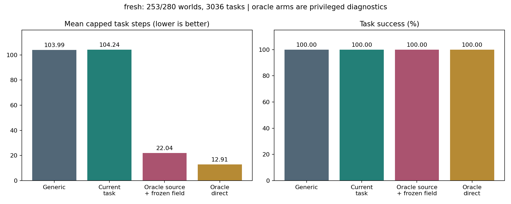

# Oracle source診断: 完全再現と新規280 worldでの拡大評価

既存780タスクの結果は完全再現しました。新規worldでも、現行の線形伝播を変えずにoracle sourceを与えると、平均手数が大きく減りました。

新規280 worldの処理は完了しています。ただし27 worldでは、凍結済みタスク生成器が規定の12タスクを生成できませんでした。280 world全体を対象とする主解析は **INCOMPLETE** です。以下の拡大結果は、評価可能だった **253/280 world、3,036タスク** に条件づけた部分的・記述的解析です。worldの交換はしていません。

## 実行と固定条件

- [GitHub Actions run 36265290609](https://github.com/corcondor/mortra/actions/runs/36265290609): completed / success。これは処理の終了を表し、280 world全体の主解析完了を意味しません。
- 実行コミット: `db5d3555500161531a131d0214ae8955b2f28877`
- 凍結アルゴリズム: `24c44da50aac2c084a91fdd9f6754f0429da9350`。対象ファイルのバイト単位の一致を検査しています。
- 新規world seeds: `77000000` から `77000279`。事前固定し、成績や生成可否による交換はしていません。
- 各条件は同じ512-step学習済みモデルの独立コピーから開始しています。同一world・task・startを使用しています。行動後の経験は条件ごとに異なります。
- Player、StructuralLearner、環境、タスク生成、タスク記憶、既知経路のplanner、`q=0.90`、最大4,096手、同点処理は変更していません。
- ユーザー提供のoracle関数を、定義を変更せず読み込んで使用しています。元スクリプトの一括実行部分は起動していません。
- 99テストに合格しました。参照コード、チェックサム、4分割結果の集約一致も確認しました。
- 実験計画: [TASK-ORACLE-SCALE-20260927.md](https://github.com/corcondor/mortra/blob/db5d3555500161531a131d0214ae8955b2f28877/docs/research/TASK-ORACLE-SCALE-20260927.md)

## 条件の意味

1. `generic`: タスクの進捗で重み付けしない既存の未知領域探索です。
2. `current_task`: 現行の `exp(progress)` をsourceとして使います。
3. `oracle_source`: sourceだけを、未知actionを実行した後の真の残りタスク距離 `d` による `0.90**d` に置き換えます。到達不能の場合は元の定義どおりゼロです。
4. `oracle_direct`: 探索を要求されたときだけ、真の残りタスク距離が最小になるactionを使います。その後の既知経路への切替は既存plannerのままです。

後二者は真の世界情報を利用する診断です。通常のエージェントが使える学習済み方策ではありません。oracleが真の遷移をlearnerへ書き込む処理もありません。更新されるのは実行したactionの観測結果だけです。

## 既存780タスクの再現

65 world、780タスク、4条件の計3,120件について、保存済み結果と成功判定・手数が全件一致しました。不一致は0件です。旧70 world中の生成不能5 worldもそのまま記録しています。

| 条件 | 成功数 / 780 | 平均手数 |
|---|---:|---:|
| generic | 779 | 103.251282 |
| current_task | 779 | 102.232051 |
| oracle_source | 780 | 23.694872 |
| oracle_direct | 780 | 13.011538 |

既報の平均手数差の回収率は `(generic-source)/(generic-direct) = 88.1612%` と再現しました。成功しないタスクは事前規定どおり4,096手として扱っています。

## 独立した新規worldの結果

各worldの12タスクを4条件で評価し、合計12,144件を保存しました。既存65 worldの結果は、この集計に混ぜていません。

| 条件 | 成功数 / 3,036 | 平均手数 | 中央値の手数 | 評価CPU秒の合計 |
|---|---:|---:|---:|---:|
| generic | 3,036 | 103.987484 | 16 | 1,075.93 |
| current_task | 3,036 | 104.243412 | 16 | 1,039.88 |
| oracle_source | 3,036 | 22.041502 | 13 | 215.00 |
| oracle_direct | 3,036 | 12.908762 | 12 | 83.12 |

**全条件が全タスクに成功しているため、新規worldでの差は失敗ペナルティによる差ではなく、完了までの手数の差です。**

worldごとに12タスクの平均を取り、同じworld同士の差を計算しました。95%区間は、253 worldを単位として20,000回再標本化した記述的bootstrap区間です。タスク行を独立標本として扱っていません。

| 比較: 条件 − generic | 平均手数差 | 95%区間 | 改善world / 同値world / 悪化world |
|---|---:|---:|---:|
| current_task | +0.255929 | [-0.429521, +1.013834] | 53 / 162 / 38 |
| oracle_source | -81.945982 | [-97.361784, -67.226869] | 157 / 94 / 2 |
| oracle_direct | -91.078722 | [-107.381028, -75.404694] | 160 / 93 / 0 |

oracle sourceによる平均手数の減少は **78.8037%** です。直接oracleとの差を基準にした回収率は **89.9727%**、同じworld再標本化による95%区間は **[87.0841%, 92.4329%]** でした。これは平均差の比であり、「原因の89.97%を証明した」という因果分解ではありません。

## タスク種別

各行は759タスクの平均手数です。全セルで759/759成功しています。

| タスク | generic | current_task | oracle_source | oracle_direct |
|---|---:|---:|---:|---:|
| 順序付き達成 | 145.934 | 144.374 | 43.123 | 17.993 |
| 全対象の達成、順不同 | 130.920 | 130.682 | 20.843 | 14.066 |
| 条件を満たしてから次の対象へ到達 | 67.698 | 67.747 | 12.401 | 9.606 |
| 最初の到達先によって後続対象が変わる分岐 | 71.398 | 74.170 | 11.800 | 9.970 |

## 悪化例も保持

oracle sourceとgenericをタスクごとに比較すると、改善1,179件、同値1,812件、悪化45件です。最大悪化はseed `77000086`、task `3` の166手から597手への変化で、431手増えています。

直接oracleでも3件は悪化し、最大差は4手でした。既存plannerへの切替を含む実行系なので、直接oracleを厳密な性能上限と呼ぶことはできません。すべての悪化行は `fresh/worse_cases.csv` に保存しています。

## 未評価worldと計算資源

27 worldは `task_generation_unavailable` です。分岐の構造条件、到達可能状態数、3〜10手の対象条件、または固定試行数内のタスク集合生成が満たされませんでした。各worldの理由は `fresh/world_statuses.json` に残しています。これらは方策の失敗ではありません。

実行例外・資源不足による未完了worldは0でした。新規worldの4条件の評価CPU時間は合計2,413.93秒です。これはworld生成・初期学習・集計を除く評価区間の合計です。評価workerで記録されたプロセスの最大常駐メモリは71.05 MiBです。これはworkerごとの累積最大値であり、全並列workerの合計や集計処理の最大値ではありません。

Actions全体の経過時間は約12分39秒でした。テスト、既存結果の再現、新規worldの評価、集計を含みます。

## 結論の範囲

支持されたのは、「現行の線形伝播と `q=0.90` を維持しても、未知actionの先の残りタスク価値をsourceに与えることで、評価可能な新規worldでも平均完了手数が大きく減る」という診断です。

現行の `exp(progress)` による追加改善は、この新規標本では明確ではありませんでした。一方、oracle sourceの改善は4種のタスクすべての平均に現れました。

この結果は、真の距離を知らない状態でも同じsourceを推定できることまでは示しません。また、線形伝播が常に最適であることや、すべてのタスクでoracle sourceが改善することも示しません。新しいvalue学習器、qの変更、readoutの調整は行わず、ここで停止しました。

## 保存物と読み方

- `fresh/metrics.json`, `episodes.csv`, `world_means.csv`, `by_task_type.csv`, `worse_cases.csv`, `world_statuses.json`, `source_snapshot.json`, `comparison.png`
- `reproduction/metrics.json`, `reproduction_mismatches.json`, `source_snapshot.json`, `comparison.png`
- 各worldの定義、タスク、初期学習済みモデル、action列、探索判断記録、実行ログは上記Actions runの各分割artifactに保存されています。
- artifactの保存期間は90日です。ここに掲載した集計・評価行・実験コードはGit repositoryにも保存しています。

`fresh/metrics.json` の `reproduction_gate_passed: false` は、そのフィールドが再現段階でのみ真になる実装によるものです。再現検査の合否は `reproduction/metrics.json` の `reproduction_gate_passed: true`、不一致0件を参照してください。新規評価は、その検査成功後にのみ起動しています。

