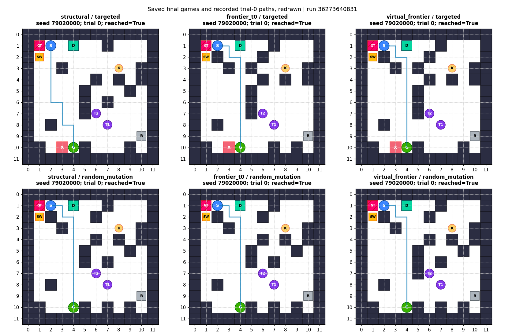
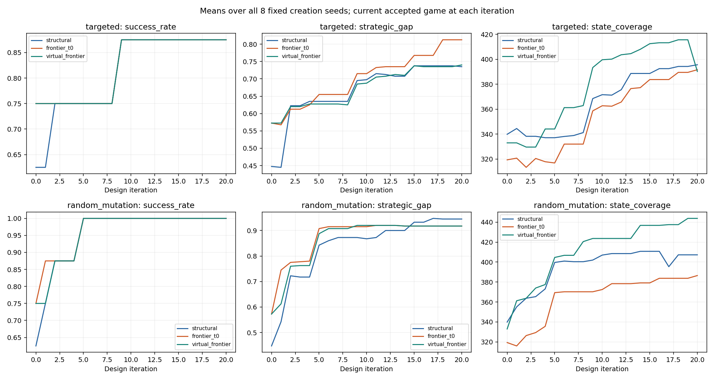

# Self-Game-Design V2: 探索方式の統合実験

## 結論

指定された既存コードを統合し、8 seed・3探索方式・2種類の変更方式、全48系列が20回の設計反復を完了しました。ゲーム案の生成、自己プレイ、批評、変更提案、採否判断は既存MORTRAが実行しました。Codexはゲーム内容や採否規則を変更していません。

初期ゲームでのMORTRA成功率は、structuralが62.5%、frontier_t0とvirtual_frontierが75.0%でした。しかし自己批評に基づく変更方式の最終成功率は全探索方式で87.5%でした。virtual_frontierの最終的な優位性は、この実験では確認できません。最終的なMORTRAとランダムプレイヤーの成功率差は、自己批評に基づく方式ではfrontier_t0が最大でした。

## 実行と固定

- GitHub Actions: https://github.com/corcondor/mortra/actions/runs/36273640831
- 実験実行commit: `5f8b36744a29327928c87d6db888f2f045dbea79`
- 統合branch: `research/self-design-v2-virtual-frontier-20260927`
- Self-Game-Design V2正本: `156abc04d3ae77f1ac42d151f5d60830585f6ae7`
- 探索方式の正本: `dd845c64b3ecfd82a17012b7ca4dabe315597e23`
- 既存の探索方式再現報告: `19f79f3b6973b72cafc6ad311e38ad580f7e1c54`
- seed: `79020000,79020001,79020002,79020003,79020004,79020005,79020006,79020007`
- 各評価は初期探索2500操作、自己プレイ50試行、ランダムプレイ50試行、各試行100操作上限です。q=0.90、仮想的な未探索遷移に与えるsource=1を保持しました。
- 同じseedの6系列は同一の初期ゲームから開始しました。変更用の乱数seedも同じです。以後のゲームは各系列自身の批評と採否によって変わります。
- 小規模実行は先頭seed、5回の設計反復です。その実行は独立した追加seedではありません。本実験の最初の5反復と全履歴が一致しました。
- seed範囲の未使用確認は、実行前に取得した登録済みコード・実験仕様の検索に基づきます。未登録の外部実行まで未使用であるとは主張しません。

実験はWindows Server 2025、Python 3.12.10、NumPy 1.26.4、SciPy 1.17.0、Matplotlib 3.10.5、pytest 8.4.1、psutil 7.0.0で実行しました。最大4ジョブを並列実行し、BLAS/OMP/MKLは各1スレッドです。各ジョブ内では自己批評に基づく方式、ランダム変更の順で実行しました。

## 再現と監査

原版V2の初期ゲーム、最終ゲーム、ランダム変更対照の最終ゲーム、全履歴、候補成績、批評、採否、trial 0の記録済み行動と状態をJSONの全値で比較しました。差分は0件です。時間などを含む全出力ファイルのバイト一致を主張するものではありません。

- 原版テスト: 22/22合格。
- 原版22件と統合8件を合わせたテスト: 30/30合格。
- 小規模実行: 3/3ジョブ、6/6系列完了。監査問題0件。
- 本実験: 24/24ジョブ、48/48系列、1008/1008ゲーム評価完了。
- 初期探索の記録: 2,520,000操作。
- 変更提案: 960件。採用124件、却下836件。人手による候補選択はありません。
- 全1008評価で、保存した行動を同じゲーム規則へ入力し、状態列と成功数の整合性を検査しました。
- ダウンロード後にも全1008評価の学習行動・プレイ行動・学習器・ゲーム・成績ファイルの存在を検査しました。全評価でMORTRA50試行とランダムプレイヤー50試行の記録が揃っています。[記録の完全性監査](trace_completeness_audit.json)を保存しています。
- 全960件の採否を、保存済み入力成績と凍結済み採否関数から再計算して一致しました。
- 全1008評価で、監視対象のoracle呼び出し0件、初期探索中のgoal判定呼び出し0件です。
- selectorにはV2自身のlearnerと現在観測だけを渡しました。taskの進捗・受理判定へのアクセスは例外となる既存SingletonMemoryを保持しました。
- 保存ソースの監査は全ジョブで一致しました。WindowsのCRLFとGitのLFは区別して両方のSHA-256を保存し、改行をLFに揃えた内容一致を検査しています。
- 実験の中断、失敗ジョブの再実行、seed交換、結果を見た方策調整はありません。

証拠は[gates](gates/)、[本実験の監査](frozen_summary/audit.json)、[独立した集計時の監査](analysis/report_audit.json)、[各ジョブのsource hashesと実行環境](analysis/source_snapshots.json)にあります。以前の探索方式再現で記録された864試行・72 snapshot・行動列の一致と、最大内部浮動小数差3.33e-16の記録は改変していません。

小規模実行の5反復終了時は、S/F/Vのいずれも両変更方式でMORTRA 50/50、ランダムプレイヤー0/50でした。採用変更は自己批評方式が各0/5件、ランダム変更対照が各1/5件でした。この成績を本実験の実行可否の条件にはしていません。実行可否は再現性、互換性、情報遮断、記録の整合性で判定しました。

主要ファイルの参照・実行時SHA-256と統合コードのSHA-256は[source_sha.json](source_sha.json)にもまとめています。

## 最終成績

各行は8ゲーム系列の最終結果です。成功数の分母400は8ゲーム×50試行です。比較の独立単位は8個のcreation seedであり、400個の独立ゲームではありません。「成功率差」はMORTRA成功率から同じゲームでのランダムプレイヤー成功率を引いた既存のstrategic_gapです。

| ゲーム変更方式 | 初期探索方式 | MORTRA成功 | ランダムプレイヤー成功 | 成功率差 | 採用変更 / 160提案 |
|---|---|---:|---:|---:|---:|
| 自己批評に基づく変更 | structural | 350/400 | 56/400 | 73.50ポイント | 19 |
| 自己批評に基づく変更 | frontier_t0 | 350/400 | 25/400 | 81.25ポイント | 24 |
| 自己批評に基づく変更 | virtual_frontier | 350/400 | 54/400 | 74.00ポイント | 23 |
| ランダム変更の対照 | structural | 400/400 | 22/400 | 94.50ポイント | 24 |
| ランダム変更の対照 | frontier_t0 | 400/400 | 33/400 | 91.75ポイント | 17 |
| ランダム変更の対照 | virtual_frontier | 400/400 | 33/400 | 91.75ポイント | 17 |

ランダム変更の対照でも、候補評価と採否はMORTRAの既存規則を使用します。ランダムプレイヤーとは別の条件です。変更を無条件に採用する方式でもありません。

自己批評に基づく方式では、初期から最終までの平均成功率差の変化はstructuralが+28.75ポイント、frontier_t0が+24.00ポイント、virtual_frontierが+16.75ポイントでした。出発時の学習結果が異なるため、この変化量だけを探索方式の優劣とは解釈しません。

## seed単位の比較

次表は自己批評に基づく方式の最終成功率差です。全seedを掲載しています。

| seed | structural | frontier_t0 | virtual_frontier |
|---:|---:|---:|---:|
| 79020000 | 0.96 | 1.00 | 1.00 |
| 79020001 | 0.86 | 0.90 | 0.82 |
| 79020002 | 0.60 | 0.98 | 0.66 |
| 79020003 | 0.88 | 0.88 | 0.88 |
| 79020004 | -0.10 | -0.10 | -0.10 |
| 79020005 | 0.96 | 0.96 | 0.96 |
| 79020006 | 0.80 | 0.98 | 0.78 |
| 79020007 | 0.92 | 0.90 | 0.92 |

次表の差は左の方式から右の方式を引いています。上昇・同値・低下の分母は各8 seedです。

| 変更方式 | 探索方式の比較 | 成功率差の平均差 | 中央値 | 上昇 / 同値 / 低下 |
|---|---|---:|---:|---:|
| 自己批評 | virtual_frontier − structural | +0.50ポイント | 0.00 | 2 / 4 / 2 |
| 自己批評 | frontier_t0 − structural | +7.75ポイント | +2.00 | 4 / 3 / 1 |
| 自己批評 | virtual_frontier − frontier_t0 | -7.25ポイント | 0.00 | 1 / 4 / 3 |
| ランダム変更 | virtual_frontier − structural | -2.75ポイント | -1.00 | 3 / 1 / 4 |
| ランダム変更 | frontier_t0 − structural | -2.75ポイント | -1.00 | 0 / 4 / 4 |
| ランダム変更 | virtual_frontier − frontier_t0 | 0.00ポイント | 0.00 | 3 / 2 / 3 |

ランダム変更のV−F平均差の保存値は約-1.39e-17です。上表では表示桁で0.00としています。生の浮動小数値は保存したままです。成績による同点許容差や採否規則は変更していません。

自己批評に基づく変更からランダム変更対照を引くと、成功率差の平均差はS=-21.00、F=-10.50、V=-17.75ポイントでした。Vでは0 seedで上昇、2 seedで同値、6 seedで低下しました。Fでは平均差は負ですが、中央値は+1.00ポイントで、4 seedで上昇、2 seedで同値、2 seedで低下しました。平均だけで全seedを同一視しません。

全指標のseed対応差は[frozen_summary/metrics.json](frozen_summary/metrics.json)、変更方式間の対応差は[designer_control_comparisons.json](analysis/designer_control_comparisons.json)にあります。

## 失敗した試行

最終MORTRA成功率が0%だった系列は、seed `79020004`の自己批評に基づく変更方式、S/F/Vの3系列です。他の最終系列は100%でした。このseedを除外していません。

この3系列は`TOO_HARD`という既存の批評を出し、20候補をすべて却下しました。Vの記録では壁やhazardの除去を提案しましたが、候補の自己プレイ成功率はすべて0%でした。初期ゲームのランダムプレイヤーは5/50試行で成功しており、「ゲームが数学的に到達不能だった」とは言えません。

同seedのVのランダム変更対照は、iteration 2でゴールを(2,4)へ移す変更を採用し、50/50試行で成功しました。これは元のゲームの解法を発見したという結果ではありません。ゲームの目標自体を変更した結果です。採否ログの`unsolvable`という原版の文言も、完全状態グラフによる不可能性の証明ではありません。

却下836件を含む全履歴は[iteration_decisions.csv](analysis/iteration_decisions.csv)と[saved_games](analysis/saved_games/)に保存しています。Codexはこの失敗を救済する変更を加えていません。

## 計算資源と観測した構造

CPU秒は各探索方式の16系列、336ゲーム評価の合計です。探索CPUは評価CPUの内数です。全処理CPUには全行動の記録、状態再生検査、JSON圧縮保存を含みます。最大メモリはジョブのプロセス高水位です。後に実行したランダム変更対照だけの独立したピークではありません。

| 探索方式 | 探索CPU秒 | 評価CPU秒 | 全処理CPU秒 | 仮想field分解・求解CPU秒 | 最大メモリMiB |
|---|---:|---:|---:|---:|---:|
| structural | 40.09 | 83.75 | 786.55 | 0 | 88.87 |
| frontier_t0 | 3221.81 | 3264.83 | 3928.13 | 0 | 84.06 |
| virtual_frontier | 4180.25 | 4219.41 | 4906.56 | 100.97 | 90.49 |

frontier_t0の0は計測欠落ではありません。この凍結実装は既知の遷移をたどって未探索箇所へ移動し、仮想fieldを求解しません。Vの求解CPUは行列分解と線形方程式求解だけであり、グラフや行列の構築、候補列挙などは含みません。共有クラウド計算機と詳細な記録処理を使用した診断値であり、厳密な速度ベンチマークではありません。

| 変更方式 | 探索方式 | 最終採用ゲームの観測状態数平均 | 試行済みstate-action数平均 |
|---|---|---:|---:|
| 自己批評 | structural | 395.625 | 1611.375 |
| 自己批評 | frontier_t0 | 391.625 | 1714.000 |
| 自己批評 | virtual_frontier | 390.250 | 1601.125 |
| ランダム変更 | structural | 407.250 | 1652.625 |
| ランダム変更 | frontier_t0 | 386.500 | 1648.625 |
| ランダム変更 | virtual_frontier | 443.750 | 1755.750 |

これらは観測した数であり、未知の真の全状態数に対するcoverageではありません。edge数、行動エントロピー、成功経路数、反復率、失敗率、未訪問箇所数、goal reuse、平均到達手数も[全seedの最終指標](analysis/final_per_seed.csv)と各反復のJSONに保存しています。原版の`mean_actions_to_goal`は成功試行の平均で、成功0件のゲームには100を割り当てます。`dead_end_rate`は試行失敗率であり、真のグラフの行き止まり率ではありません。

## 集計上の訂正

凍結済み集計器の補助列`final_exploration_known_pairs`は、最後に評価した候補を参照します。その候補が却下された場合、最終採用ゲームの数ではありません。原本の集計はそのまま保存し、本報告の`final_known_state_action_pairs`は最後に採用された反復の学習器から取得しました。ゲーム、採否、V2の指標、実験結果は変更していません。[訂正記録](analysis/column_audit.json)に範囲を明記しています。

## 画像

次の画像は撮影したプレイ動画ではありません。保存済みゲームと記録済みtrial 0の状態列を、原版V2の描画関数で再描画したものです。新たな方策行動や成功例を生成していません。全8 seedについて同じtrialを掲載し、失敗も残しています。



[79020001](analysis/games_79020001.png) / [79020002](analysis/games_79020002.png) / [79020003](analysis/games_79020003.png) / [79020004・失敗を含む](analysis/games_79020004.png) / [79020005](analysis/games_79020005.png) / [79020006](analysis/games_79020006.png) / [79020007](analysis/games_79020007.png)



## 保存物と再現

原版の再現、統合テスト、小規模実行、本実験はすべて同じActions runに保存されています。[artifact一覧](artifacts.json)には元artifactのID、サイズ、SHA-256 digest、有効期限があります。Actionsの保存期間は90日です。展開した全ログ・全学習器・全行動記録もローカルの`C:/Users/81808/.openclaw/v2-integration-evidence-36273640831/`へ保存しました。GitHubの期限後もオンライン保存されると約束するものではありません。

この報告の保存先は`C:/Users/81808/.openclaw/workspace/mortra-self-design-v2-integration-20260927/reports/self_design_v2_integration_36273640831/`です。`analysis/saved_games/<seed>/<method>/<control>/`には初期・最終ゲーム、全採否履歴と候補ゲーム、trial 0の行動・状態、資源記録があります。大きな全行動記録と全学習器は元artifactの各`evaluations/evaluation_NNN/`にあります。

再現する場合は別checkoutで実験実行commitを使用し、`.github/workflows/self-design-v2-integration.yml`の依存関係と順序をそのまま使います。既存出力を上書きしないディレクトリが必要です。単一系列の呼び出し例は次のとおりです。このコマンドは本報告作成時に再実行していません。

```sh
python -m experiments.self_design_v2_integration.run --stage full --seed 79020000 --method virtual_frontier --output reports/new_reproduction_79020000_virtual
```

`build_report.py`は保存済み結果だけを集計・描画します。ゲーム生成、探索、変更提案を行いません。読み込んだファイルのハッシュは`analysis/input_hashes.json`にあります。

## 解釈と停止

確認できたのは、既存のtask-blind探索方式を既存V2の同じ学習器に接続し、その結果が自己プレイ、批評、変更と採否へ実際に反映されたことです。最終ゲームは条件間で異なるため、最後の成績差は同一ゲーム上のPlayerだけの比較ではなく、設計ループ全体の比較です。

この8 seedではvirtual_frontierの最終的な優位性、自己批評に基づく変更のランダム変更対照に対する優位性は支持されません。ゲームの人間にとっての面白さは評価していません。これは新たなDesignerをCodexが作った実験ではなく、指定された既存の批評・変更・採否規則をそのまま実行した結果です。

ここで実験を停止しました。結果に応じた方策、ゲーム生成器、批評、採否、q、sourceの変更や再実行は行っていません。
