# 最終ゲームの共通C評価: 保存行動の図示

run 36285287250。各初期seedの全A/B/C条件について、最終ゲームを共通C評価器で再評価したtrial 0を表示します。
全条件の初期学習2500・追加学習5000操作後の行動列です。成功例の選別はしていません。
画像は保存状態・行動から作った座標投影であり、実行時の画面録画ではありません。
各ゲームの試行操作数と成否は画像内にあります。位置が同じでも他の状態変数が違う場合があります。

## 79020000
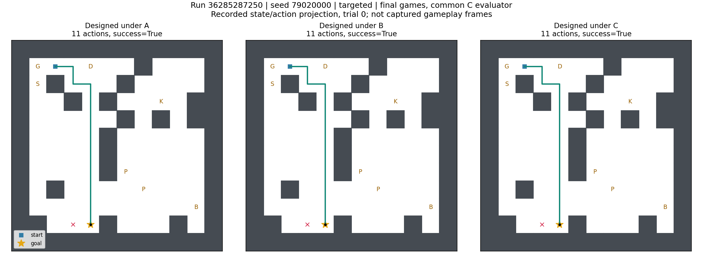
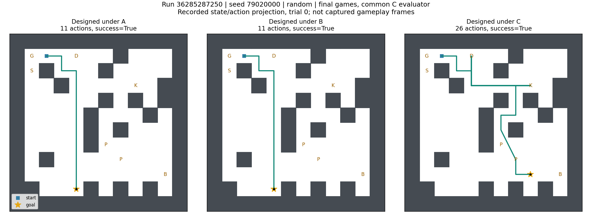
## 79020001
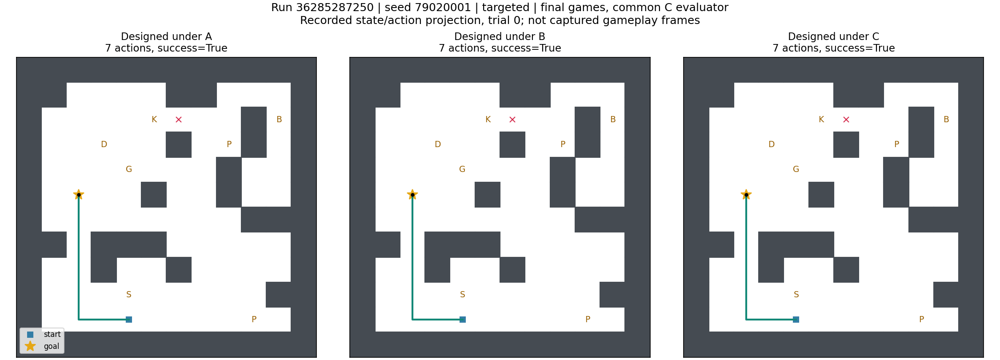
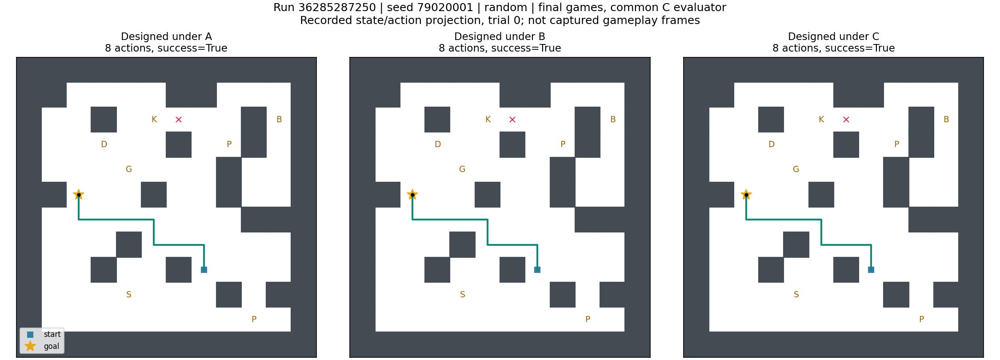
## 79020002
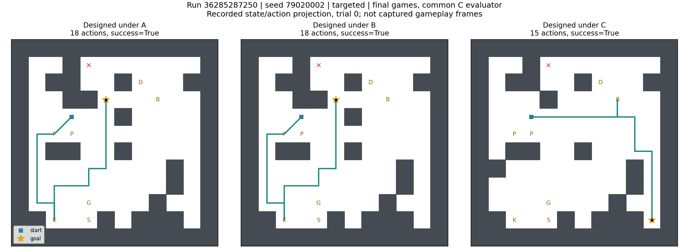
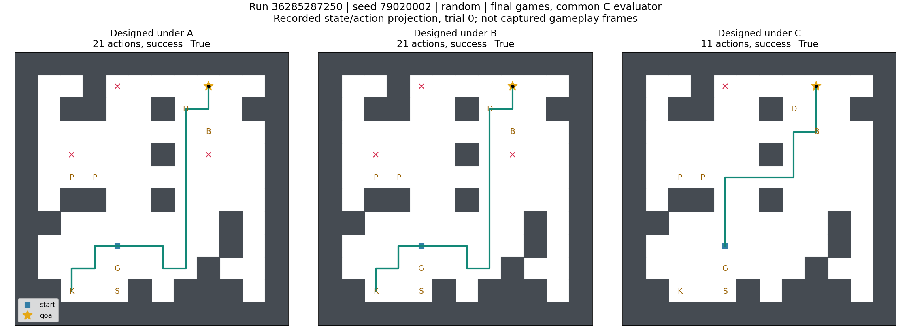
## 79020003
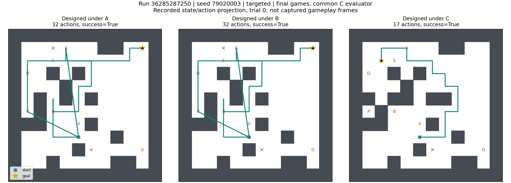
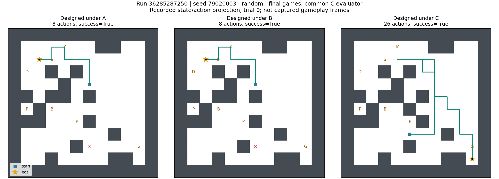
## 79020004
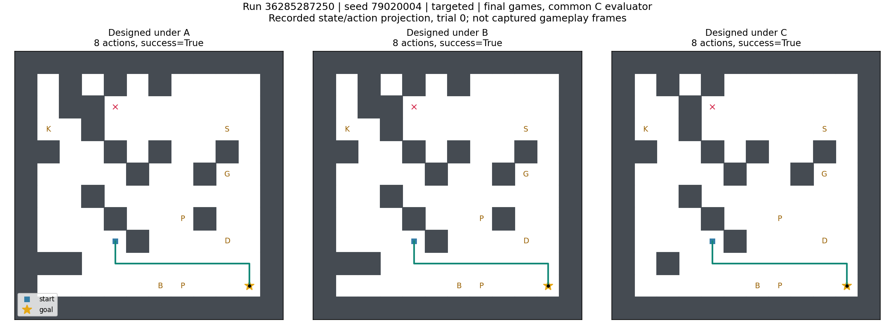
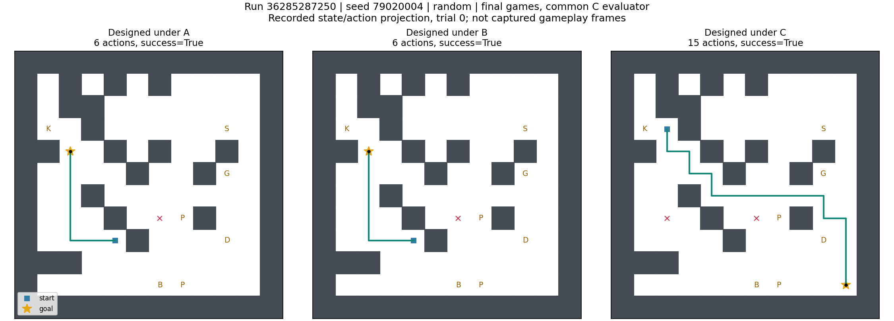
## 79020005
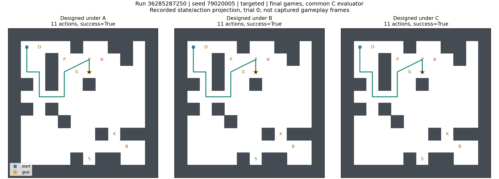
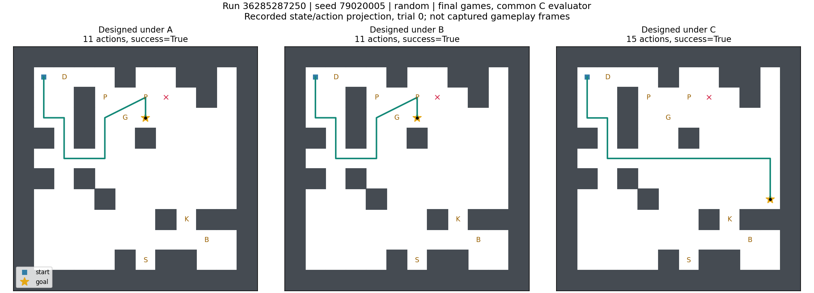
## 79020006
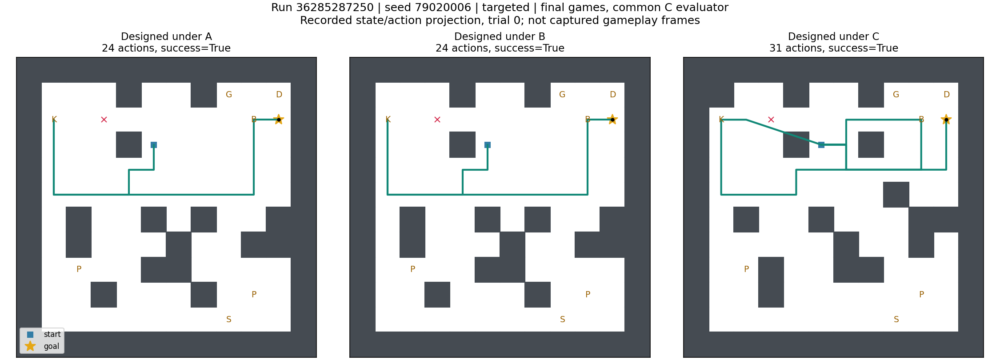
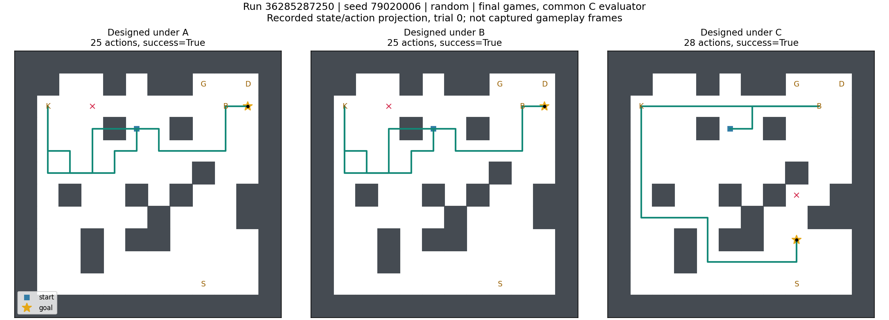
## 79020007
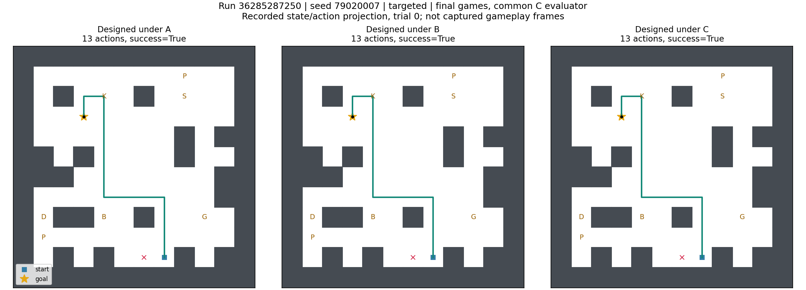
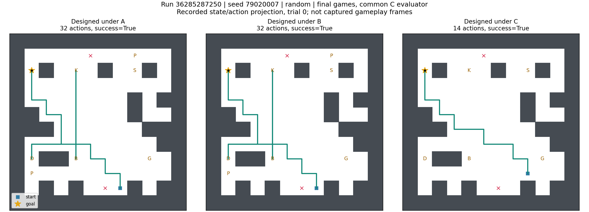
