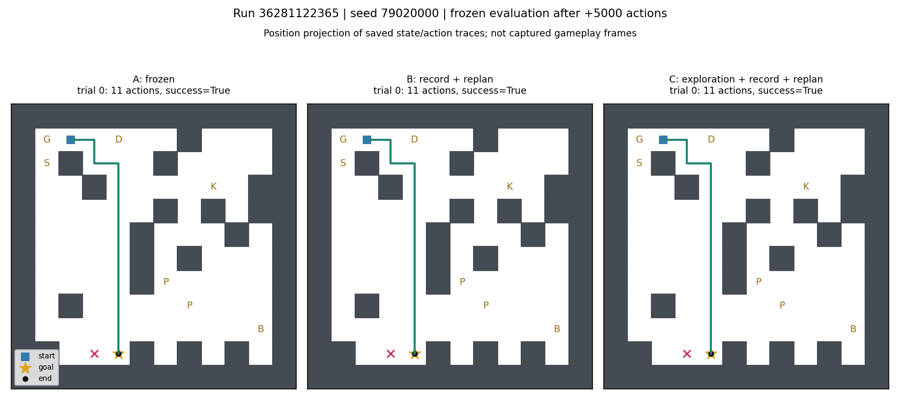
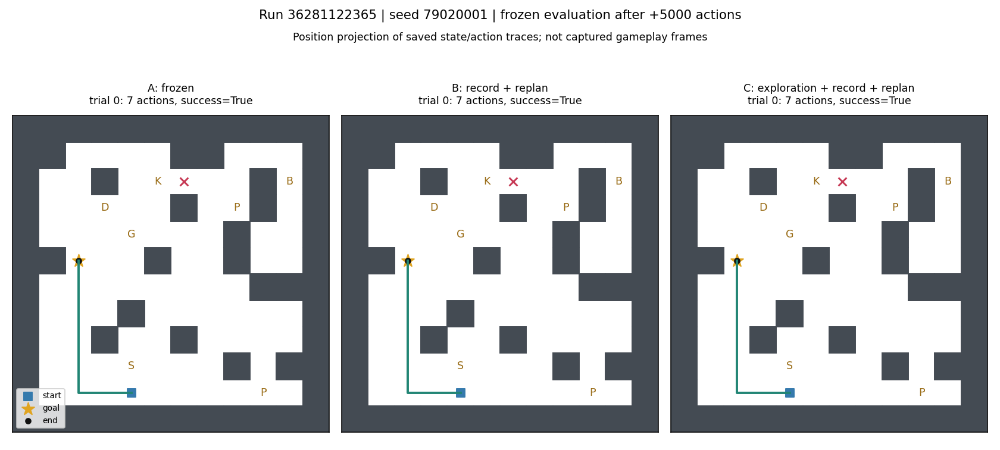
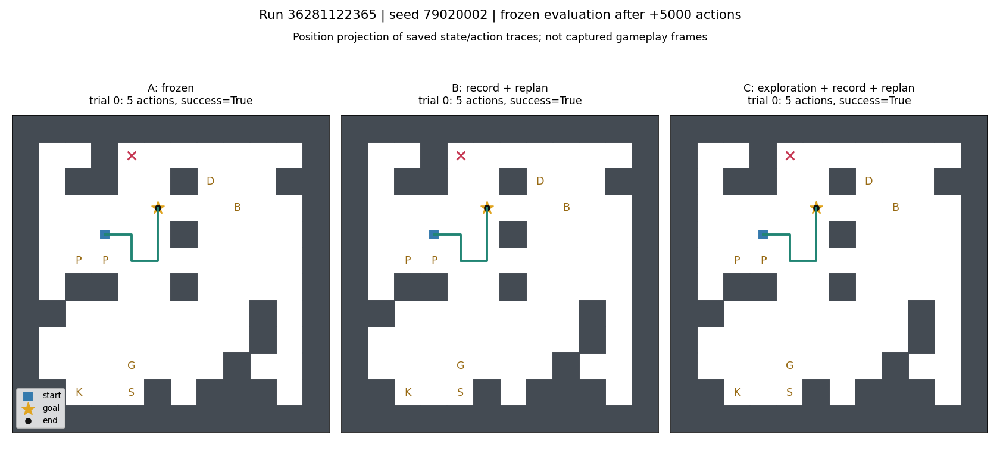
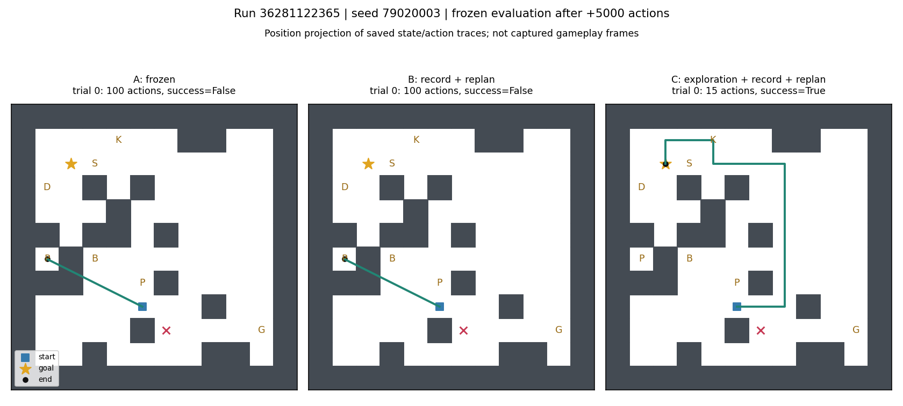
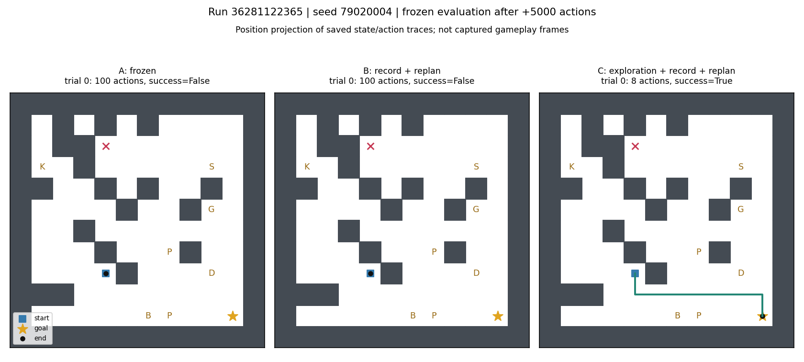
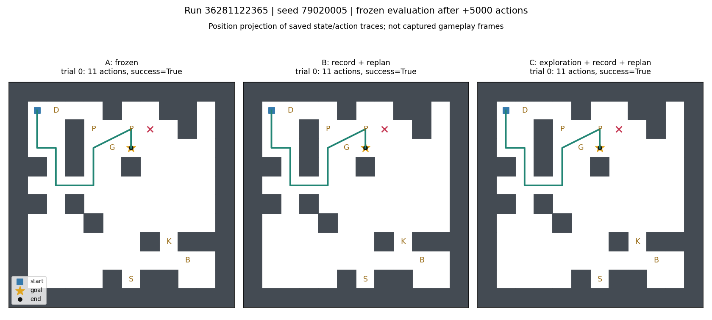
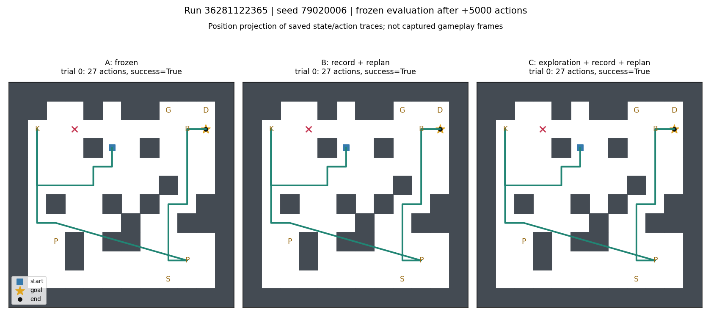
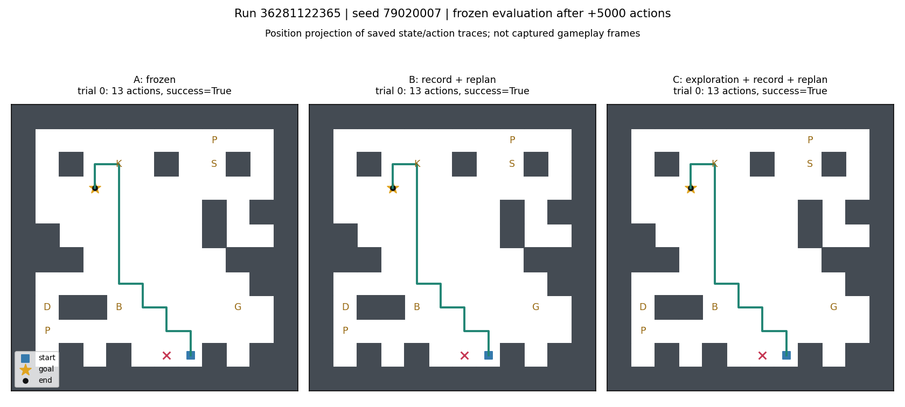

# 保存された行動の表示

Run 36281122365。追加5000操作後にモデルを凍結して評価した、各条件の最初の試行です。
成功例だけを選ばず、固定8ゲームをすべて表示しています。
これは保存済み状態列を座標へ投影した図です。実行時の撮影画像ではありません。
左からA（更新なし）、B（記録と再計算）、C（未攻略時の探索も追加）です。

## 79020000

## 79020001

## 79020002

## 79020003

## 79020004

## 79020005

## 79020006

## 79020007

