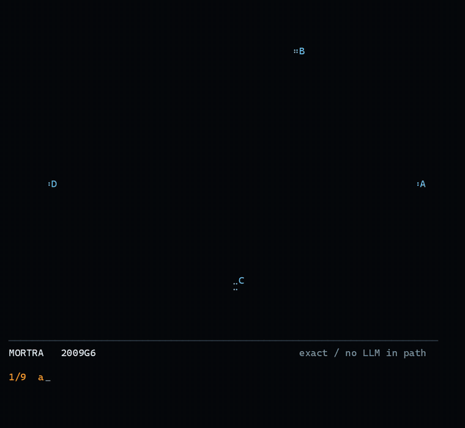

# Watch a geometry olympiad proof draw itself in your terminal



Pure PowerShell. Braille cells for the drawing, one character holding a 2x4 dot
grid, so a 70x44 terminal is a 140x176 raster. No image library, no GUI, no LLM
anywhere in the path.

```powershell
git clone https://github.com/corcondor/mortra
cd mortra/scripts/terminal
pwsh -File Play-MortraProof.ps1
```

That is the whole setup. The scenes are in this folder, no build step.

```powershell
pwsh -File Play-MortraProof.ps1 -List        # 17 proofs
pwsh -File Play-MortraProof.ps1 2023USAMOp6  # pick one
pwsh -File Play-MortraProof.ps1 -Check       # is your terminal able to draw this?
```

Press `Esc` or `q` to stop. The player runs in the alternate screen buffer, so
your scroll history comes back untouched.

## What you are looking at

Each line that types out at the bottom is one clause of the proof's own
construction statement. This is not a script written for the animation:

```
a b c d = quadrangle; p = on_line a d, on_line b c;
o1 = circumcenter a b p; h1 = orthocenter a b p;
o2 = circumcenter c d p; h2 = orthocenter c d p;
e1 = midpoint o1 h1; e2 = midpoint o2 h2;
x = on_tline e1 c d, on_tline e2 a b
? coll x h1 h2
```

Nine clauses, nine steps. Points appear on the step that defines them. A segment
appears on the step by which both of its endpoints exist — that assignment is
computed, not hand-authored.

The point coordinates are the ones MORTRA actually produced when it closed the
proof, read back out of the published figure. Nothing in the renderer invents a
coordinate, a label, or a sentence.

## The last line is measured, not asserted

When the goal closes, the player evaluates the goal predicate against those same
coordinates and prints the residual:

```
[ VERIFIED ]  coll X H1 H2
residual 0.000001 px   measured on the figure's own coordinates
```

Six goal predicates are measured, each in its natural unit:

| goal | residual |
|---|---|
| `coll` | max distance of any point from the line through the two farthest, px |
| `cyclic` | max deviation from the circle through the first three, px |
| `perp` | \|90° − angle between the two lines\|, degrees |
| `para` | angle between the two lines, degrees |
| `cong` | difference of the two lengths, px |
| `eqangle` | difference of the two angles, degrees |

All 17 shipped scenes land at or below `1.2e-06`. That threshold is enforced:
a figure whose residual exceeds `1e-3` is not shipped, and the player prints
`[ NOT VERIFIED ]` with the number rather than hiding it. One proof
(`2021IranTSTp6`, residual `1.26 px`) was dropped by that rule. Ten more were
dropped because their goal names points the published figure does not plot, so
there was nothing to measure.

## Requirements

PowerShell 7 (`pwsh`), and a terminal font containing the Braille block
`U+2800–U+28FF`. Run `-Check` and compare the two lines it prints.

Measured coverage:

| font | Braille glyphs |
|---|---|
| Cascadia Mono, Cascadia Code | 256 / 256 |
| Consolas | 0 / 256 |
| Ubuntu Mono | 0 / 256 |

Cascadia Mono is the Windows Terminal default, so this usually just works. If you
see `?` instead of dots the output encoding is wrong, not the font — the player
sets `[Console]::OutputEncoding` to UTF-8 itself, but a host that overrides it
will produce `0x3F` for every Braille character.

## Pieces

| file | does |
|---|---|
| `Mortra.Raster.psm1` | Braille canvas: dots, segments, polylines, per-cell colour, frame to string |
| `Play-MortraProof.ps1` | scene to timeline to terminal; also `-CaptureDir` to write frames |
| `build_scene.py` | figure coordinates + proof statement to scene JSON; measures the goal |
| `frames_to_png.py` | captured frames to PNG with the real terminal font |
| `scenes/*.json` | 17 proofs |

The renderer takes no geometry from the animation layer. Reveal, draw, trace and
type are presentation operations; the morphism basis is untouched by them.

## Rendering to video

```powershell
pwsh -File Play-MortraProof.ps1 2009G6 -CaptureDir frames -Fps 24 -Cols 70 -Rows 44
python frames_to_png.py frames --output png --cell-height 30
ffmpeg -framerate 24 -i png/%05d.png -c:v libx264 -crf 18 -pix_fmt yuv420p out.mp4
```

Live playback tops out near 18 fps because `Build-Frame` rebuilds the whole canvas
each frame; capture is unaffected, since frames are written at the exact `-Fps`.

More at [mortra.ai](https://mortra.ai).
